# A Bulbul's First 100 Days

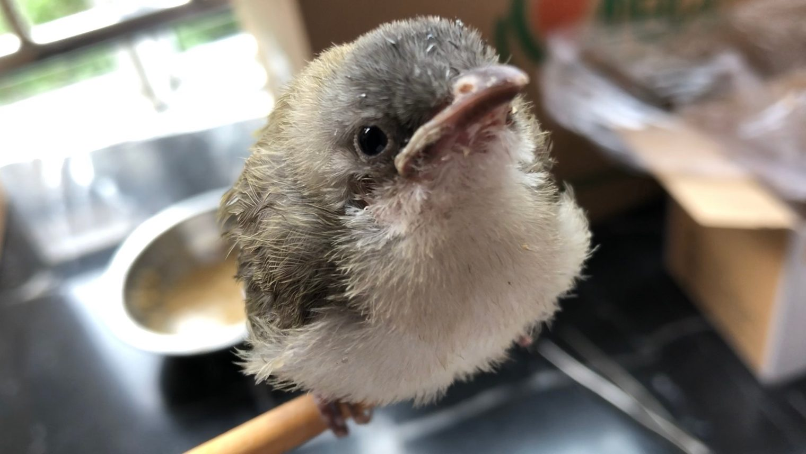

Since I brought a round little thing home one Saturday at noon, before I knew it today has become the bulbul's hundredth day with us. I wrote this as I went back through the photos and videos, so it's messy and rough. When I have time I plan to upload some of the videos to Bilibili~

### Day 1 - May 23

When I found it, it was huddled in a corner of the outside window frame of our compound's gatehouse, dazed and silent. At midday there were no people around, no trees and no birds, so as a stopgap I cupped it in both hands and carried it upstairs. The cage from my parrot years ago had long since been thrown out, so I found a cardboard box, lined the bottom with newspaper and put it on the bay window in my room. That became its temporary shelter. Before long it broke its silence and started calling, hungry, I guessed. I dabbed a little minced cucumber on my finger and held it out, and it very graciously ate the lot, not shy in the slightest.

A quick search online suggested the little thing was most likely a chick of the light-vented bulbul (Pycnonotus sinensis). The one I found was probably only five or six days old. One eye still wouldn't quite open, and it was too early to tell whether it was male or female. Another search, and it turned out the bulbul was the bird I had heard all my life, everywhere I'd lived, the one that sings so beautifully. Most of the lilting birdsong we hear all around is probably from male bulbuls. Online they said the chicks can eat magpie feed and mealworms, so in the afternoon I went to the pet shop and bought some (so cheap). Back home I started with the semi-liquid feed. I whittled one end of a plastic straw into a little spade and scooped up the feed, and it went at it as if the straw were its parent's beak and licked it clean.

Then I held it on a chopstick and put a worm on the counter. It pecked at it, calling all the while. One moment the worm got knocked away, the next it wriggled off, and I moved the chopstick along to help. This time it finally got a firm grip, worked its beak hard, and at last swallowed it down. That's how it went, six or seven worms in a row before it stopped. Once it was full I put it on my hand. The little thing turned out to be clingy, pressing against my thumb and dozing off, a little bird nestling against a person, just like the Chinese idiom.

It didn't care much for the cardboard box, though. Whenever I put it inside, it flapped its not-yet-grown wings and jumped for the top. Maybe it felt unsafe because it couldn't see out. So in the evening I went out again to pick up some twigs to lay across the rim of the box, and along the way also found a small bundle of unused bamboo leaves for wrapping zongzi. My mum wove them into a little nest and put the bird on it.

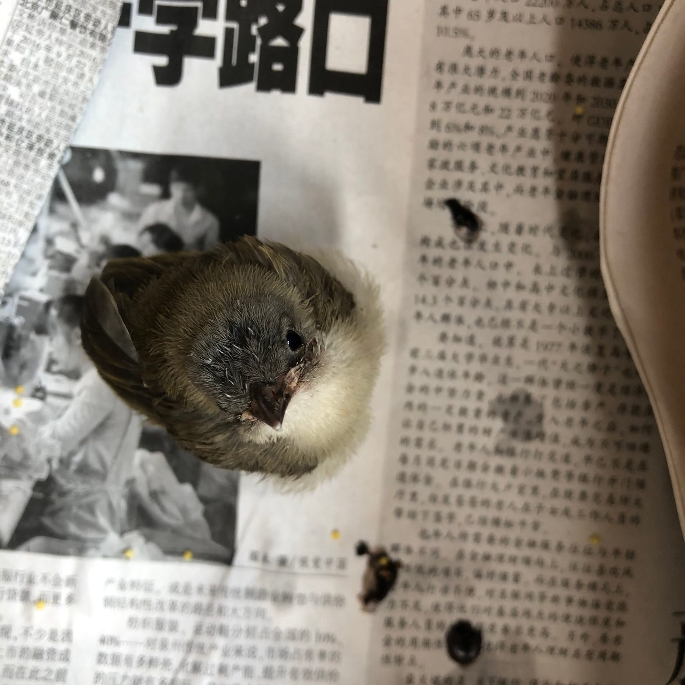

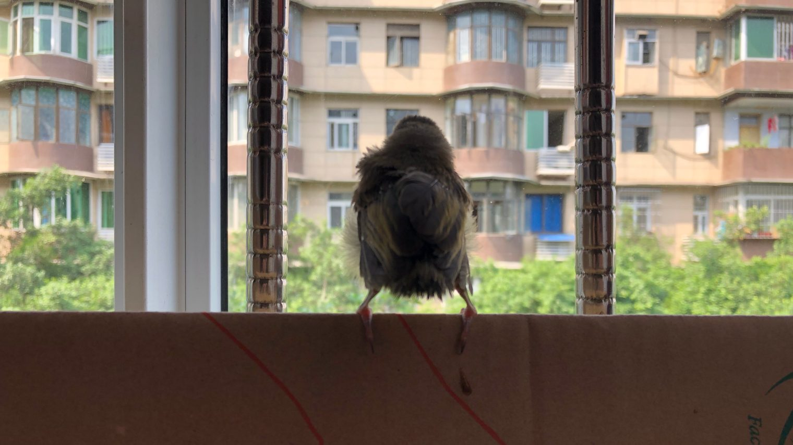

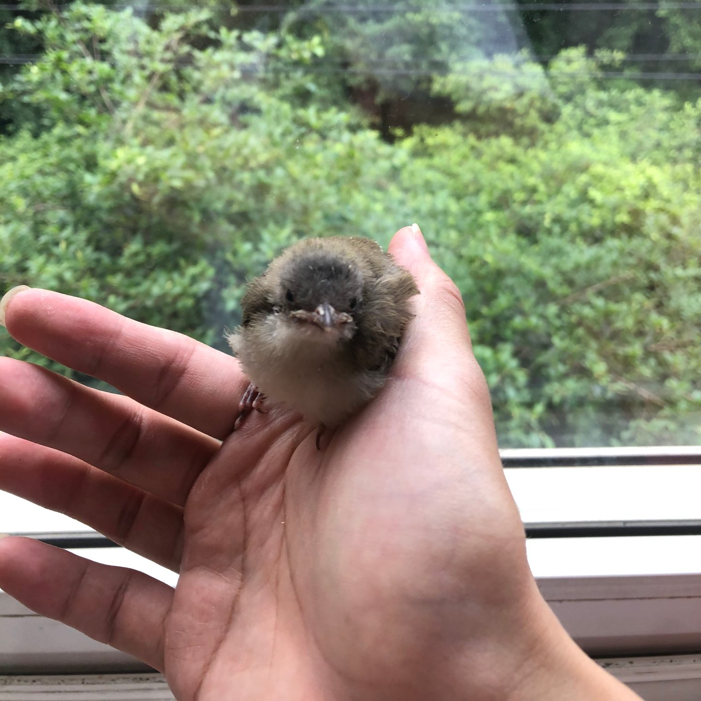

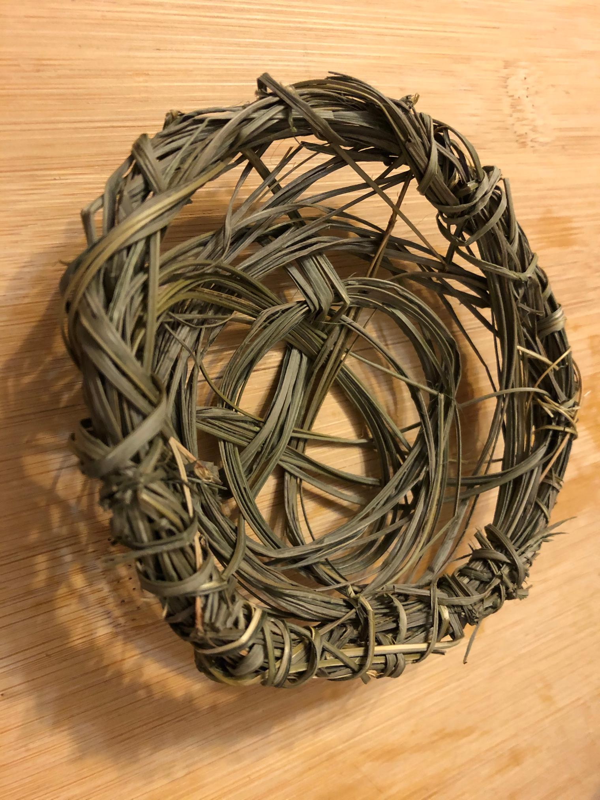

### Day 2 - May 24

Early in the morning, half awake, I heard the little thing's piercing calls. I couldn't be bothered and pulled the covers over my head. By the time I got up my mum had already fed it, and she said that when she came in it wasn't in the box but on my bed, calling hard at my backside, not the least bit afraid I might roll over... That day I found a tender bamboo stick to wedge in the box instead of the twigs. The bamboo was a bit slippery, and it still preferred the rim of the box... With a full belly it would stand on the rim and sleep with its head tucked into the feathers on its back. From behind it was one grey-green ellipsoid, the spitting image of a kiwi fruit. And so it went: eat, sleep, wake and call, eat and sleep again. One cycle every hour or two...

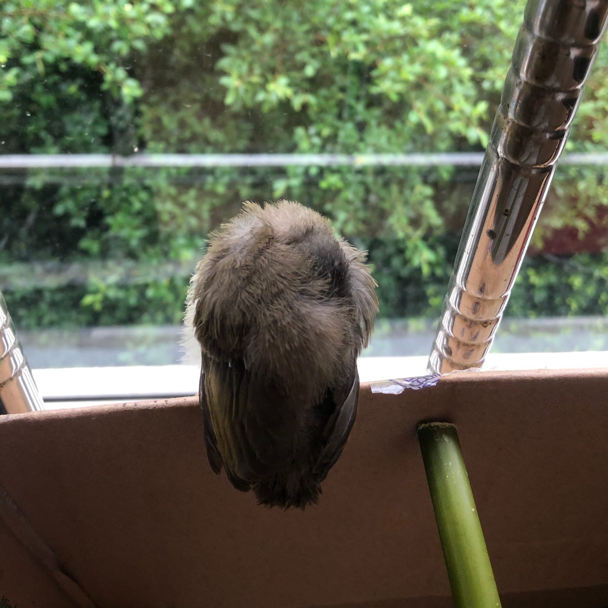

### Day 3 - May 25

I had moved it to the kitchen the night before, but a little after seven on Monday morning its noise still got me up to feed it. I had the baffling feeling of having become a stay-at-home dad (an intern one?). I tried peeling it a loquat, and it ate with real relish, calling as it ate. Sometimes it stared at the food (and at the straw on the counter), beak wide open and wings trembling, but wouldn't go for it, as if it believed loquat flesh and crawling worms would fly into its mouth by themselves.

### Day 4 - May 26

The little thing got even clingier. When I was at the computer, it squatted on my mouse arm and dozed... Its tail feathers had grown a little, into a tiny tuft.

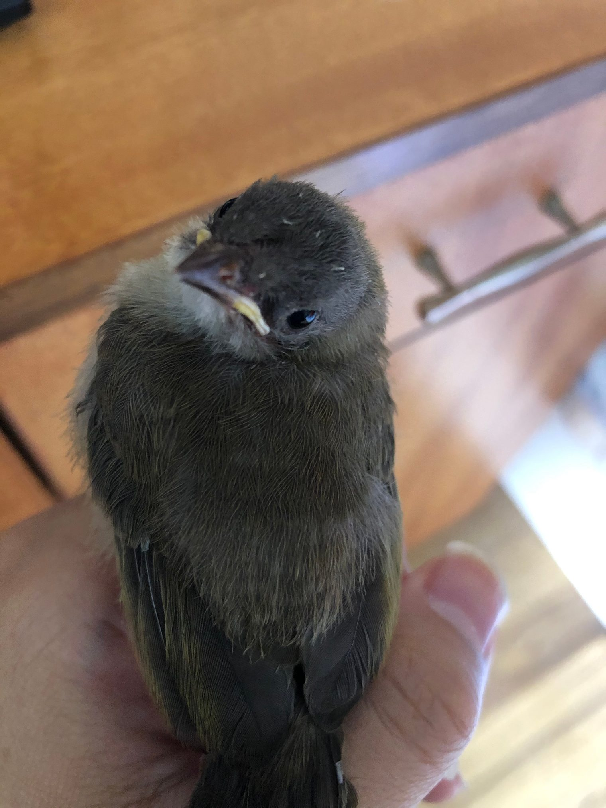

### Day 6 - May 28

The little thing flew better and better. By mid-morning it was perched on top of my head, calling and looking all around... The box could no longer hold it at all, so I hurried to my grandpa's to bring back an old birdcage. Every evening at seven or eight it fell asleep, and no amount of calling would wake it, but at the slightest movement of the cage its head popped out from behind its back. Every night, after carrying it to the kitchen, I held a finger over its drowsy head and waited for it to nip it gently a couple of times before I left. Like a half-asleep mumbled greeting: good night. Every morning when it first saw me it trembled its wings, and once it had coaxed and bullied me into opening the cage, it darted madly all around the flat, with loud calls on the side, officially starting another day of pecking everywhere, flying everywhere, pooping everywhere and making a nuisance of itself everywhere.

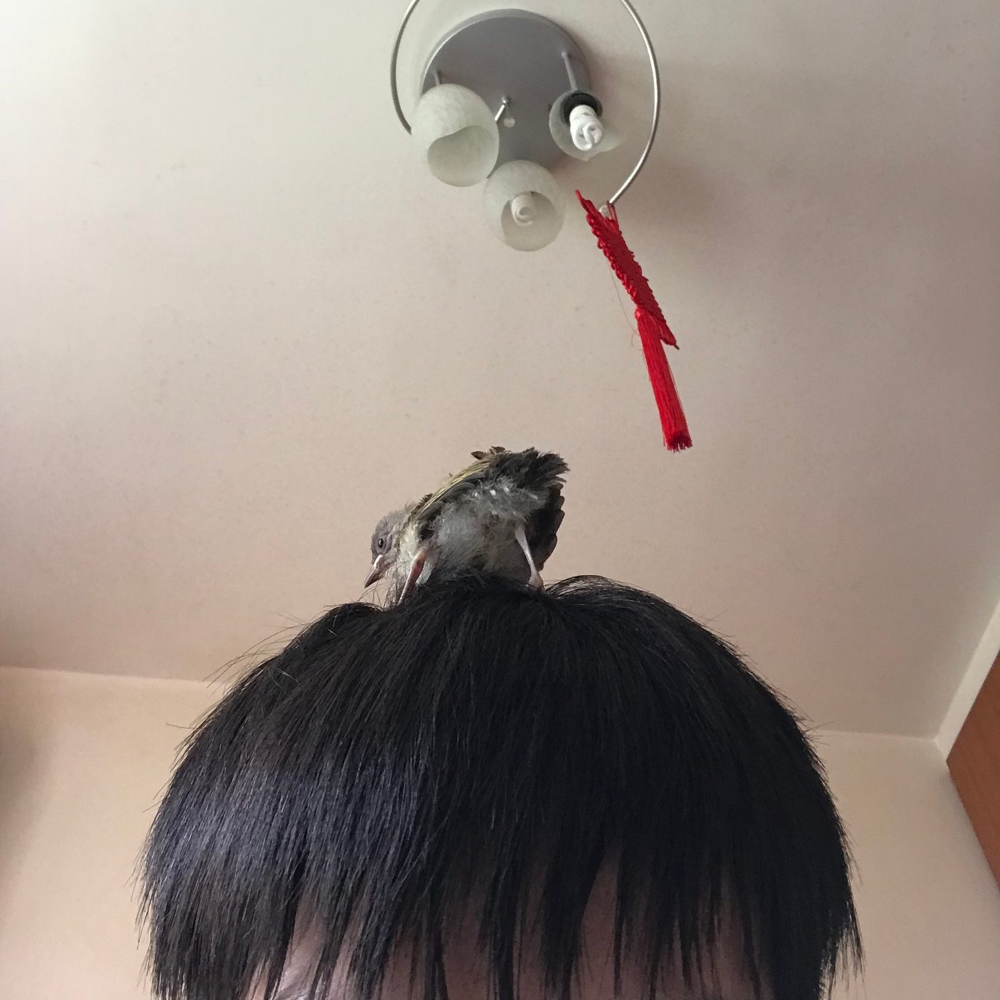

### Day 9 - May 31

The tail feathers were another centimetre or two longer. It became hooked on squatting on my shoulder and leaning against my neck, and taught itself the watching-you-in-secret pose... and bathing in the dipping-sauce dish... The little one was so clingy that when I looked it up, it was already pretty clearly imprinting (treating me as its parent). It didn't resist being petted, either. All week I had been torn about when to release it, and how. Honestly, I was really torn.

### Day 10 - June 1

This time the bird kid became hooked on perching on my monitor.

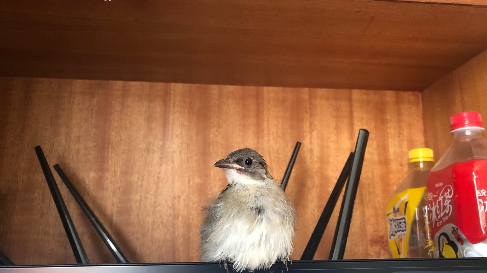

### Day 13 - June 4

The bird kid stayed hooked on perching on my monitor, and was endlessly entertained by my cursor doing high-DPS moves. I had more or less made up my mind to keep it, for a few reasons: 1. this bird can be kept at home, and it had adapted quite well; 2. it was already imprinted, so rewilding it would be hard; 3. I really like it.

### Day 23 - June 14

The fellow had shot up quite a bit. I could already take photos of its sexy figure, and of a big beak so sexy it's blurry (?)... I can't understand its obsession with my monitor, my phone and every other device that lights up... Its calls had changed a lot too, chattering as it learned to sing, and I could more or less tell that it was a he.

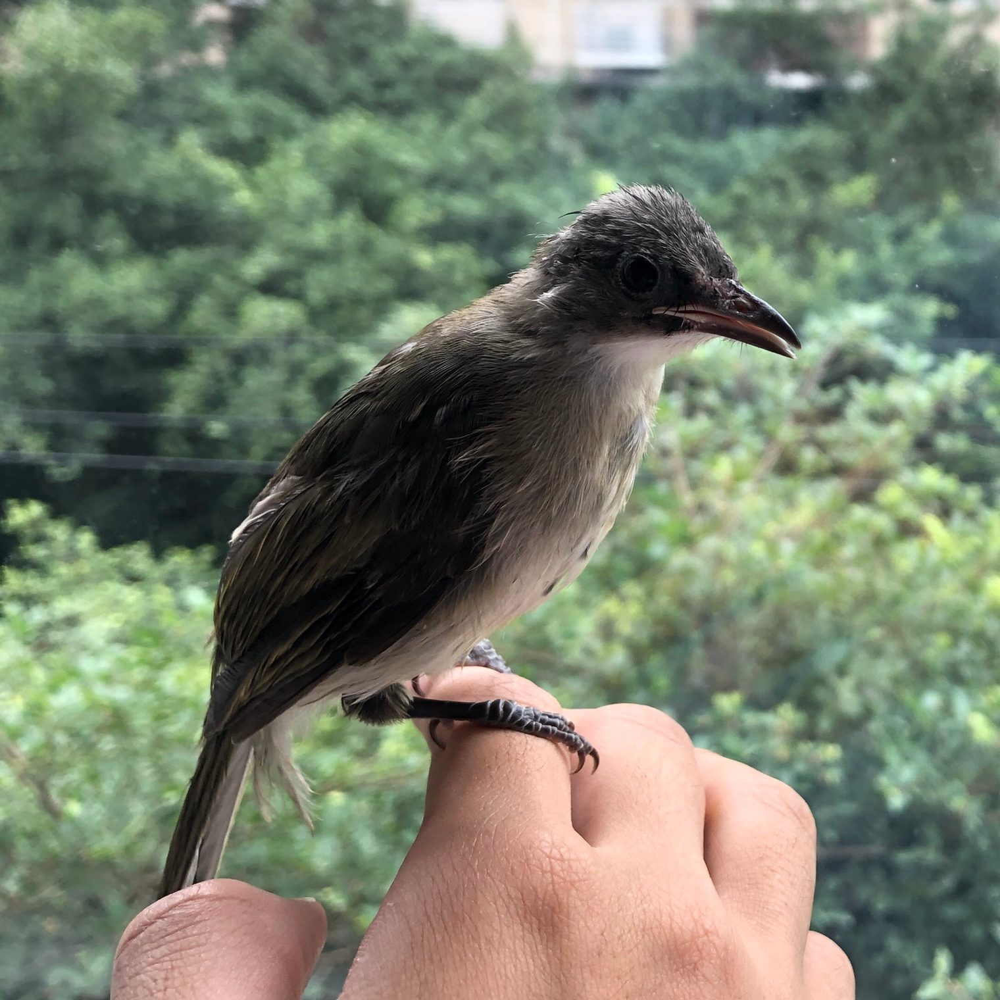

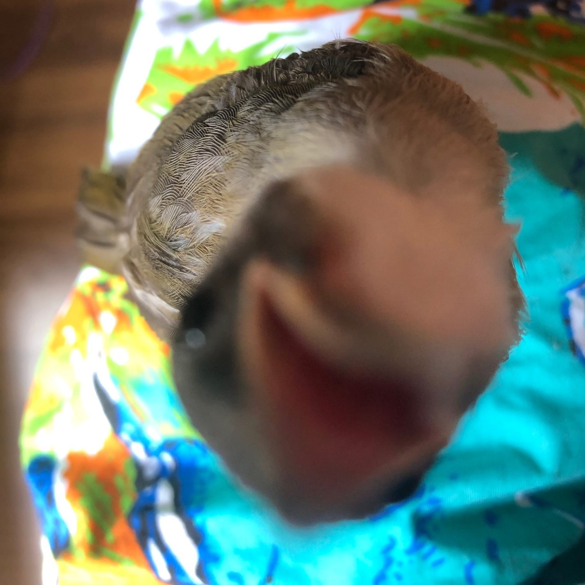

### Day 27 - June 18

A bright, sunny day. He had a happy little bath in a fruit bowl bigger than the sauce dish, puffed himself into a ball, then perched on my monitor again and shook water all over my face.

### Day 50 - July 12

From skimming along the floor, he had become a very good flier, and his range now crossed rooms. In the slow-motion video I shot, he turns his head in the sunlight, takes off and beats his wings: an enviable bird talent.

### Day 51 - July 13

Relatives (maybe) came looking for him and squawked away for ages on the clothes-drying pole outside the window.

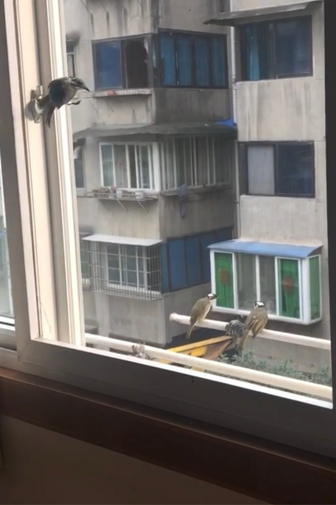

### Day 71 - August 1

By now he had a brand-new big cage, with a food trough, a water trough and a nest box (he soon learned to crawl into it to sleep at night). That day I put him out on the balcony, and two more of his kind came over to squawk, separated from him by nothing but the wires of the cage.

### Day 72 - August 2

In the morning two big birds came squawking again. Could he be their chick? At noon I was lying on the bed and he was hopping around beside me and on me, when suddenly he ran up and pecked me right in the eyeball... The sting! Tears kept streaming, and when I opened my eyes again the whole world was blurred, as if seen through frosted glass... Actually he always liked pecking my glasses (sometimes the whole bird clung to my frames, and made a coaxing, cuddly sound when I stroked him), and once or twice he had pecked the corner of my eye. I had thought then that I'd better watch out for my eyes, and now it had actually come true... After a nap at noon it was no better, so I had to go to the hospital to see an eye doctor, on edge the whole way: surely I couldn't be that unlucky. The doctor took a look and said there was a small wound, nothing serious, and prescribed two kinds of eye drops, one antibacterial and anti-inflammatory, one to help it heal. If it recovered in two or three days, all would be well. That was a relief, but for the rest of the weekend I didn't dare play games or look at my phone, and just gritted my teeth through it. Back home, the windowsill was covered in black droppings from the big birds; they must have thrown a party after we left. The little one seemed a bit listless. I don't know whether it was because the big birds had come looking for him or because he knew he had hurt me.

### Day 73 - August 3

The next morning, to my surprise, my eye had basically recovered, but now the little one was even more listless. He had no appetite, and when I opened the cage door he flew but could only skim along the floor. Searching online, I felt he was ill, sigh... But I wasn't sure what with. Maybe a gut infection, maybe something else (I even half suspected the big birds had passed something on to him yesterday), so all I could do was keep watching.

### Day 74 - August 4

After a night he was not better but worse. I tentatively tried berberine, thinking that if it didn't work he'd have to go to a vet. Luckily, over the next few days, thanks to the berberine and his natural talent for eating and sleeping, he slowly got better.

### Day 77 - August 7

The little one's colouring and plumage had actually been changing all along. The feathers on his chin went from grey to whiter and whiter. On his head, black feathers grew first and were then replaced bit by bit with white. His tail feathers kept getting longer and more numerous, the feathers on his wings turned a green tinged with yellow, and the feathers on his belly turned a band of white and a band of yellow. His singing sounded more and more like a grown bird's. Once all these changes are done, the fellow will be more or less a grown bird. A new bathing pool arrived, and he bathed until the feathers on his head stood on end, a bit like a Gundam or a Super Saiyan...

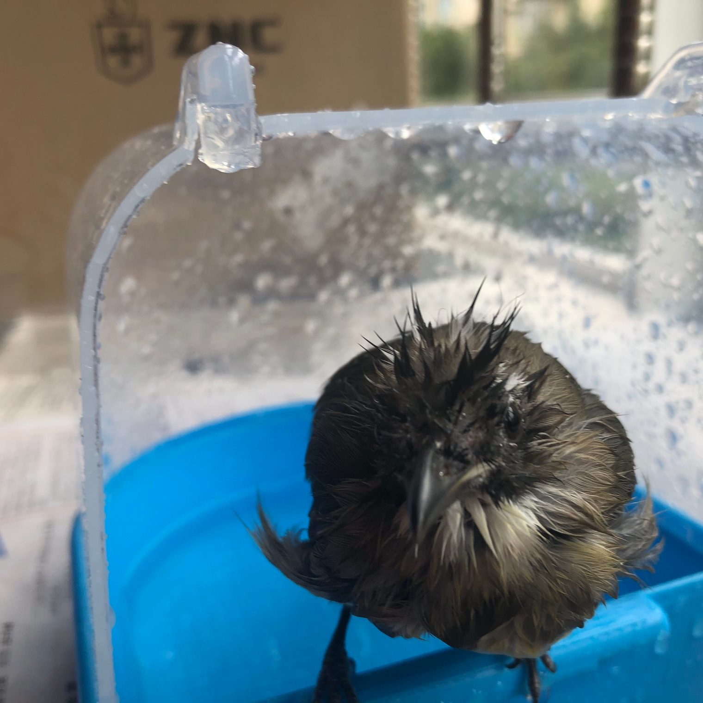

### Day 79 - August 9

Another bright day. I secretly filmed his bath while he wasn't looking.

### Day 84 - August 14

I shot a little video of him preening after his bath, in HD and uncensored (he really does love my monitor). The season must be about to change, because he's moulting heavily. Oh, and he likes to eat his own feathers (quality protein?), so I came up with a little game: when I find a feather he has dropped, I show it to him and toss it in the air, and he picks his moment, flies over, catches it precisely and eats it (am I training a dog??). Another game he never tires of is duelling with people's fingers and toes, feathers all bristling in fury, but without biting very hard, while making strange sounds that seem almost coaxing (flirting???). When he can't beat a human hand, he gets so cross he flaps up and stands on it: can't beat you, but I can still stand on you.

Speaking of coaxing, a couple of days ago I found him standing on my chair, practising courtship at thin air: crouching low, trembling his wings, sometimes cooing and sometimes singing... The troubles of adolescence have begun. Where am I going to find him a little girlfriend... The flower and bird market doesn't sell this bird, and even if it did, it's closed because of the pandemic... So the current plan is to wait until next spring and summer, and after a big storm go and look under the trees, one by one, for more fallen chicks (does that count as a plan)... After all, bulbuls can live ten to fifteen years, so a girlfriend a year younger would be just right (though I might pick up a boyfriend instead).

### Day 95 - August 25

Every sunny morning he likes to tuck himself into the east side of the bay window to sunbathe for a few minutes, feathers spread, eyes glazed, beak slightly open... Anyone who didn't know might think he was sitting on eggs... He's actually charging his solar panels XD

### Day 99 - August 29

He's so obsessed with my phone that it's very hard to catch a full-body shot of him... he basically lunges at it faster than the phone can autofocus... This time I at least got one with his head half white and his tail feathers, flight feathers and eyes all sharp. In the daytime I took him to the park in the car. On the way we went through a tunnel and the flickering light and shadow scared him into flapping wildly, but once we were in the park he started singing again. He probably loves the air smelling of grass and trees, the insects' buzzing and the other birds' calls. Beyond that, his biggest haul was probably a dozen or twenty ants, wild game, straight into his belly. On the way back, when we hit the tunnel again, he wasn't scared anymore. Some adaptability! I should take him out for walks more often.

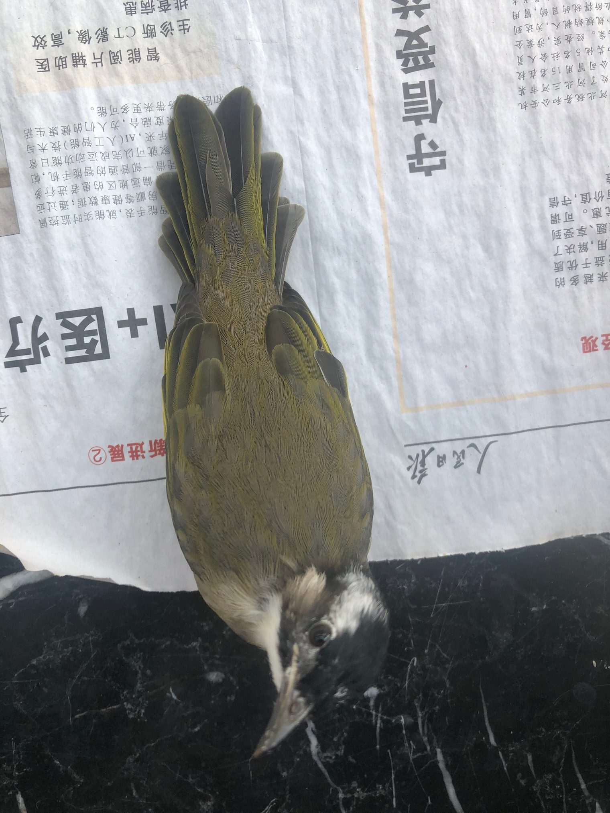

### Day 100 - August 30

The day before, I noticed lots of little black berries had fallen from the trees in our compound, with a faint fresh smell. Only then did I realize these were the privet berries I'd read about online, one of the fruits bulbuls like, and probably also what the big birds' black droppings came from. I brought two back and put them in his food trough. A little later they were gone. He really eats everything. I forgot to mention earlier: every day, when our family sits down to eat, he flies from shoulder to shoulder, begging for or grabbing all sorts of food, and his everyday tastings also include my socks... A real little glutton. Today I went and picked up a few more. Enjoy, sir, and happy 100 days.

---

Afterword: [Thank You for Sheltering from the Rain](thanks-for-sheltering-from-the-rain.en.html).
