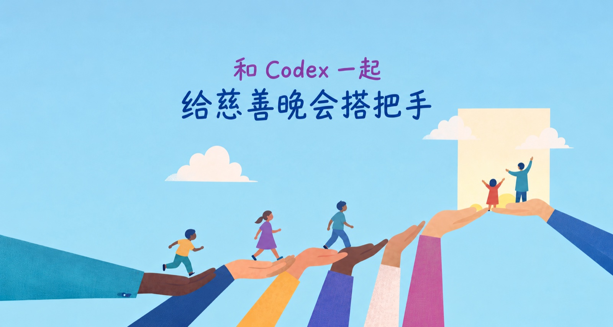

# 和 Codex 一起，给慈善晚会搭把手

今年又参与了晓日春晖的年度慈善晚会，很高兴能继续贡献一份自己的力量。跟去年相比，这回多了几个 AI 帮手，花的时间少了，能做的事情却多了不少：宣传页面开发部署、拍卖系统的需求对接和测试、拍品信息维护、在线认捐表制作、宣传文案，还有活动结束后的各种收尾。

其中有些事情，以前也能做，就是比较费时间；有些则是因为有了 AI，才有余力多接一点。整个过程有不少省心的地方，也有一些预想之外的小插曲，值得记下来。

先说活动页面。活动团队提供设计稿，我让 Codex 根据 Illustrator 和 PDF 做成网页，适配手机、部署预览，再根据反馈修改，陆续接上场刊、拍卖链接和二维码。拍卖平台则由另一支开发团队负责，我带着 Codex 参与需求对接、资料准备和测试。

网页搭起来很快，但把细节做好，还是要来回看几轮。设计稿上用来说明交互的“link to PDF”，曾被原样放进页面；人物照片的裁切、Logo 大小、字号，也需要逐处调整。原稿没有手机版，多列赞助名单整张缩到手机上，字就小得看不清了，于是重新排名单和 Logo，再处理某一行只剩一个名字、却没有居中之类的小问题。

这些事情都不算特别难，但很碎。现在可以直接指出哪里不对，让 Codex 修改、部署，再打开看看。省下来的主要是实现过程中的精力，我可以更多地关注最后的效果。

接下来是拍品资料。Excel、PDF、图片文件夹，再加上聊天里陆续补充的信息，一场活动推进下来，文件版本很容易多起来。

有一次图片和编号怎么都对不上，查了一圈，发现我们和活动团队看的不是同一份表。后来把主表固定到一个地方，旧版本归档，后续围绕同一份表更新，才少了很多来回核对。Codex 则负责批量检查字段、找图片引用错误、比较 PDF 和 Excel 里的差异。这类工作交给它，确实能省不少眼力。

不过，它也会有点过于热心。原表的捐赠人栏里有一个“5000”，Codex 觉得这大概是最低加价，就把它移了过去。推测听起来很合理，但毕竟没有人确认过。复核后，我们把相关字段留空，将猜测写进备注，再找活动团队确认。

后来我就更倾向于让它先把材料过一遍，把有疑问的地方挑出来，集中确认。它可以帮忙发现问题，暂时不知道答案的地方，也可以先不知道。

图片又是另一组小麻烦。有的文件后缀叫 JPG，实际却是 PSD；有的原图太大，超过上传限制；长幅画作放进系统，上下又被裁掉。一次尝试用生成式 AI 处理图片，还改动了包装上的文字，这当然不能用。

最后，最管用的往往还是那些简单办法：检查格式、压缩副本、等比例缩放、加白边，原图留好。让画完整地出现在页面里，有时只需要一个方形白底。

测试拍卖系统也是 AI 帮忙很多的地方。Codex 可以通过浏览器操作后台，导入拍品，再去客户端检查分类、图片、详情和出价入口。

测试时发现过，同一件拍品在列表、详情和默认出价里显示的金额不一致，甚至刚打开时还是对的，等一下又跳回了旧值。如果只看后台那句“导入成功”，这些问题就很容易漏掉。

发现问题后，它可以把具体拍品、操作步骤和截图整理出来，我再转给开发团队。对方修好，我们沿着原来的路径再测一遍。我少做了很多重复操作，也更容易把问题讲清楚。

报告本身也经过了一轮精简。有一份五页的问题报告，后来压到了一页，只保留需要开发处理的关键问题。有些图片显示不完整，既然加白底就能解决，我们就先把图片处理好。临近活动，大家手里的事情都不少，反馈写得清楚、简短一点，也方便对方接着做。

当然，AI 工具自己也会卡住。浏览器控制有过反复连不上的时候，排查后才发现卡在工具自己的配置加载环节。共享 Excel 被别人打开时，回存也会遇到文件锁，只能等一等，再拿最新版合并修改。有些图片上传后，还需要开发团队额外处理才能正常显示。

所以实际过程里，人和 agent 经常是交替接手的。一边补资料，一边核对，一边解决遇到的新问题。

晚会结束后的补拍，还发生过一次值得记住的失误。最初我们考虑把剩余拍品统一打八折，后来我改了方案，但 Codex 仍然沿用了旧决定，给六件拍品打了折。我看到后指出问题，它先检查没有新出价，再把价格恢复。

这让我对长对话有了更具体的认识：历史都在，并不代表 agent 就一定分得清，哪些决定现在还有效。尤其涉及价格、时间、上下架，执行前把当前方案重新说清楚，还是很有必要的。否则人这边已经翻篇了，它还在认真执行前几页。

后面，我们又把纸本认捐表搬到了 Google Forms，写补拍宣传文案，保存结果、整理交接。这些事情单独看都不大，加在一起却很花时间。有 AI 帮忙后，我确实可以少花一些时间在表格、网页和反复核对上，多接住一点原本未必顾得过来的工作。

不过，回头看这次经历，我最大的感受有两面。

一面是，AI 减少了大量系统和数据对接的摩擦，减轻了测试和开发的负担。很多以前想到就觉得费劲的事情，现在可以先做起来，再慢慢改。

另一面是，整个过程里最费劲的部分，仍然是 **context 没有打通**。

活动相关的沟通在微信里，分散在不同人、不同 group 之间；Codex 在几个会话里工作；拍卖平台的后台和客户端，又各自显示一部分状态。

于是，我需要把微信里的新决定带给 Codex，把它发现的问题整理给开发，再把开发的答复带回来，让它复测，最后把结果告诉活动团队。

一项改动已经在群里确认了，文档可能还写着“待确认”；后台已经更新，表格还没同步；某个方案已经取消，长对话里仍然留着旧版本。要让 AI 帮忙，往往得先由我把这些前因后果重新拼起来。

多方一起筹备活动，信息随着事情的发展不断补充，是很自然的。我自己参与其中，才更具体地体会到：单个环节做快了，整条链路未必能按同样的比例变快。AI 已经接下了不少执行工作，而跨工具、跨对话的上下文，仍然需要人来连接。

这次能顺利推进，离不开活动团队和开发团队不断补充资料、核对细节、处理临时变化。也是在这样的配合里，我开始对未来多了一点想象。

假如从 first principles 出发，暂时放下现有工具和平台的边界，不受限地想一想，以后我们有没有可能更轻松地做同样的事情？

或许，人和 agent 可以更自然地在一起协作，需求、相关知识、问题列表和最新决定，都能在一个共享的工作环境里持续更新、流通。一个改动确认后，需要它的人和 agent 就能知道；一个问题解决后，结果也能回到原来的记录里；新决定替代了旧方案，不必再靠谁记得提醒一遍。

这样，大家或许能少花一点时间传递和核对信息，把更多精力留给沟通、判断，以及活动本身。

具体会长成什么样，我现在也没有答案。这次经历只是让我觉得，这个方向很值得继续探索。能借助 AI 为活动多出一点力，已经是一件很开心的事；如果以后还能让大家配合得更轻松一些，就更好了。

无限进步！
