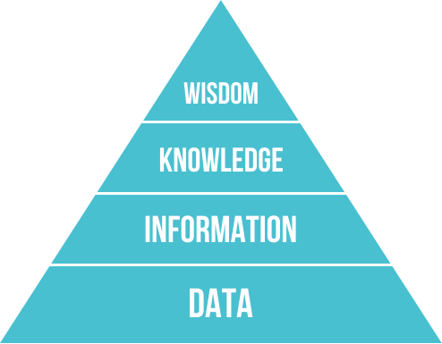

# Data, Information, Knowledge, Wisdom

The DIKW hierarchy

The figure above shows the DIKW hierarchy, a pyramid of four layers: data, information, knowledge and wisdom. The whole process can be roughly summed up as **bottom-up, then top-down.**

Data is what actually carries information; information is obtained by processing data. Data is neither right nor wrong, but the information obtained from it may be wrong (failing to reflect the real situation). Data from noisy environments in particular is more likely to lead to wrong information. Sources of information vary widely in quality, and the truly valuable information is often swept along in a mass of redundant, wrong and ever-exploding information.

Knowledge is valuable information (for the definition, see the World Bank's *World Development Report 1998/99: Knowledge for Development*): it is the information that remains after filtering, and by this definition knowledge too can be right or wrong. At the large scale, new data and information may extend correct knowledge, while mistaken knowledge stands to be overturned. The vast body of human knowledge we can see today is the good result of a long process of iteration. From the individual's standpoint, though, each person's energy and ability are quite limited, and **eating whatever comes to hand when starving (quality) and gorging (quantity) usually end in indigestion, even stomach ache and diarrhoea**, which is of course harmful to the individual.

As for the level of wisdom, I think that what we can take in directly from outside goes no higher than knowledge; **wisdom can only come from within.** Through reading or anything else, taking things in from outside is necessary, but if you only take them in without digesting and absorbing them, it is wasted and cannot produce the least bit of wisdom.
