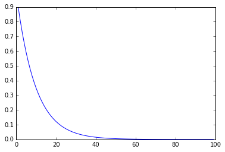
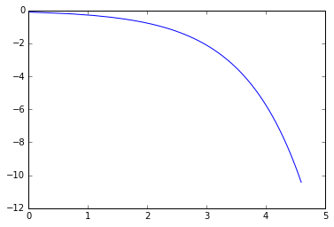
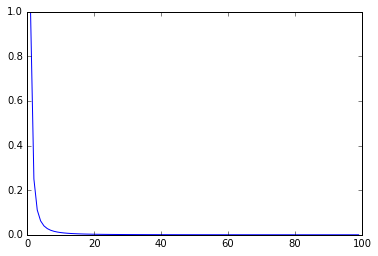
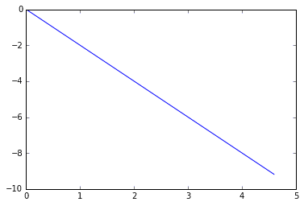

# 指数分布与幂律分布的图像对比

指数分布（exponential distribution）和幂律分布（power-law distribution）有时看起来很是相似，但实际上极为不同。我用python做了两种分布的函数plotting，方便直观理解。可以看到，两种函数转化为双对数形式（这里我用的math.log()是自然对数ln）后图像差异非常明显。

注释里我给出了几个图分别对应的解析式，另外注意因为这里是用离散的点集近似，相当于对分布函数曲线的采样，所以可以得到一个power-law的数值mean，数学上power-law的均值存在须满足一些条件。

```python
import matplotlib.pyplot as plt
import math

%matplotlib inline
```


```python
# exponential distribution
# y = c ** x
x = list(range(1,100))
c = 0.9
y = [c**i for i in x]
print('mean: {}'.format(sum(y)/len(y))) # exponent has mean which equals to the exponent c
plt.plot(x,y)
plt.show()
```

    mean: 0.09090640793950629





```python
# log-log exponential distribution
# y_ln = ln(c) * exp(x_ln)

x_ln = [math.log(i) for i in x]
y_ln = [math.log(i) for i in y]
plt.plot(x_ln,y_ln)
plt.show()
```





```python
# power-law distribution
# y = x ** c

x = list(range(1,100))
c = -2
y = [i**c for i in x]
print('mean: {}'.format(sum(y)/len(y))) # power-law has no mean
plt.plot(x,y)
plt.show()
```

    mean: 0.016513978789746385





```python
# log-log power-law distribution
# y_ln = c * x_ln

x_ln = [math.log(i) for i in x]
y_ln = [math.log(i) for i in y]
plt.plot(x_ln,y_ln)
plt.show()
```


