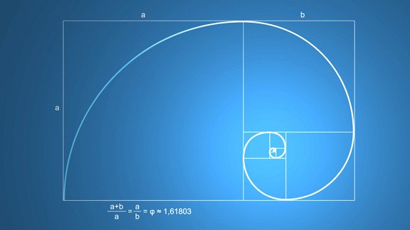
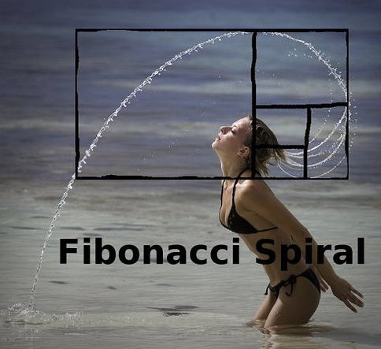

# The Golden Ratio and Design

#### The Fibonacci Sequence and the Golden Ratio

Anyone who likes art, design or mathematics must know something about the name "Fibonacci".

Fibonacci was an Italian mathematician who lived in the 12th and 13th centuries. In his writings he mentioned a famous sequence, which goes like this:

> 0, 1, 1, 2, 3, 5, 8, 13, 21, 34, 55, 89, 144, 233, 377, 610, 987, ...

What marks this sequence out is that every number in it equals the sum of the two before it. Of course, that is surely not why the Fibonacci sequence is so well known. It is well known because the "golden ratio" lies hidden in it.

The ratio of two neighbouring numbers in the Fibonacci sequence (0/1, 1/1, 1/2, 2/3, ...) gets closer and closer, as the sequence goes on, to an irrational number: (√5-1)/2, which as a decimal is 0.618… This number is usually written with the Greek letter Φ.

Now for another number. Divide a line segment into two parts so that the ratio of the longer part to the shorter one equals the ratio of the whole segment to the longer part. That ratio is an irrational number, (√5+1)/2, which as a decimal is 1.618..., usually written with the Greek letter φ.

The ways we arrived at these two numbers seem to have no obvious connection (although in fact they do), yet they are a pair that simply has to be mentioned in the same breath. Irrational as they are, they are, uncannily, each other's reciprocal, and, eerily, they differ by exactly the natural number 1. That is:

> 0.618... : 1 = 1 : 1.618... = 1 : (0.618... + 1)  -> 
> Φ = 1/(Φ+1)= 1/φ

This pair, φ and Φ, is what is called the "golden ratio".

The golden ratio earned the name "golden" because it turns up, unexpectedly, in every corner of the natural world (living things, physics and chemistry) and the man-made one (art, design), and the ancients believed it held a mysterious and powerful force. Concrete examples are described in all sorts of encyclopedias, popular science sites and even gathering places for unconventional flights of fancy, so I won't list them here. Some may ask whether there are silver and bronze ratios too. The answer: there really are. Wikipedia is just around the corner: [metallic means](https://en.wikipedia.org/wiki/Metallic_mean).

#### The Golden Ratio in Design

The golden ratio's inner beauty and outer fame have led to its wide use in design, past and present, East and West.

The golden rectangle and the golden spiral, the geometric constructions that correspond to the golden ratio, stand in a chicken-and-egg relation with it, and are often used as guide lines in graphic design. The relation among the three can be shown in full in a single picture:

The golden spiral is also called the equiangular spiral, and it has many special geometric properties too, such as self-similarity (magnified, it is exactly the same as the original). The famous 17th-century mathematician Jacob Bernoulli even left instructions that this curve be carved on his tombstone, with the words "Though changed, I remain the same" (eadem mutata resurgo). By the way, the golden spiral is easily confused with the arithmetic spiral (also called the Archimedean spiral), but the two are not the same. Poor old Jacob: in the end, the curve on his tombstone was carved wrong.

The golden rectangle is self-similar as well: every golden rectangle can always be divided into a square and a smaller golden rectangle.

Next, let's look at a widely circulated picture:

What this picture sets out to show is that the design of Apple's logo may also have used the golden ratio. Setting aside whether the picture is far-fetched and forced, the question that interests us is this: what role do the golden section and other guide lines actually play in design? Let's look at this answer by @AllanLi on Zhihu:

> Apart from the beauty of the proportions, in early visual design, by which I mean before computers were widespread, one big function of logo or brand design was to make it easy to reproduce and spread.

[The rest of the answer, paraphrased: a logo without good proportions, or without a method by which it can be reconstructed, is hard to cut and produce at different sizes, which is why VI (visual identity) design standardizes a logo in units such as 1X, 2X and 4X and uses circles and other proportional shapes so that every part can be scaled for later production and enlargement; once the artistic form is done, precise proportions turn it into a more rational final logo. Since computers became common, reconstructing proportions matters less, but using proportions still carries on people's aesthetic principles, so it remains a necessary step at some stages. Working backwards is a way of checking a design's thinking and technical problems on screen or in sketches; you will understand once you have made a few logos yourself.]

Now let's look at what @未成年的揣想 thinks:

> Taken on its own, the golden ratio is something you could easily find ten reasons to refute; the key is that when designers design a logo, the golden ratio is a very good reference method, which makes it fairly easy for them to find mature, suitable proportions.

[It goes on, paraphrased: it may not suit every logo, but it is a very general method, and once we accept that every design method has its limits, the golden-ratio question should be clear to all.]

(The two Zhihu answers were written in Chinese. The sentence quoted from each is my translation; the rest is paraphrased in brackets.)

From all this, we can roughly sum up the role that the golden ratio and similar guide figures play in design:

- As a rational reference while designing (whether looking for inspiration at the start or fine-tuning at the end)
- To make a design precise and measurable, so that it is easy to reproduce and spread
- For a bit of fun when you're bored, like the picture below (stretching the golden ratio this far for the sake of a beauty, well, what can I say >_<):

[An article](https://medium.com/@gpeuc/design-is-not-art-d229af10c167) on Medium sets out the differences between art and design. From the Chinese version translated by @fmsbi, the first two points:

- Art discovers problems; design solves them
- Art needs explaining; design is a kind of consensus

[The other four points, paraphrased: art is exploration where design is observation and iteration; art is made for artists and design for end users; art has no aim while design has a particular, clear one; and art follows style where design follows function.]

(The two points are translated back from the Chinese, so the wording is not the original article's.)

Perhaps we could also sum it up by analogy: art is dancing, and design is dancing with shackles on. The golden ratio is perhaps one such shackle, restricting design's steps and yet making it shine.
