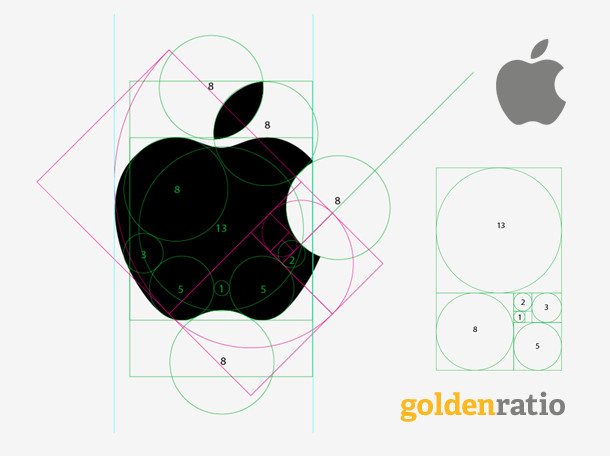

# 黄金比例与设计

#### 斐波那契数列与黄金比例

但凡喜欢美术、设计或是数学的人，一定都对“斐波那契”这四个字有一定的了解。

斐波那契是生活在12至13世纪的意大利数学家，他在自己的著作中提到了一个著名的数列，这个数列是这样的：

> 0, 1, 1, 2, 3, 5, 8, 13, 21, 34, 55, 89, 144, 233, 377, 610, 987, ...

这个数列的特点是：数列中的每个数，都等于它之前的两个数的和。当然，斐波那契数列之所以广为人知，肯定不是因为这个特点，而是因为在它的身上潜藏着“黄金比例”。

斐波那契数列中相邻两个数的比值（0/1, 1/1, 1/2, 2/3, ...）会随序号的增加逐渐逼近一个无理数：(√5-1)/2，写成小数就是0.618…这个数一般用希腊字母Φ表示。

再来说说另一个数。将一条线段分成两截，使较长那截与较短那截的长度比，等于整条线段与较长那截的长度比，那么这个比值是一个无理数：(√5+1)/2，写成小数就是1.618...，一般用希腊字母φ表示。

看起来，我们得到这两个数的方法彼此没什么明显联系（虽然实际上并非没有），但是它们却是不得不拿来“相提并论”的一对数，因为作为无理数，它们不仅神一般地互为倒数，而且还鬼一般地恰好相差为自然数1，也就是说：

> 0.618... : 1 = 1 : 1.618... = 1 : (0.618... + 1)  -> 
> Φ = 1/(Φ+1)= 1/φ

这一对φ和Φ，便是所谓的“黄金比例”。

黄金比例之所以被冠以“黄金”之名，是因为它令人意想不到地广泛存在于自然（生物、理化）和非自然（艺术、设计）的各个角落，而被古人相信具有神秘而强大的力量。具体的例子在各种百科、科普网站乃至非常规脑洞集散地都有描述，在此不详细陈列了。有人或许会问，那还有没有白银、青铜比例呢，答案是：还真有。出门右转维基百科：[贵金属比例](http://zh.wikipedia.org/zh-cn/%E8%B2%B4%E9%87%91%E5%B1%AC%E6%AF%94%E4%BE%8B)。

#### 黄金比例与设计应用

黄金比例身上带有的内在美感和外在名气，使其在古今中外的设计中都被加以广泛的应用。

黄金矩形和黄金曲线作为黄金比例对应的几何构造，与黄金比例间存在着“鸡生蛋，蛋生鸡”的关系，常被用作图形设计的辅助线。三者间的关系可以用一张图完整地表示出来：

黄金曲线也被叫做等角螺线，在几何上也具有许多特别的性质，比如自相似（经放大后与原图完全相同），17世纪的著名数学家雅各布·伯努利还曾因此遗言要将这曲线刻在墓碑上，并附以颂词：“纵使改变，依然故我”(eadem mutata resurgo)。顺便一提，黄金曲线与等速螺线（也称阿基米德螺线）很容易混淆，但并不等价。悲催的雅各布童鞋，最后墓碑上的曲线就被刻错了。

黄金矩形同样具有自相似性，每一个黄金矩形总可以被分割成一个正方形加一个小的黄金矩形。

接下来，让我们看一张流传较广的图：

这张图意图反映的是：苹果公司logo的设计可能也存在黄金比例的应用。姑且不论这张图是否属于牵强附会和生搬硬凑，我们感兴趣的问题是：黄金分割与其他一些辅助线，它们到底对设计起到了什么样的作用呢？让我们来看知乎上 @AllanLi 的这样一个答案：

> 除了比例的美感之外，在早期的视觉设计，我指电脑普及之前。logo或品牌设计有一个大的作用是便于复制与传播。

> 如果一个logo没有良好的比例关系或可以推导的复原制作工艺，很难应用在不同大小比例的切割与制作之上，因此如果你在早些年的美术学校有学过VI设计的话会知道。logo需要比例化与标准化，在VI设计图上就会有众多如1X（1倍）、2X、4X的单位，同时通过圆形等比例化图形、保证logo中的各个部分都可以被比例化以便于后期加工与复制、放大。因此在完成了logo的艺术造型之后、要通过精确比例化来考虑各个局部的比例关系、再推导出比艺术造型更理性的最终成品logo。

> 在电脑普及之后虽然比例复原已经不再重要，特别是互联网上的低成本的logo作品，但是在logo设计中采用比例仍然可以很好的延续人的审美原则，因此在某一阶段或重视的情况下仍然是一个必不可少的步骤。

> 反导过程是检视作品思维过程和技术问题、直接在电脑或草图中完成，不作细节解释。如果你自己做几个logo之后就明白了。

再来看看 @未成年的揣想 的想法：

> 拿黄金比例要单独去说，你可以随便找出10个理由来反驳，关键是设计师在设计logo的时候，黄金比例是一种非常不错的参考方法，可以方便设计师较为容易的找到成熟合适的比例，虽不一定适合所有的logo设计，但它是非常通用的一种设计方法，我们只要知道设计方法都有其局限性，黄金比例这个事大家就应该明了了。

到此，我们大概可以总结出黄金比例等辅助图形在设计中起到的作用：

- 作为一种设计时的理性参考（无论是前期找灵感还是后期微调）
- 保证设计的精确和可计量，从而方便复制和传播
- 用于无聊时找找乐子，比如下面这张图（为了美女黄金比例被拉伸成这样也是醉了>_<）：

Medium 上有[一篇文章](https://medium.com/@gpeuc/design-is-not-art-d229af10c167)中分析到艺术和设计的不同之处（ @fmsbi 翻译）：

- 艺术发现问题，设计解决问题
- 艺术需要解释，设计是种共识
- 艺术是一种探索，设计是一种观察与迭代
- 艺术为艺术家们创造，设计为最终用户创造
- 艺术没目的，设计有特殊的明确目的
- 艺术追随风格，设计追随功能

我们或许还可以用比拟的方式来总结：艺术就是舞蹈，而设计则是戴着镣铐起舞（dance with shackles on）。黄金比例大概便算是这样一种镣铐，限制设计的舞步，却又使它闪闪发亮。
