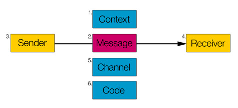

# Media and Content Business (1): Communication Models

*Note, 2026: this is the only part of the series that was ever published; the others remained drafts.*

### Preface

The *Media and Content Business* series grew out of a draft I wrote a few years ago, ["The Limits of Streaming Media"](https://www.jianshu.com/p/581fe91d39a5) (in Chinese), which tried to think fairly systematically about streaming media such as audio and video. As scattered material and ideas piled up over a long time, the scope of my thinking gradually extended to more everyday forms of media, such as print text and images and interactive media (software, games), to comparisons between media, and to how media evolve and merge.

The thinking pays particular attention to the relationship between the nature of a medium and its business ecosystem, which helps with some interesting concrete questions, such as: why do the business models of online music and online video differ? What are the pros and cons of online music compared with CDs? How has digitisation changed the production and consumption of content, and what further possibilities will it open up?

I had originally planned to write all of this up as one long essay, but found that this meant fitting every scattered idea into a single framework from the top down, which made it much harder to write, so that in several years I made very little progress. From here on I'll try to break this big subject into a series, with each article covering only a narrower discussion focused on one aspect, without worrying too much about whether the discussions share a consistent framework.

The series contents (see below) and each article will keep being updated, adding to or revising what is there and strengthening the links with other discussions, so that a whole takes shape from the bottom up.

### Media and Communication Models

In [an earlier piece](http://www.jianshu.com/p/792086bda29c) I gave "media" some very shallow thought. The simplest definition of a medium may be "a channel": a medium is a channel for content. This explanation is actually very crude and raises plenty of questions. Here I'll quickly restate my understanding of two core questions: what is content? What is a channel?

What is content? Bob Dylan's "Blowin' in the Wind", an episode of *Romance in the Rain* that has been rerun a thousand-odd times, a Weibo post full of cute cat pictures, even a dirty joke you happen to overhear on the bus: these are all content. Content can be anything, text, images, sounds, smells and so on, that people can perceive and process into an actual meaning.

In the simplest communication model, the [Shannon-Weaver Model](https://en.wikipedia.org/wiki/Models_of_communication), the sender of a message, the receiver of the message and the channel that carries it together make it possible for the message to be transmitted. The message here leans towards the physical existence of the content, as distinct from the information the receiver finally extracts from it.

More complex models, such as [the six functions of language](https://en.wikipedia.org/wiki/Jakobson%27s_functions_of_language) proposed by Jakobson, focus on modelling linguistic communication and add code and context. The code describes the physical form of the message on its own, while the context stresses the importance of the information implicit in the situation.

However you classify or extend it, there is always an entity, or a set of entities, between the sender and the receiver that carries and transports the message. This series may use different divisions in different discussions, but most of the media it discusses will be divided the way print text and images, audio, video and games are, at the level of content consumption (rather than the technical or academic level). Media shape the physical form of content and affect how content spreads; the nature of a medium has an enormous influence on every aspect of the content business.

### Series Contents

(1): Communication Models 
(2): Streams and Streaming Media 
(3): The Online Music Business 
(4): The Nature of Media and Cognitive Science 
(5): From Composite Media to Atomised Control 
(6): Digitisation and the Evolution of Media
