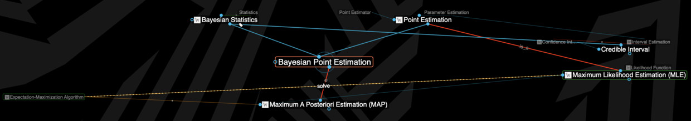

# MLE，MAP，EM 和 Point Estimation 之间的关系是怎样的？

关键词：参数估计 | 统计 | 机器学习

[原知乎问题](https://www.zhihu.com/question/19894595)

### 概念图

最近在尝试用thebrain画统计相关的概念图，标题里这几个东西从比较宏观的角度上看，关系大致是下面这样的。

### 解释

还是要大致解释一下。

首先要有样本（Sample）和总体（Population）的概念，假设我们认为总体对应了一个真实分布，那么总体就有了定义分布需要的参数（Parameter）。因为总体不可见，所以需要通过观察样本（**数据**）来估计总体的参数，这叫参数估计。

参数估计的结果可以是一个点（**Point Estimation**），也可以是一个区间（Interval Estimation）。无论是其中哪一类估计，都有多种估计的具体方法（Estimator），不同estimator表达了对**最优**估计的不同看法（其实estimator是一种**目标函数/模型**）。

比如，**最大似然估计（MLE）**和最小均方误差估计（MMSE）都属于点估计的estimator，前者使用了似然（Likelihood）的概念；**最大后验概率估计（MAP）**也一样，只是它是一种贝叶斯统计/贝叶斯点估计视角下的estimator，引入了贝叶斯定理、先/后验概率的概念。**MLE和MAP之间的关系**又是一个可以继续展开说的事情了，只提一下和先验概率（Prior Probability）及正则化（Regularization）有关。

而**期望最大化算法（Expectation-Maximization Algorithm）**则是一种可用来求解MLE和MAP的具体算法，它可以通过迭代不断给出新的解（估计值），直至收敛到estimator所定义的最优（其实是一种**优化方法**）。

### 不严谨的例子

参数估计是说我要通过一个样本（1000个中国人的身高）去估计全部中国人身高（总体）的分布，如果我们**猜测（假设）**总体满足正态分布，那么可估计的参数之一就是均值μ，另一个是标准差σ；

点估计是说我就猜均值是x，区间估计是说我猜均值落在某个范围；

MLE、MMSE、MAP等是说我认为怎样**猜测**，猜出来的人均身高是最优的，或者说最优的猜测是什么样的（可以看到猜测的方法无穷无尽，比如算样本均值、找众数，甚至从样本里随机选一个人的身高，都算是一种猜测方法、一种estimator，只是很多一看就知道不靠谱）；

EM算法是说你们争论完什么是最优了，那么我们就以这个最优为目标开始算吧，但不是每种最优的定义我EM都能算。

补充：注意上面的两个**猜测**很重要，意味着我们可能算出一个估计，不代表这个估计是足够好的。比如我们估计的是正态分布的参数，而实际上总体满足幂律分布，这时如何才能知道我们的猜测有问题呢？如果没有更多的测试，这其实是做不到的，但我们至少可以估计一下我们出错的概率有多大，这就涉及到假设检验（Hypothesis Testing）了。
