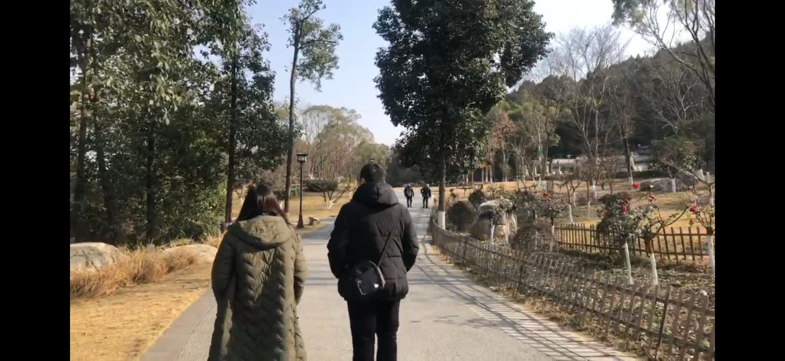
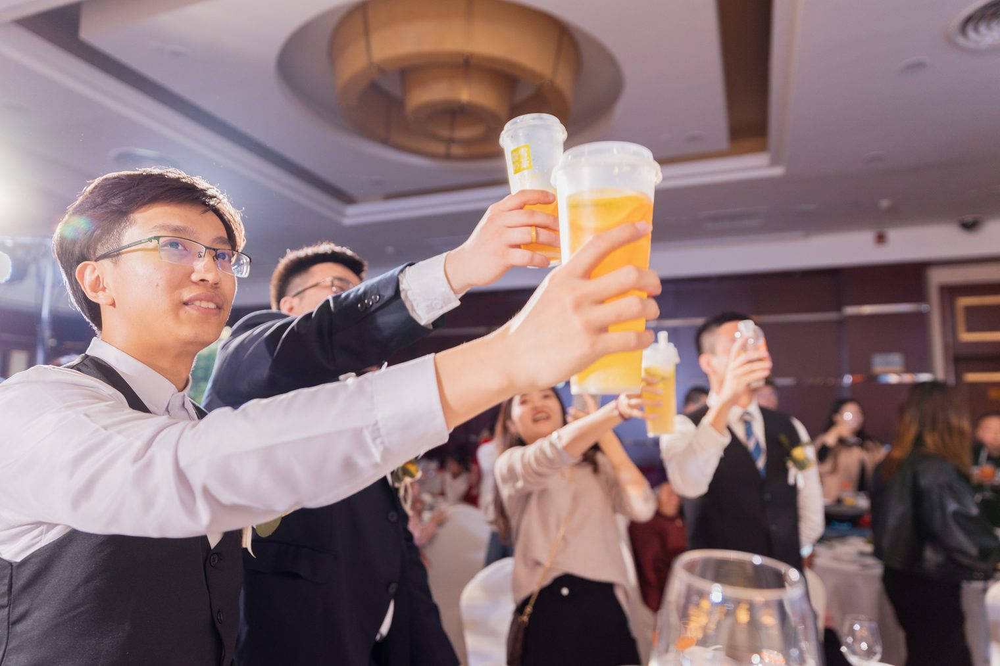
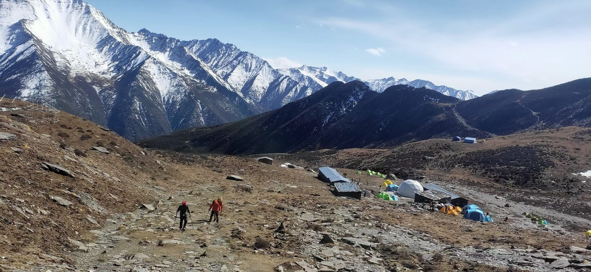
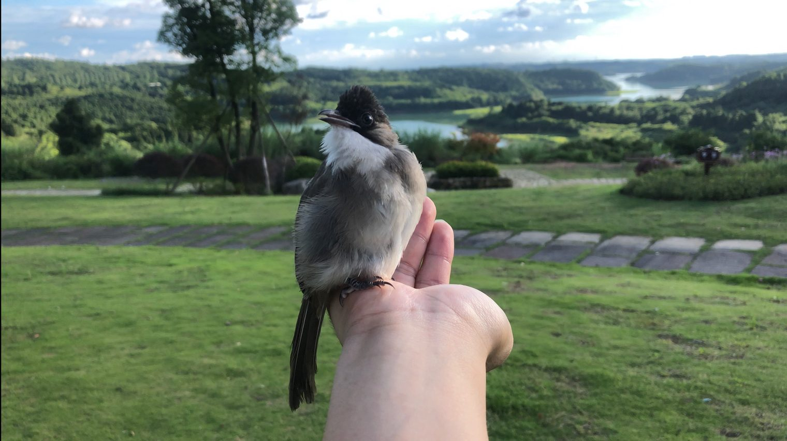
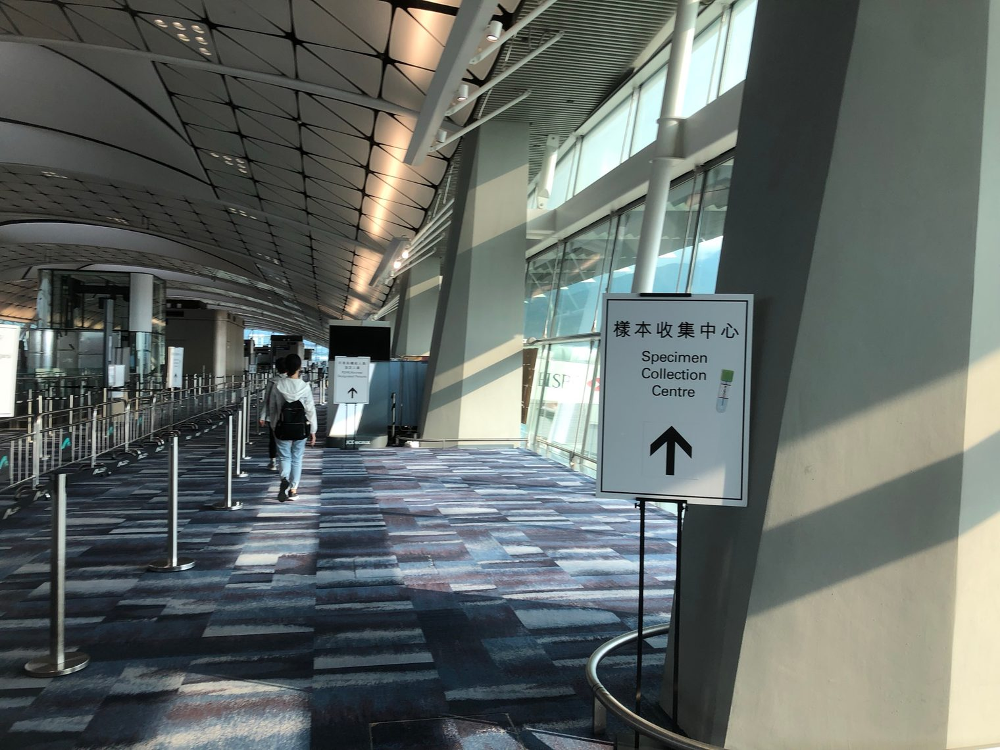
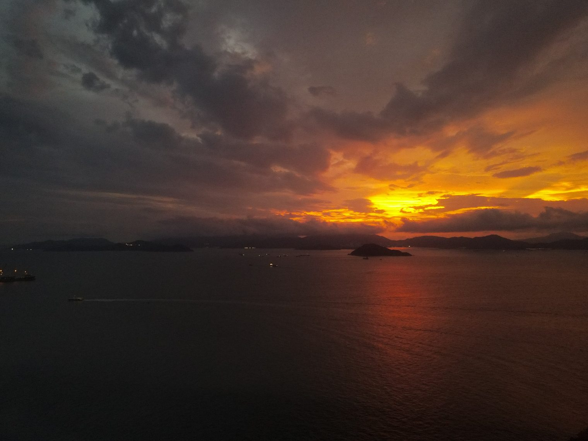
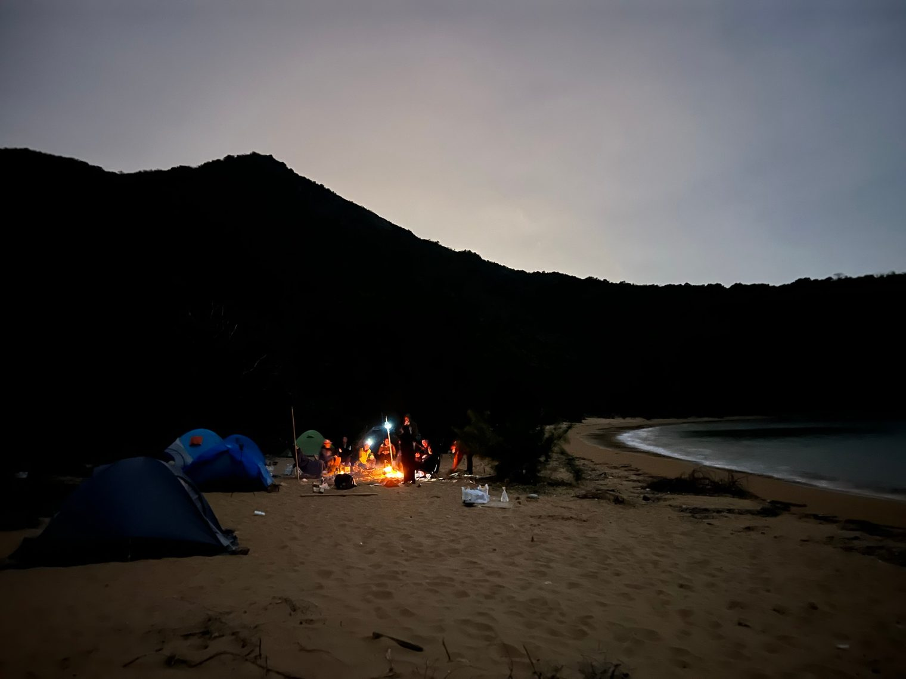
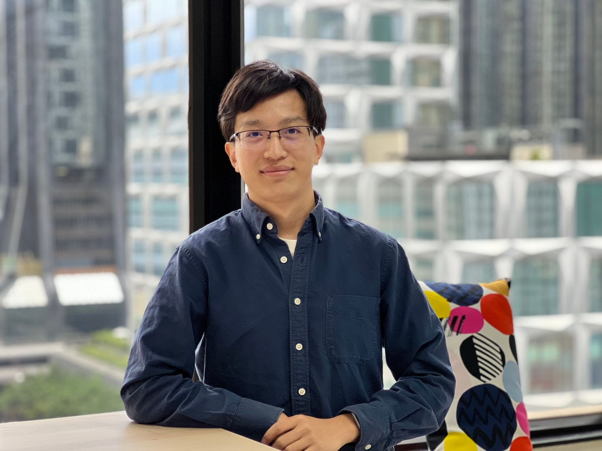
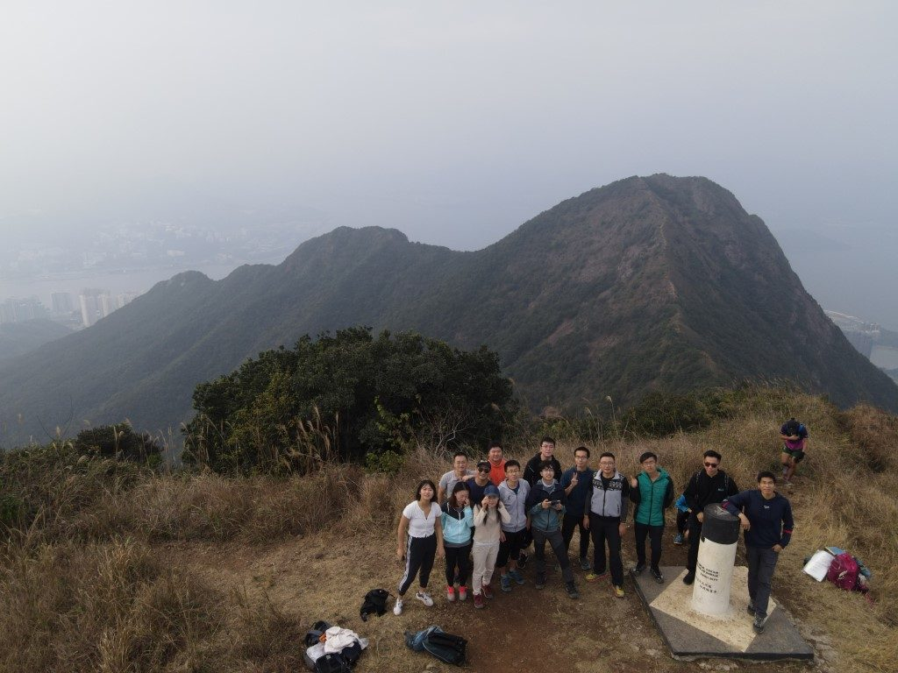

# My 2021 in Pictures

### Ordinary Days

The last notes of winter had not yet faded, and the spring sunshine was already showing through. The pandemic changed the course of our lives, but not all of it for the worse. The pandemic, together with a few other coincidences, ended up letting me work remotely from my hometown for a full year and a half. Every day and every hour of it was so ordinary, and yet so worth cherishing. Without the pandemic, these ordinary days, and many of the moments I mention below, might never have happened at all.

### At the Ceremony

In an age when we are so far apart and yet so close, how many good friends' weddings can one person make it to? I was very happy to take part in, and witness, this one-of-a-kind moment. What remains: glints of light, glimpses in flight.

### The Snow Mountain Trip

Right after that came my first-ever trip to a snow mountain. The journey to the summit was like a life in miniature, with every flavour in it. If you are not sure how to approach life, perhaps give it a try. For me, the deepest lesson was that the boundless view at the top would be pale and feeble indeed without every second along the way to hold it up.

### With Fluffball

In 2020, I met a little bulbul in early summer and parted from it in autumn. What I didn't expect was that in the early summer of 2021, as if the world had arranged it on purpose, I would meet one of its close relatives, but this time the parting came sooner and hurt more. Meeting is happiness and parting is pain; there is a time for meeting and a time for parting, and probably everything in the world has these two sides. I know that, materially speaking, these feelings are only biochemical reactions: oxytocin, dopamine, and the storms of electrical signals they set off in the brain, complex but not mysterious. But it is precisely because of these feelings that we can be said to be vividly alive. I think I will always miss these lovely lives I have met and parted from.

### The Way Back

After that parting came another parting, but it was also a return. "Return" is an interesting word: what kind of destination do you have to reach before it counts as a return? I think it depends on whether the destination holds a life you know, one that goes on day after day, plain and ordinary and reassuring. And something like the pandemic overturned the ordinary. It turned many things we took for granted, things we could do with a lift of the hand, into brand-new challenges, and made the familiar strange, turning a spacious airport, for instance, into a maze of checkpoint after checkpoint. As it did fourteen years ago, this reminded me once again that the ordinary is the least ordinary thing of all.

### Clouds, Sea and Sunset

Even scenery like clouds, the sea and sunsets is the same: they don't seem like things that change easily, yet what you see is never the same twice. On the scale of the whole universe, even the sun is like a flower that blooms for a single night, or as tiny and brief as a bacterium on that flower. Everything is spray thrown up from a sea of chaos, there for an instant and never to be repeated.

### The Exhibition *Serendipity in the Street*

Some of that spray we are lucky enough to record, so that it can be retold, and then it becomes a story. Like what this exhibition (which I came across by chance) recorded: during the pandemic, people of all sorts of backgrounds, brought together by chance, travelling from different corners of Hong Kong by different means of transport to the same street corner to kick a shuttlecock. Baffling, but utterly romantic.

### My First Camping Trip in Hong Kong

Like the memories before it, this camping trip was a wonderful experience of the same kind. However much we prepare in advance, we can only roughly steer what comes after. Looking back, nearly everything was improvised on the spot, and yet it all came so naturally, like this campfire. Who would have thought that on a lonely island there would be so much firewood, washed up from who knows where and dried out who knows when, waiting for us to pick it up and use it?

### Thirty

It was by the light of that night's campfire, too, that I greeted my thirtieth birthday. Just three days before, because of a chance need at work, I had also got a photo to keep as a memento. The ancients said that at thirty one takes one's stand. But what is it that one stands on? I think the most important thing is to set one's heart firm.

### The Last Hike of 2021

In the four months and more since I came back to Hong Kong, I have walked many different hills with many different people. The last hike of 2021 was Ma On Shan, wrapped in cloud and mist. I lugged a drone all the way up, huffing and puffing, but couldn't get a single shot of blue sky and white clouds. Recently I came across the name of a radio programme, *On a Clear Day* (在晴朗的一天出发, literally "Setting Out on a Clear Day"). But setting out on a day that isn't clear (in the figurative sense) is really nothing to worry about, because however thick the clouds, beyond them is still the boundless universe. Everything has its own flow, accidental and yet natural. For those of us in the midst of it, besides good health and being able to eat and sleep well, the most important and hardest thing to come by is probably a calm, clear state of mind, the spirit of *ichigo ichie*: this one time, this one meeting.
