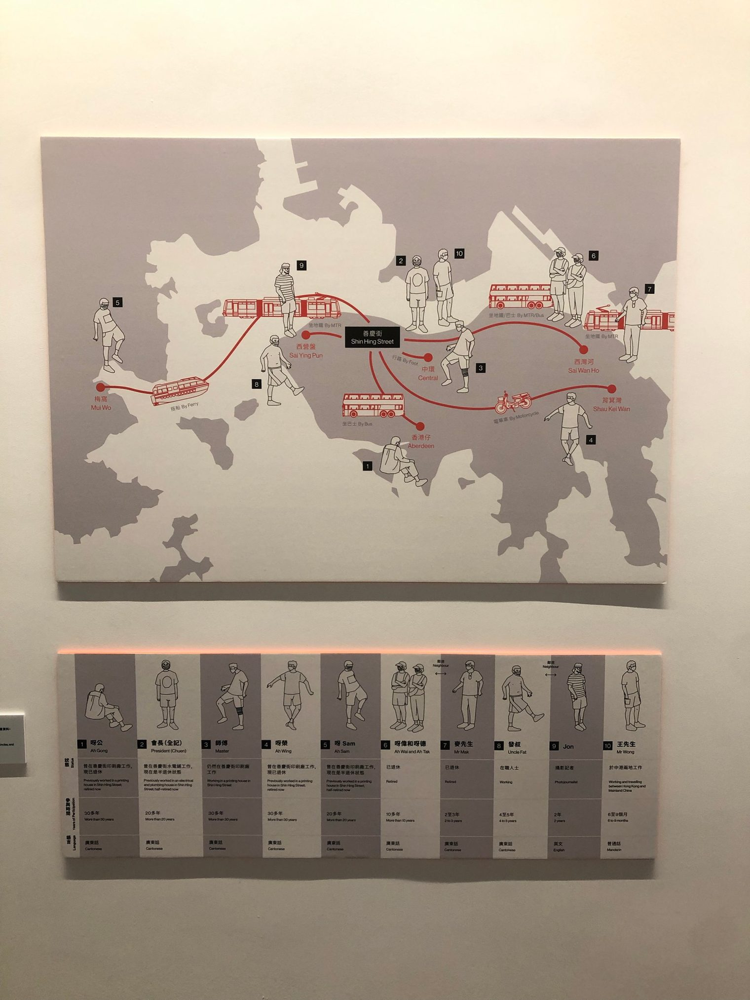

# 我的影像回忆2021

### 平凡日子

冬意的余韵未了，春日的阳光已露头角。疫情改变了我们的生命轨迹，但其中不一定都是坏事。疫情，加上其他一些巧合，最终使我得以在家乡远程工作了一年半之久，这中间的每一天、每个小时都那么平凡，却又那么值得珍惜。如果没有疫情，这些平凡日子，以及后面提到的很多瞬间可能根本就不会发生。

### 观礼

在一个这么远那么近的时代，一个人能参加到几个好友的婚礼呢？很开心能参与和见证这独一无二的时刻。留下浮光，掠影飞舞。

### 雪山之行

紧接着便是生平第一次的雪山之行。登峰的旅途恰似浓缩的人生，什么况味都在里面了。如果你不清楚该如何对待人生，或许可以一试。于我而言最深的体会是，顶上的无限风光，如果没有沿途的每一秒作为支撑，可就太苍白无力了。

### 与毛球

二〇二〇年，我与一只小白头翁在初夏相遇，又在秋天分离。没想到的是，二〇二一年的初夏，仿佛世界的刻意安排，我又遇到一只它的近亲，但这次分离更快也更痛苦。相遇是幸福的，分离是痛苦的，相遇与分离都有其时，世事大概都是这样的一体两面。我知道从物质上来说，这些感受只是些生化反应，是催产素，是多巴胺，是它们在大脑中激发的、像风暴一样的电信号，复杂、却不神秘。但正因为有这些感受，我们才算是鲜活地存在着。我想我会一直怀念这些人生中遇见又分离的可爱生命。

### 归途

分离之后是又一次分离，但同时也是回归。“回归”是一个很有意思的词，去到什么样的终点，才算是回归呢？我想，那取决于目的地之中是否存在一种你所熟悉的、日复一日的生活，平凡普通，让人心安。而疫情这样的东西颠覆了普通，让很多习以为常、举手间就能做到的事情，变成了全新的挑战；将你所熟悉的事物变得陌生，比如把宽敞的机场变成有一层层关卡的迷宫。像14年前一样，这又一次提醒我，平凡才是最不平凡的。

### 云、海与日落

就连云、海与日落这些风景也一样，好像不是那么易变的东西，然而每次所见绝不相同。从整个宇宙的尺度，连太阳都如昙花，甚至是花上的一个细菌那般微小短暂。一切都是混沌之海中涌现出的浪花，存于一瞬、不可复制。

### 展览「街角巧現」

一些浪花，被我们有幸记录下来，变得可以复述，这便成了故事。比如（我偶遇到的）这个展览中所记录的，这些疫情下背景各异的人，因机缘巧合偶遇，从香港的不同角落、借助不同的交通方式，赶到同一个街角踢毽子。莫名其妙，但浪漫至极。

### 在香港的第一次露营

同前面的这些回忆一样，这次露营也是这样奇妙的体验。我们提前做很多的准备，也只能大致引导之后的走向，回过头来看，几乎所有事情都是临场的即兴发挥，却是那么自然而然，比如这片营火的产生。谁能想到孤岛之上会有这么多不知哪里漂来，又何时已变得十分干燥的木柴等着我们捡起来用呢？

### 而立

也是在这晚的营火映照中，我迎接了自己的三十岁生日。仅仅在这之前三天，因为工作上的偶然需要，我又得到了一张相片可作留念。古云三十而立，立的到底是什么呢？我想，最重要的是立心。

### 二〇二一的最后一次行山

回到香港后的这四个多月里，我与许多不同的人，行了许多不同的山。二〇二一年的最后一次行山是马鞍山，山上云雾弥漫。背着无人机吭哧一路，却拍不到蓝天白云。最近看到一个电台节目的名字叫做《在晴朗的一天出发》。但在（比喻意味上的）不晴朗的一天里出发，其实也完全不用担心，因为云层再厚，外面仍是无垠的宇宙。万事万物都自有它的流动，偶然又自然。对身处其中的我们自己而言，除了身体健康、能吃能睡，最重要也最难得的大概是那种宁静澄澈、一期一会的心境。
