# My 2022 in Pictures

Foreword: by the time I finished, this piece had gone beyond what I expected. 2022 was a special year, and I offer this as a partial record, to prove that I was here and that these things happened.

### Among the Hills

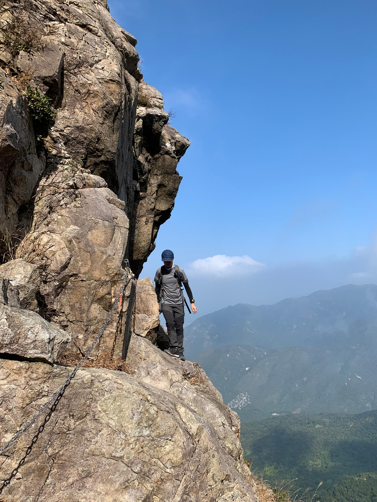

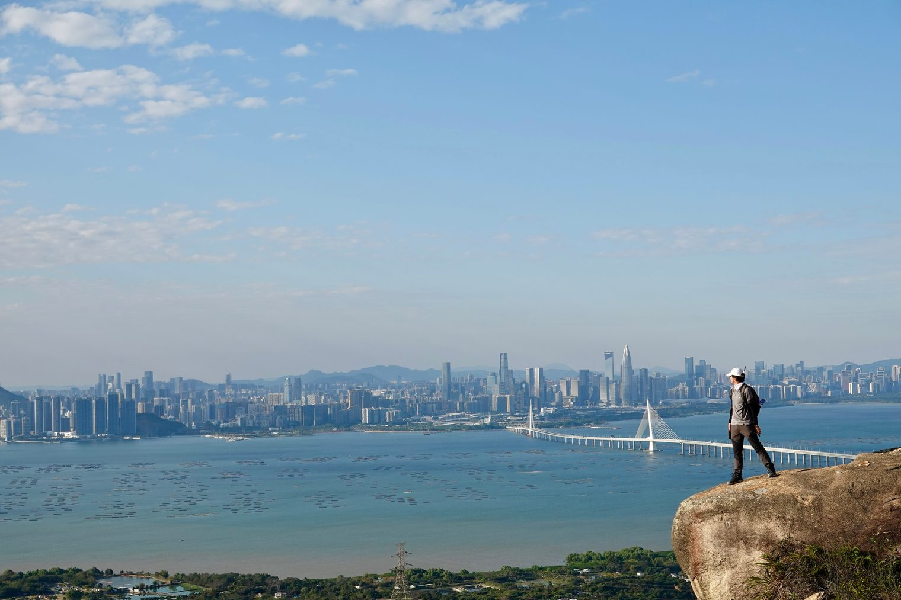

Carrying on the rhythm of the second half of 2021, the first anchors of memory in 2022 are two wonderful days in Hong Kong's hills in January: the Lo Hon Tower and the South and North Heaven Gates on Lantau Peak, and the Tai Shek Tsui and Ling Hui valleys in the hinterland of Castle Peak. The scenery was quite different: Lantau Peak had cloud, mist and sunshine, Castle Peak had strangely shaped gorges and a view across the bay. What they had in common is the old cliché: the other side of Hong Kong. The mountains and sea and the city are like two dimensions, opposed and contradictory and yet somehow consistent, just like the human heart. To this day it still amazes me.

Looking out from Castle Peak, Shenzhen across the water seemed so far and yet so near.

### The Stalled Days

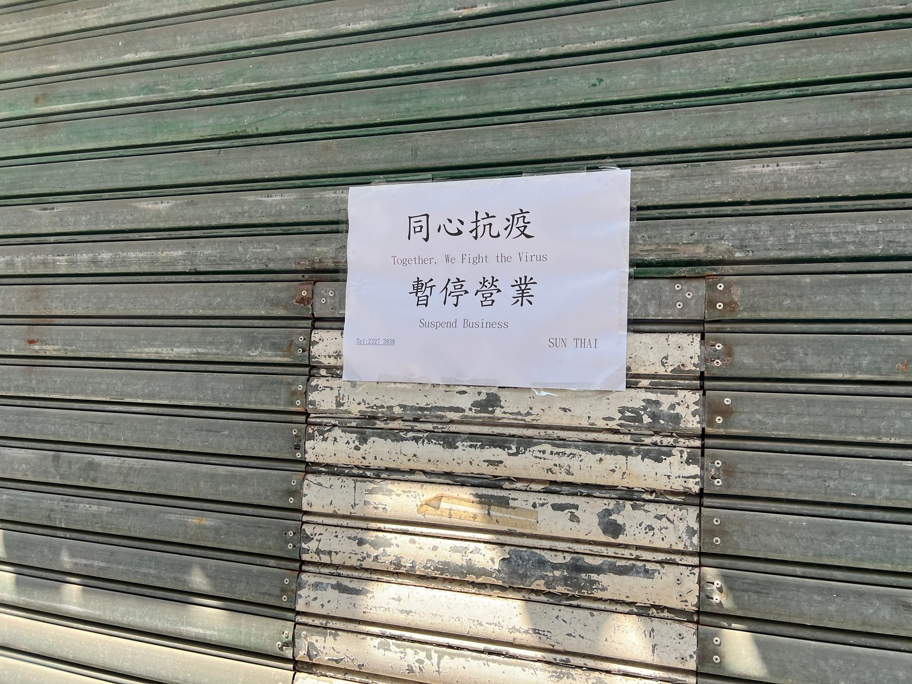

February was a hard month for everyone in Hong Kong. The outbreak kept hitting new highs, the anti-epidemic rules kept tightening, and the streets were far more desolate than at Chinese New Year. My company moved to remote working, and the intense outdoor activity of the previous few months had brought back an old knee injury, so neither work nor life gave me a reason to go out often. Nothing actually forced me, but I shut myself in my room for almost the whole month, getting out for air only when I went downstairs to buy takeaway. Time seemed to stand still. This is the sand of our times; no one is spared, but at least we can keep a record.

The one brighter memory is a lunchtime walk. It was an extremely bright, sunny Friday, and I took the new phone I had just bought for some test shots around Admiralty. It was the first time I felt the appeal of a telephoto lens.

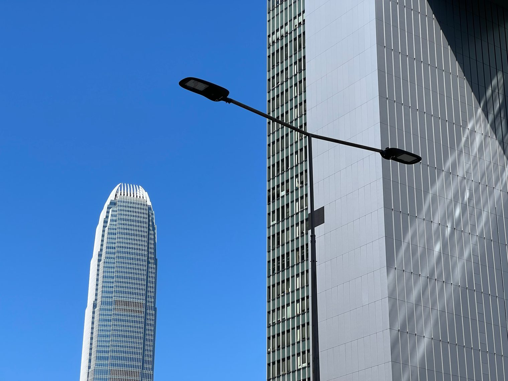

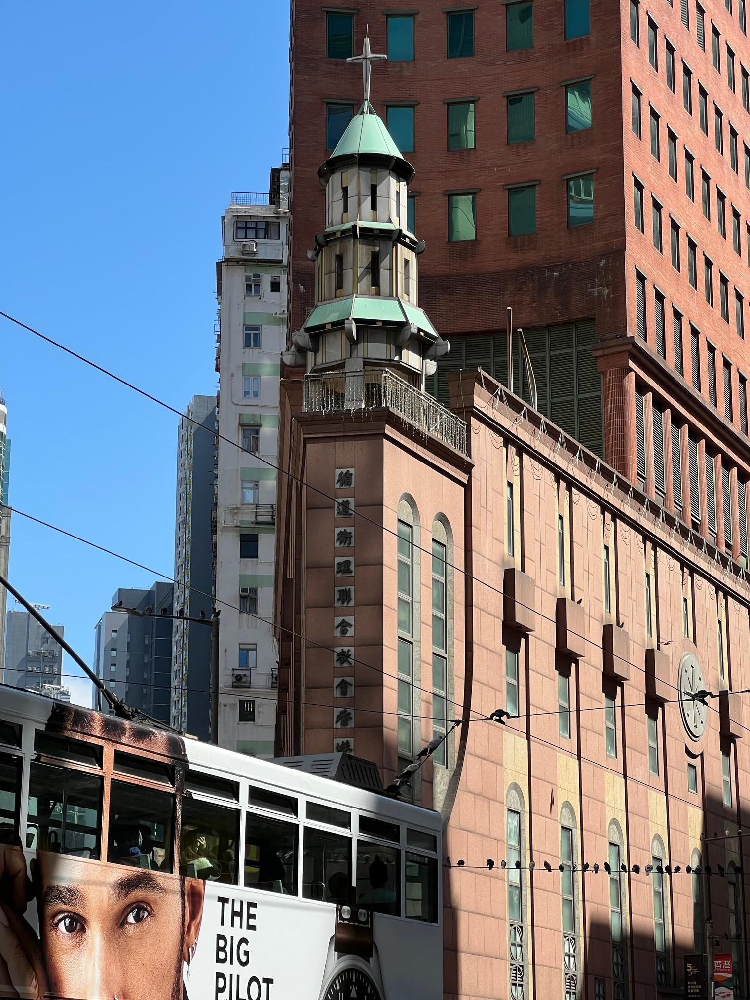

### Unplanned Growth

In March and April things improved. My knee was slow to recover, so I joined some outdoor activities that no longer interested me much, and yet they gave me a great deal.

The fog on Victoria Peak, for example, during the damp spell when the south wind returns:

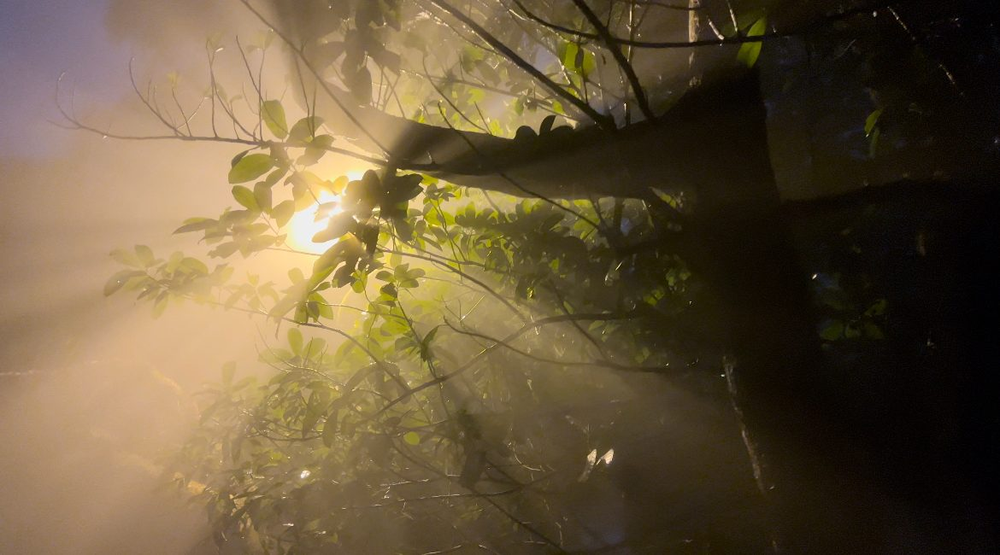

Or a hike I expected to be easy that ended up (once again) as a bushwhacking challenge (God bless my knees). I still remember reaching a relatively flat, rocky stream bed halfway down the hard descent, and lying flat on my back looking up at the sky set in the trees. In the gloom I had the illusion that it was already late in the day, but outside the sun was still shining brightly.

I really enjoyed the quiet of that moment.

But for me the bigger gain that day was the seedling of a friendship. Many good memories since can be traced back to it, and I have grown a little through them. Now, in the blink of an eye, it is a new year. To my friends: no words needed.

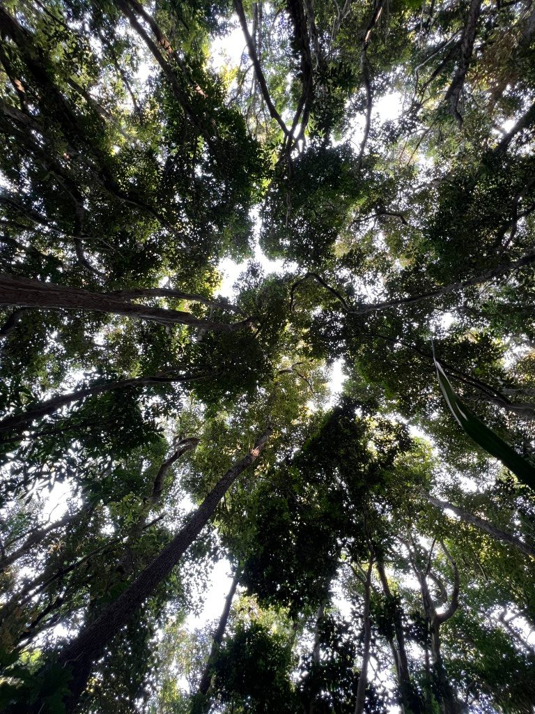

### Let it happen

At the end of May, with no next job lined up, I left behind a few boxes of business cards that had never done much work and left the company where I had worked for nearly six years. A change of professional identity: in the worldly sense, that was probably the most important thing that happened to me this year.

Take off the identity labels the outside world gives you, and who are you? Everyone knows the standard answer: you are still you. But as I once wrote, "Those who refuse to be defined by the outside world face an equally or even more difficult task: defining themselves." A person's identity and meaning do not fall from the sky; they have to be searched for and won with effort. Some even think the meaning of a whole life lies in finding yourself.

Measured with a worldly ruler (the worldly is not necessarily worse; the values of the traditional Chinese literati are twisted), this actually happened a bit too late, and the pandemic can be said to deserve no small credit for that. But it was also why I wandered onto a strange side quest in my life in 2020 and 2021. If finding yourself is the work of a lifetime, then there is no early or late, and it is not something with a universal, fixed pattern. So let it begin of its own accord, let the water flow, and, as the old children's song has it, let us row with both oars.

In six years there was naturally a lot of growth, and a lot of comradeship-in-arms. To the colleagues I once fought alongside: no words needed.

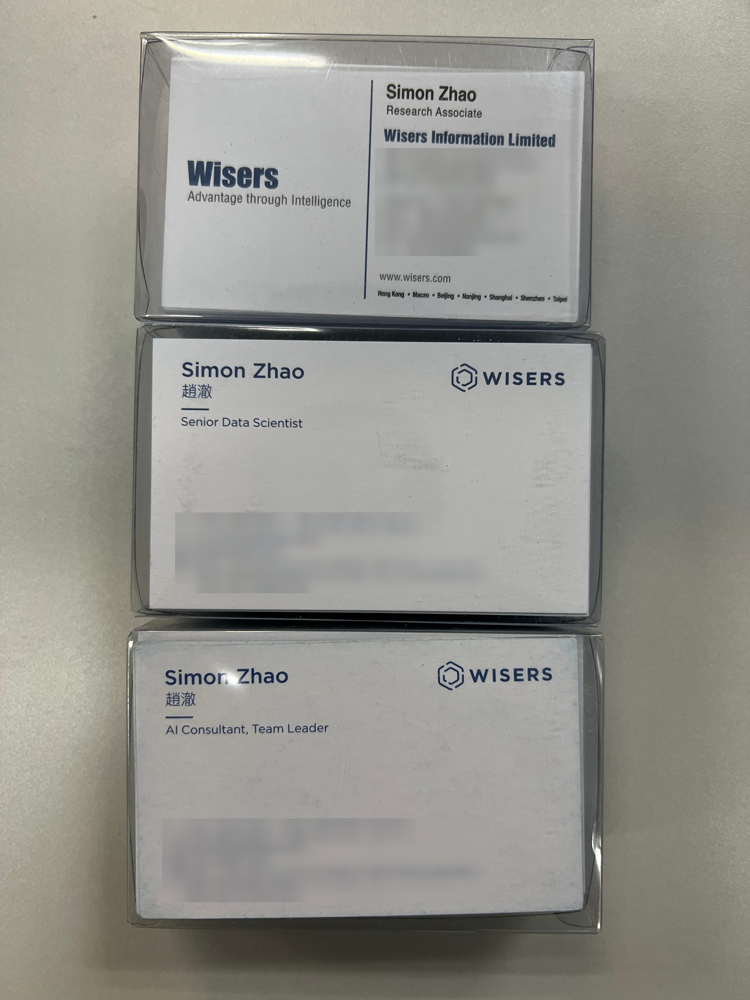

### Light and Shade

While I am at it, let me break the chronological order and step outside the limits of a photo memoir to keep remembering. Over the next six months I went through the ups and downs of Gap 1, Job A, Gap 2, Job B.

Job A challenged me a great deal, and even Gap 1 was not very idle; it became my preparation for A. The content, pace and way of working were all very different from my past experience, and in the end I could not carry on. But I am glad I had the experience. It was like a compact dungeon run that forced me to try things in an all-out state. What I am, what I am not, and what I could be; what I want and what I don't want. I quickly got part of the answers to these questions, and my confidence actually grew (I think real confidence comes from knowing yourself). That was exactly what I had been short of during the long six years before.

If one photo were to stand for this period, I think it would be this one:

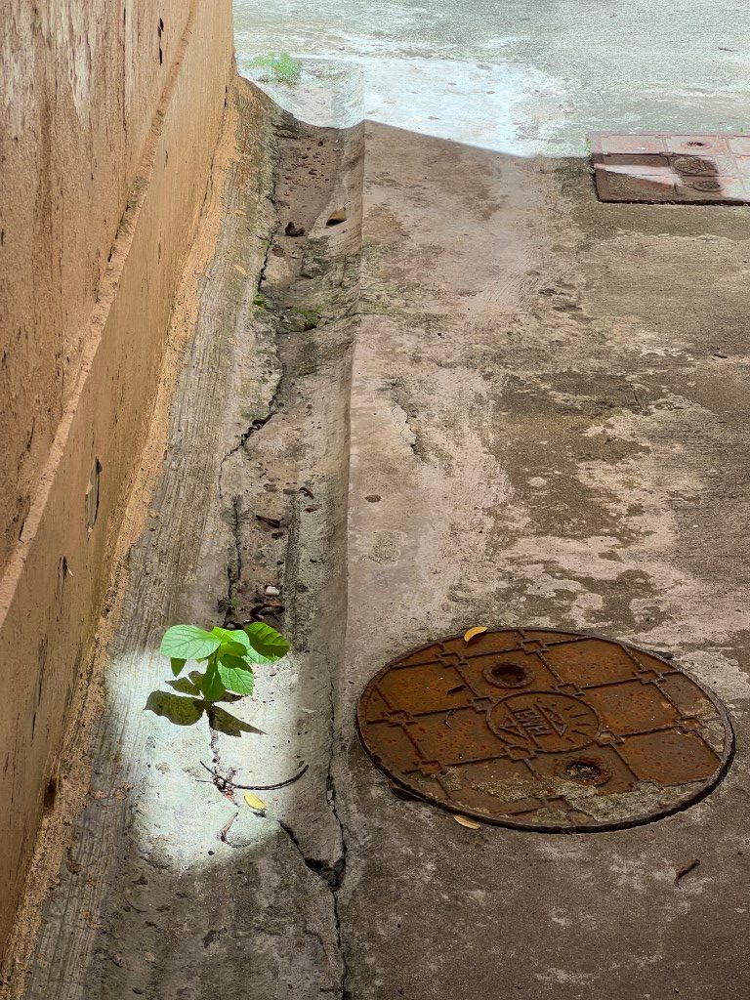

In those months I compressed myself into a crack and stretched in one direction only. As long as that narrow beam of light had not vanished, I put the thought of giving up on hold. In the end the light vanished before I reached my limit for giving up. From that point of view, I won. From other points of view, I did not lose anything either. It was also then that I realized that one's relationship with a job is just like a relationship between people: very often it simply doesn't fit, doesn't work, but that does not mean you are inferior to others. Going a step further: everyone is inferior to others in some respects in the end, but is there really such a thing as being inferior to others in every respect? That is a very strong proposition, and I don't have a definite answer myself.

At least as things stand now, I gained a lot along the way; those months were not spent for nothing.

During Job A, life was not entirely flavourless either. In the heat of the southern summer there was no hiking, and I had no energy left for anything fancier (I tried kayaking once, and went to a boat party once; I'm looking forward to next summer). But there was midweek swimming that refreshed body and mind, and a sunset I happened on after one swim; there was a once-a-week happy farm; there were songs I recorded whenever I could squeeze in the time; and there was the black-and-white photograph I am happiest with this year (taken during Gap 1). The joy of life comes from consuming, and also from building.

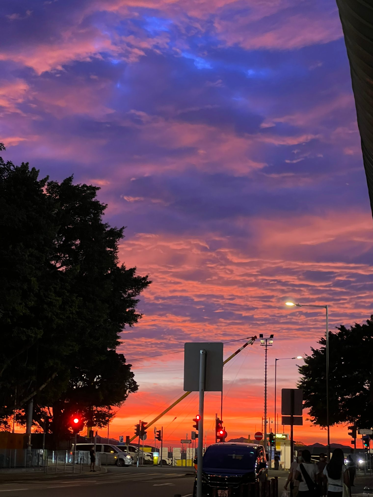

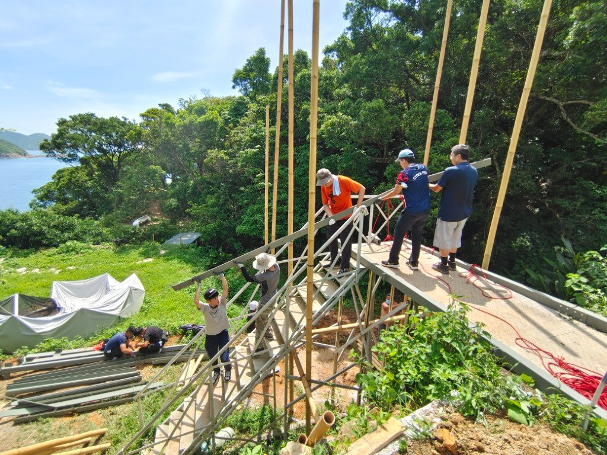

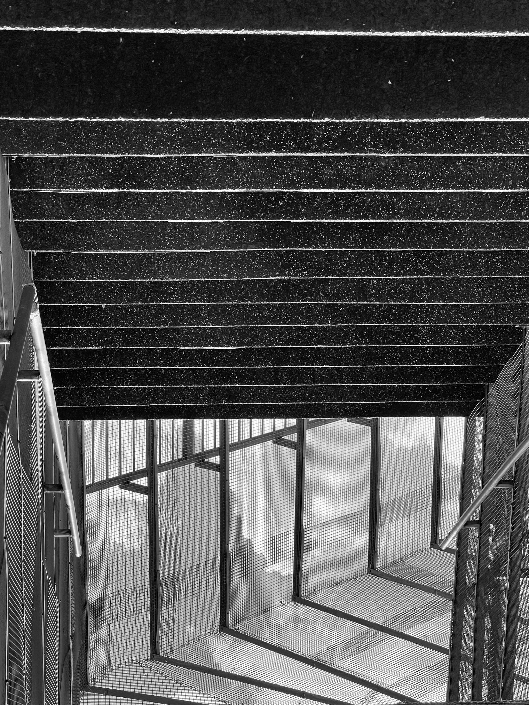

Only in Gap 2 did I really feel I could breathe again. I carried on with farm life, and at last had the chance to lead a big group over Sunset Peak and Yi Tung Shan once more and enjoy a perfect silvergrass sunset.

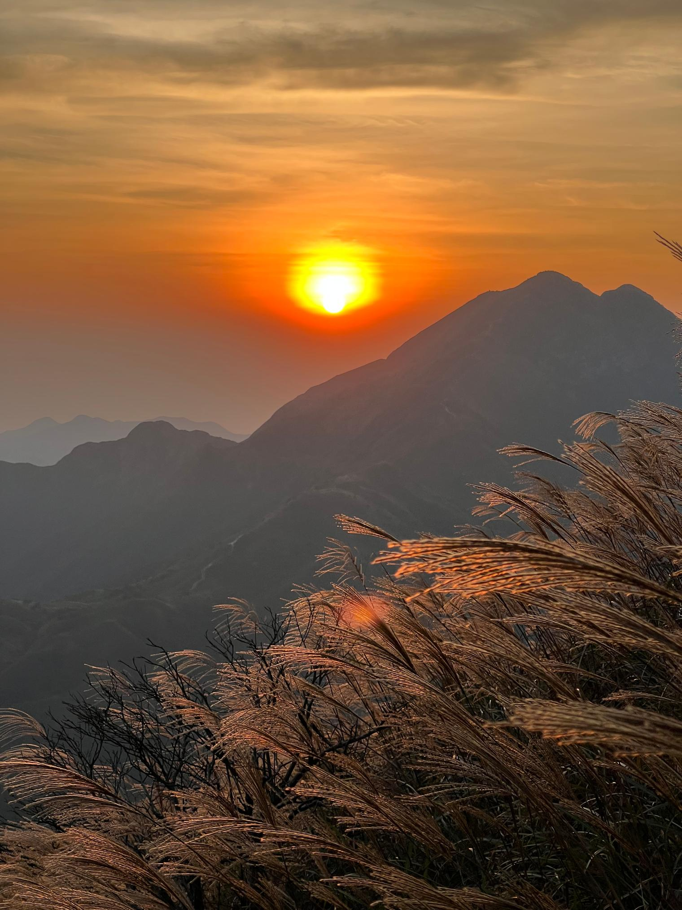

During Gap 2 I gradually figured something out: don't wait, try. Don't guess whether something suits you or whether you'll like it; only trying gives you the answer. Don't feel you are not ready: if an opportunity is open to you, you can get a ticket in, and you have enough reason to go, then go and try it. In the real world, information is always incomplete and always changing. There is no standard route to any goal, no level 1-2-3 to clear in order, no optimal solution. Lock onto your goal and get to work, and your actions will naturally bring back more information, so that you can optimize and iterate your strategy where it matters, and then keep going, until it is time to quit (1. the goal has changed, or 2. an assessment finds the ROI too low).

In fact I had long since seen this idea in all sorts of places, such as a blog post I like very much, [Action Produces Information](https://commoncog.com/blog/action-produces-information/), or the basic action-feedback-action loop of control theory. Only then did I finally begin to bring what I know and what I do into line on it, in the big directions of my life.

In concrete terms, that meant I dropped the idea of extending the gap and moved quickly into Job B. Besides the thinking above, this move was based on another very important conclusion: stopping production and taking a gap does not let me produce effectively, whether in my main career direction or in my secondary hobbies. Looking back over the past ten-odd years, it is having one main job and goal that puts me in good working order. Even my output on hobbies was mostly done in periods when work was busy (though not when it was close to the limit). For instance, many of my spare-time essays were written when I had a lot of development work on my plate. My brain needs to get into that hot state; the only condition is that different things should not draw too much on the same mental resources. Besides, in this age there are more and more things that give people quick, cheap stimulation and the pleasure of instant feedback, such as games and short videos. As soon as your mind is idle, they seize your attention with maximum speed and stickiness, so you must actively use your higher brain to fight your lower brain for cognitive resources. The other choice, of course, is to lie flat and give yourself up to pleasure, as the refrain of Huang Ling's song "Itch" invites you to, but I have come to see that I am not, after all, someone that would satisfy.

All in all, so far I think the decisions I made on these ideas were right. First, in Job B I really did get information that will help me plan my career. Second, in my spare time I really have produced more (adjusted, as I'll explain in a moment); this piece is a clear example, and there were also several gatherings and events that took some brainpower to organize.

### Those Shadows

"Experience" is a fairly neutral word: it can be followed by good things or bad. "Enjoy" is usually followed only by good things. But just as light and shadow are a unity of opposites, we naturally enjoy sunshine, and perhaps we can enjoy shadow too. Besides, eight or nine things in ten go against our wishes; life is ups and downs and downs and downs and downs, and most of the time we have to deal with bad things, sometimes exceptionally bad ones, like this damned COVID-19.

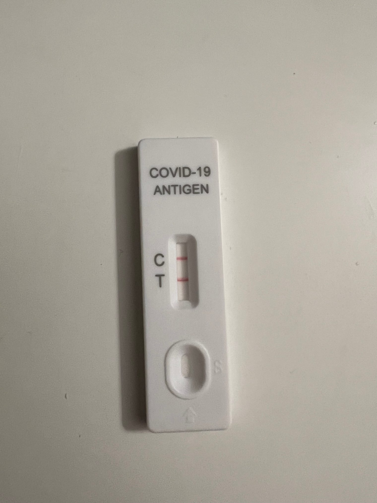

At the end of 2022, living up to everyone's expectations, I tested positive, and was blessed with long COVID as well. For two weeks I could hardly work (calling back to the "adjusted" I mentioned earlier), and even now I have not fully recovered. Then, only a few days after my fever broke, an elder in my family died of COVID.

Can I say that something like this can be enjoyed? No. Really, no.

Perhaps try a different word, one that Chinese does not seem to have: appreciate. It has two meanings:

1. recognize the full worth of.
2. understand (a situation) fully; grasp the full implications of.

Using the word directly still makes me uneasy, but perhaps meanings 1 and 2 are the right ones. Yes, we cannot enjoy the pandemic and what it has brought, but <del>we</del> I (on this subject I am in no position to speak for anyone but myself) may be able to understand their meaning fully and thoroughly.

The pandemic crushed the human world we had so carefully built and run with all our strength, causing or widening economic losses, social upheaval and division; 
the pandemic left some people damaged in body and mind, their careers in ruins, their loved ones lost; 
the pandemic made us lose three years for good, and we are not sure whether it will make us lose still more;

I don't want to turn straight round now and force myself, and anyone who has read this far, to think positively. Along the lines of: we gained things in the pandemic too, such as blah blah blah. We could even deconstruct the pandemic and make up a pile of jokes to get a laugh. There is nothing wrong with any of that. I only want to say that we are creatures with feelings; that is how we are designed. If we really feel pain, then as long as we keep one string of reason taut to make sure the pain doesn't hurt us too much, let it hurt. Otherwise we risk losing our humanity.

Beyond the pain, at least we can first try to face it squarely and look it in the eye. Pain is itself a way of facing it. Beyond that, what we can do is remember it and tell it. Then accept that it exists, and keep walking.

Time does not heal the wounds in our hearts; it only makes the pain they bring less. A wound is actually proof that we are alive. It proves that something happened, and that in it we lost something important. Loss is sad, but through it we also learn what is important. And to feel from the heart that something is important is, as I see it, love, however many forms its outward expression may take.

As long as we are still in this world, we can keep on loving.
