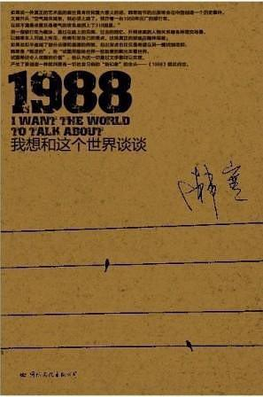

# Only Forward — Reading 1988: I Want to Talk with the World

Twice while reading Han Han's *1988: I Want to Talk with the World*, just when I was most absorbed, I put the book down. Not because the content was dull or the plot flat, but because emotionally it was hard to swallow.

I can't easily describe the feeling this slim novel of barely more than a hundred thousand characters gave me. If I had to, it is like standing before a slightly warped mirror in dim light: the figure and face in front of me are me and not me; we share a similar helplessness, yet the helplessness seems to come from different experiences. And the harder I try to tell apart me and "me", the more our pasts, our memories and the stale, damp smell those memories carry all churn together, giving off a faintly bitter smoke like rosemary, so that however I grope I can't catch hold of a single standout piece of evidence.

The story begins with a battered car called 1988, and the "I" who takes it on the road. It should have been a simple story, hardly even a story: "I" drive along the national highway for a few days, reach a certain city and meet a friend I haven't seen for years as he comes out of prison, or rather his ashes do. The story should have been over within the first ten pages, but, in Han Han's words, "barring accidents, there was an accident": a woman of the streets named Nana bursts into the motel room where "I" am staying, and so 1988 picks up an uninvited passenger on the road. After that, the present-day plot is even simpler. Between the shifts in time and place it is filled with "my" memories, and even the conversations between "me" and Nana mostly serve as tools for digging deeper into the characters' pasts.

Stories are mostly like that, really: people meet by chance in a vast, chaotic, complicated world, and from then on the journey differs from what it would have been had they never met; the interplay of feelings and thoughts throws off more and more sparks, which widen the difference until everything becomes completely different. It is probably the same between people and things. When 1988 left the factory, "I" must have been a small child, and the grown-up "I" bought this worn-out, weather-beaten car for the price of scrap metal and had someone restore it, extending its life. And the car went with "me" through plenty of rough patches, sharing "my" memories and ideals, carrying "me" in the direction I firmly believed in.

"I" am an unusual person, with a view of this world all my own. This probably owes most to the influence of Brother Dingding. Following him, "I" saw many things children my age had never seen, such as roaring trains; did many things other children had never done, such as stealing motorbikes; and learned from him a spirit and qualities that nobody else around had, such as trying to solve problems not by force but by other means, even when strength could get there more directly. In the small town where "I" grew up, people lived quiet, old-fashioned lives, and few had a wider view. So in "my" eyes Brother Dingding was a tall and distant figure. Riding on his shoulders, "I" gained a strength that longed to go forward. "I" followed closely in his shadow, trying to keep up with him, and even after he died in an accident and "I" had grown older than he ever was, "I" still felt a long way from catching up.

Going forward may be the story's deepest theme. Among "my" long passages of memory there is one [in which the narrator says that the people he has worshipped all his life are the hot-blooded ones; his own blood is merely warm, and whenever he is daydreaming they are already thinking, when he thinks they are already acting, and by the time he acts they are already dead, which leaves him afraid to act; the fallen become the highest figures he looks up to, and he hopes their blood can warm him]. Many people in real life are like this: deep in their hearts lie distant figures. We see the beauty of their dreams, envy them endlessly, and wonder whether it is time we set off too. Then we watch them on the way, their clothes stained red by thorns, bruised all over from missing their footing on the mountain path, and we hesitate; our earlier bold words vanish in the blink of an eye for fear of pain and uncertainty. So dreams turn into idle fantasy, and we go on watching them advance along their winding way, treating their effort as our own sweat and their achievements as our own gains, while weeping and cursing our own cowardice and wretchedness.

Now look at the paths some of the characters take. Brother Dingding walked bravely forward, only for misfortune to swoop down like a vulture and take his young, vivid life. Mengmeng was a girl who loved her profession and, full of drive, meant to make a career in show business, but she lost out to society's dirty unwritten rules and ended up a pitiful soul selling her body for money. No. 10 was the leader of the kids as a child and grew up to be a local thug. Liu Yinyin, talented and proud, was once the girl of many boys' dreams, "mine" included, but in the end, absurdly, she died in a car crash together with No. 10. Nana was born into a poor rural family and was forced by fate into prostitution as well, but she had her own limits and her own hopes: so that the child in her belly, whose sex she didn't know and whose father she didn't even know, would not suffer as she had, she worked hard at a trade people scorn, and in the end, having fallen ill, she entrusted the baby she gave birth to to "me".

How could life have no pain, no twists and turns? As the song 尘缘 (*Chen Yuan*), which comes up in the book, puts it: [a line about life's long road, whose ups and downs are not ours to decide]. The world is so vast, and people crawl across it like ants; after a hundred years it all comes to nothing, flowers in a mirror, the moon in water. Against the vast and eternal meaning of the universe, however great or small a person is, how could they shake it even a fraction? And yet I think big and small are always relative: the world brought me into being by chance, but heaven and earth can also fit within the few square inches of my heart. I am who I am, and my existence must have its meaning, even if that meaning is limited to me alone. There must be things in life worth believing in, things for which I could give everything I have, body and mind, only to make ourselves whole.

In fact 1988 itself carries a rich symbolic meaning. Isn't the road it travels the road of life, a kind of exchange and dialogue with the world? Along the way there may be lovely scenery and one surprise after another; there may also be breakdowns, traffic jams, even a fatal crash. But if we stop and go no further out of fear, cowering in a corner, not daring to step up and talk to the world face to face, we will still meet the endless silence of death in the end, without even knowing whether the direction we should have taken was right, and everything wonderful and rough that would have come before the result will be missed forever.

At the end of the novel we finally learn that the friend whose ashes "I" drove 1988 to bring back is the very one "I" had asked to give 1988 its second life. The story closes with a passage [in which the narrator says his friends went on ahead while he picked up the playing cards that fell from their pockets as they ran; running in their slipstream never made the wind any weaker, but they crashed into every wall and fell into every ditch he might have hit, and then told him the road was right and to keep going, only that he had now used up his one chance of help, and said goodbye].

Having watched them struggle and sink in life's great waves and spend all the strength of their lives, "I" and 1988 roll over the ruts they left behind, carrying their gifts, the memories of the first half of the journey still churning, and have already set off on the rest of the journey forward. The road ahead is still vast and unknown, and fate is heavy and sad, but for the "I" in the book and for me alike, only by going forward can we truly talk things through with this world and reach a conclusion.

Only forward.

2012.02

(Quotations from the novel are translated here from the Chinese; they are not Howard Goldblatt's wording in the published English translation. The two longer passages and the line from the song are summarised in square brackets; they are quoted in full on the [Chinese version of this page](only-forward-reading-1988.html).)

Douban: [1988: I Want to Talk with the World](https://book.douban.com/subject/5275059/)
