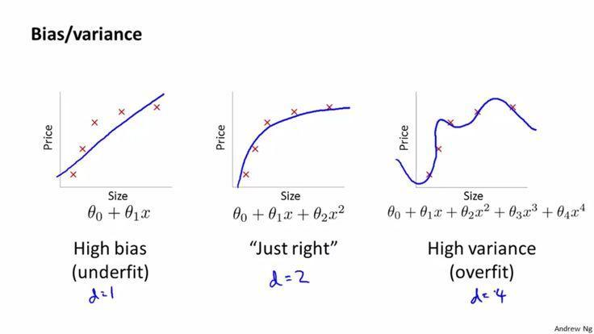

# 关于机器学习中的过拟合与正则化

*在知乎时间线又看到这个问题：[机器学习中使用正则化来防止过拟合是什么原理？](https://www.zhihu.com/question/20700829/answer/587052674)恰好最近刚精读完《Deep Learning》正则化一章，于是手痒写了一下自己对于过拟合和正则化的一些理解。这部分内容我在[问题解决与设计系列](problem-solving-and-design-1-situation.html)的下一篇文章也会涉及（标题暂定《解的优化与复杂度》），只是这两年自己对这部分问题的理解不断刷新，所以文章停留在积累想法的阶段。*

---

据维基百科[Regularization (mathematics)](https://www.wikiwand.com/en/Regularization_%28mathematics%29)：In mathematics, statistics, and computer science, particularly in machine learning and [inverse problems](https://www.wikiwand.com/en/Inverse_problem), regularization is the process of adding information in order to solve an [ill-posed problem](https://www.wikiwand.com/en/Ill-posed_problem) or to prevent [overfitting](https://www.wikiwand.com/en/Overfitting).

因此正则化本身的定义就是通过增加某种信息来防止过拟合的过程。

机器学习问题基本都是优化问题，**模型/参数**给定解的空间（或者说假设空间），**优化算法**负责从空间里找到最优或足够优的解，**目标/损失函数**负责提供优劣的度量。模型的解空间越大，越有可能包含对于问题本身而言最优的解（意味着学习到了数据的真实生成过程或者说真实分布），但是优化/搜索的难度越大。

对于有监督问题来说，解是特征到label的映射，学习的过程只使用训练数据，而**训练数据的最优往往不是测试数据上的最优**。这里原因要说清楚又要涉及很多东西了（比如独立同分布假设、经验风险、泛化误差，可以参考《统计学习方法》）。但有一个角度是：假设我们使用的模型能够提供足够大的解空间，而训练数据是有限的，那么解空间里存在一些解可以精确地将训练数据中所有的点都映射到正确的label上去，但这种映射不一定对测试数据有效，因为它**考虑了训练数据的全部信息**，而这些信息里有些来自于要学习的真实分布，还有一些是训练数据本身的一些信息，比如采样不良带来的某方向的偏差，或是噪音/随机扰动/异常点。测试数据其实也有一样的问题。

举个比较极端的例子，特征是人的年龄，label是身高，如果解空间够大，那么可以找到这样一种解：对于每一个年龄值，我都记下来对应的身高值，对于训练集以外的年龄值则做某种简单的插值（比如最近邻回归），**这样训练集错误可以到0**（不考虑贝叶斯错误时）。但假设我们的训练集比较糟糕：恰好里面的所有人都很高，腿长一米八，或者里面混进去一只老鼠的年龄-身高，结果在测试集上就会很糟糕了。**这种“记下来训练集中问题真实分布以外的信息”的现象，就是所谓过拟合。这种现象越强，越可能导致训练集错误较小，但测试集错误远大于训练集的结果。**要量化过拟合的程度，我能想到的可能办法是度量两个数据集错误的差异。bias-variance，模型复杂度（VC维）之类的概念都有助于进一步理解过拟合的问题（很多书里都有讲）。

而正则化的做法大致都可以看作是在**阻止机器学习算法学到真实分布以外的信息**，**减小搜索空间，砍掉奇葩的解**。实际的操作方法有多种多样：可以给目标函数增加约束（正则项，也有人用增加先验来解释这种做法），可以给训练数据增加随机noise，可以使用半监督，可以用多任务参数共享，可以用集成学习等等（可以参考花书《Deep Learning》，该书认为正则化和优化算法可能是机器学习最重要的两个问题）

个人理解。
