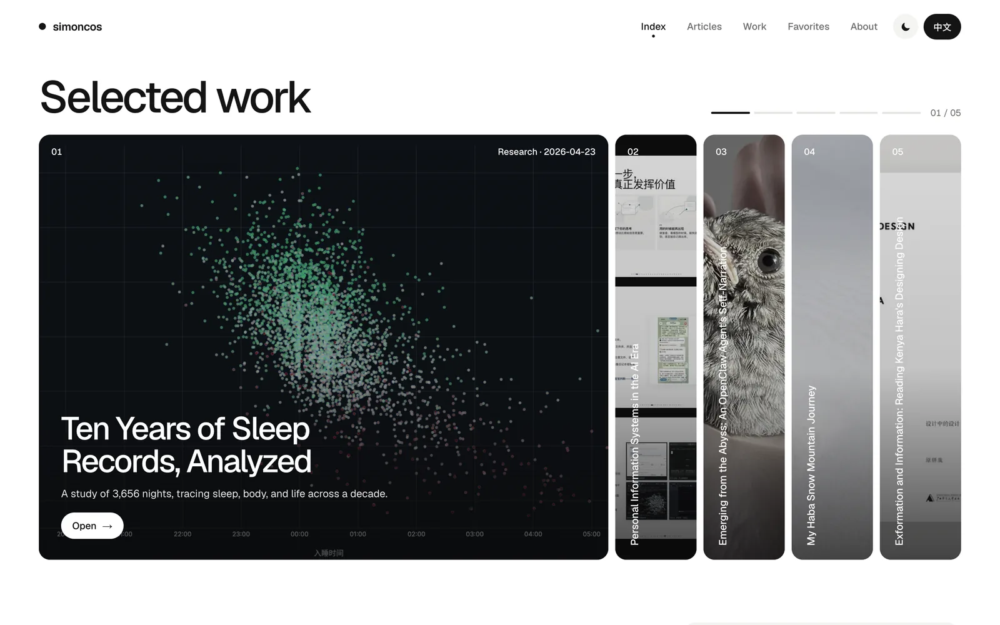
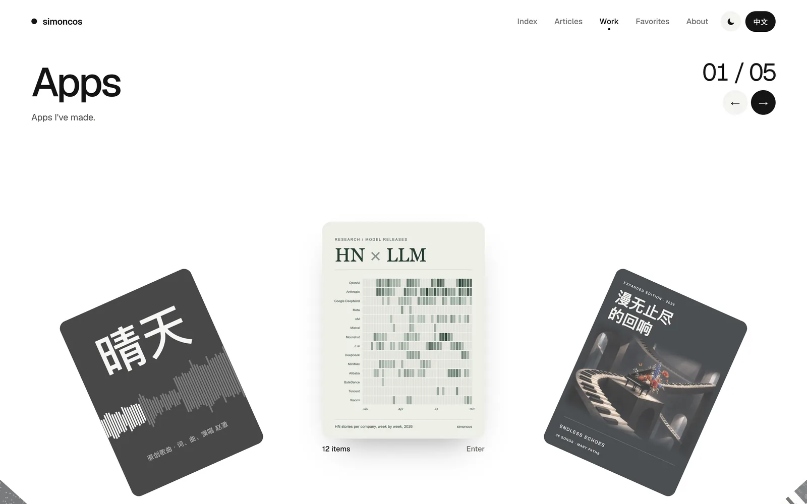
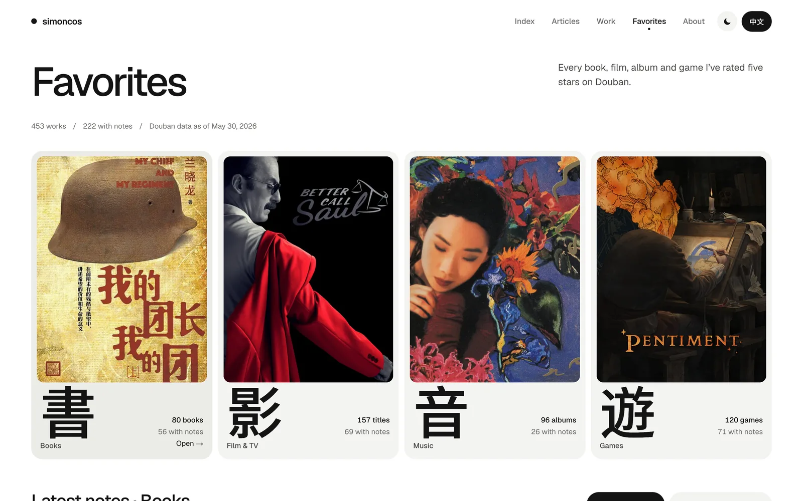
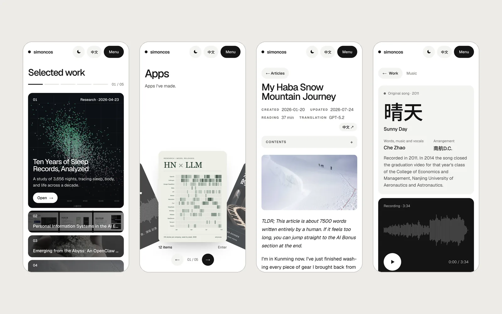
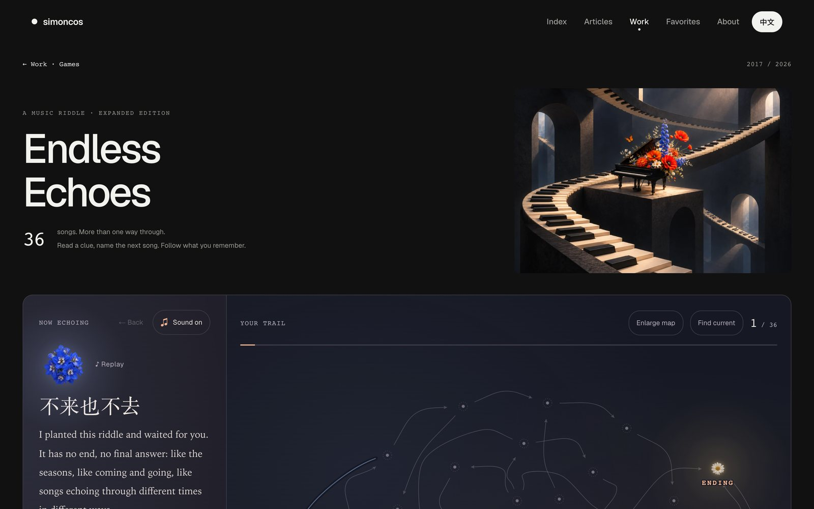

# Personal Site, Remake

Between September and today I rebuilt this site from top to bottom, and made a 40-second intro video along the way. This remake is not just a fresh coat of paint. It is also a way of sorting myself out.

<video class="post-film" src="assets/images/personal-site-remake/intro.en.mp4" poster="assets/images/personal-site-remake/intro.en.jpg" width="720" height="1280" controls playsinline preload="none" aria-label="The 40-second intro video: sleep data, the talk, the Work wheel, Sunny Day, Endless Echoes, articles, Haba Snow Mountain and Favorites, until every dot connects into the site’s name"></video>

<small>Piano samples in the video: <a href="https://freepats.zenvoid.org/Piano/acoustic-grand-piano.html">YDP Grand Piano</a>, recorded by Zenph Studios, prepared by the FreePats project, <a href="https://creativecommons.org/licenses/by/3.0/">CC BY 3.0</a>.</small>

## The site

The new version started from a design package. Late at night on September 26, I packed up the design drafts I had been polishing on and off with Claude Design for two or three weeks, put them in the repository, and had Claude build and deploy them. The new site was live a little over an hour later.

<figure class="post-shots" role="group" aria-label="Screenshots of the site"><input class="post-shots-input" type="radio" name="site-shots" id="site-shot-home" checked><input class="post-shots-input" type="radio" name="site-shots" id="site-shot-work"><input class="post-shots-input" type="radio" name="site-shots" id="site-shot-fav"><input class="post-shots-input" type="radio" name="site-shots" id="site-shot-phones">

<figcaption class="post-shots-tabs"><label for="site-shot-home">Home</label><label for="site-shot-work">Work</label><label for="site-shot-fav">Favorites</label><label for="site-shot-phones">Phone</label></figcaption></figure>

Over the next two weeks, I brought back the details and features of the old site that the AI had dropped, and moved more of my writing and projects over: from 8 articles at launch to 64 now, the earliest written in 2008, all in both Chinese and English.

A few fun things about the new site:

**[The Work wheel](../gallery.html?lang=en).** I sorted my work into five kinds: apps, games, talks, research and music. On the Work page you swipe sideways, one notch at a time. More kinds will come later, such as photography and video.

**Interactive pages.** Interactive, rich-media content is one direction I want to take my work in, and there will be more and more of it on the site: [ten years of sleep records](../gallery/research/sleep-2016-2026.en.html) (3,656 nights), a [social network study](../gallery/research/zhihu-2015.html?lang=en) built on 2015 Zhihu data, the [HN × LLM](https://simoncos-hn-llm-research.vercel.app/) data analysis, the [slides](../gallery/talks/pkm-2026-06-07/index.html) (in Chinese) of my talk on personal information systems, and the small puzzle game [Endless Echoes](../gallery/music/endless-echoes.html?lang=en), which I will come back to below. Content like this used to take a great deal of time to make; with AI's help, I now have the chance to explore more of these ideas.

**[Favorites](../favorites.html?lang=en).** Everything I have rated five stars on Douban, books, films, music and games: 453 in all, 222 of them with a short review. They are an important part of me too, the things I grew up on.

Next come the parts that deserve more space.

## Evergreen

There are eleven cards among the works on this site that you can't click into yet. These are things I have been working on for the past few months that are not yet ready to show:

- **Daily Oracle**: draw a card each day, go do a small thing in the real world, and come back to log it. Over time the card collection grows and the garden comes into full bloom.
- **Vocal Coach**: a phone app for singing in tune: sing along to a target note and see live whether you are sharp or flat. The piano in Endless Echoes and in the intro video first came from the real samples I found while making this app.
- **Paper Research Platform**: ask the same set of questions of a batch of papers; a model answers for each paper with evidence from the text, and after a human check the results export as a table.
- **Hiking Planner**: import a route, read distance, climb and resupply segment by segment, and log the hike once it is done.
- **WeChat Chat Exporter**: export your own WeChat chats on your own computer, together with their voice messages, images and files; the text is searchable, and every message keeps its time and where it came from.
- **Birdie**: a phone app for keeping pet birds, with a profile for each bird and one diary for weight, food and mood.
- **Muscle & Joint Log**: for everyday neck, back and joint strain: check first for signs that mean see a doctor, log how it changes day by day, and bring a summary to the appointment.
- **Photo Curator**: import a batch of photos, sort them into album ideas, and get help picking the frames and putting them in order.
- **The Midnight Ledger**: a wuxia mystery RPG prototype: walk around a small town, question people, collect clues, and confront the suspect face to face.
- **Murder Mystery Table**: a murder mystery you can play alone, with an AI host and AI characters who search for evidence, discuss and vote with you.
- An unannounced project, in agentic investment research.

Some projects sprout early and grow slowly; others are the opposite, just as every flower in a garden is different. And I am the gardener: looking at this one today and that one tomorrow, wandering back and forth, watering them with ideas and tokens, and letting them grow as they will. The ones not yet ripe, we can wait for a while longer; the ones that have already borne fruit may evolve again; even the ones that died have a chance to echo back and be reborn. Nothing holds a fixed form; things live and die, flicker and shine. This is what is called [**Evergreen**](https://notes.andymatuschak.org/z5E5QawiXCMbtNtupvxeoEX), or, in [Kevin Kelly's book](https://en.wikipedia.org/wiki/The_Inevitable_%28book%29), **Becoming**.

## Endless Echoes

In 2017 I made an Eason Chan playlist riddle on Xiami: each song's recommendation note was the clue to the next song. There were 26 songs. The riddles were first laid out as text in the comments of each song on Xiami Music, and [the column explaining how to play](https://www.jianshu.com/p/bacb95af08b1) (in Chinese) was even officially featured by Xiami. But in that form it was very hard to keep playing: players had to take notes on paper, and could never be sure whether they had hit a dead end. Before Xiami Music shut down in 2021, I made a simple backup of it as a Douban list.

This time my first goal was to restore the riddle in an interactive, friendlier form. Codex helped make the first version, rebuilding 26 songs and 31 paths from the Douban list, but when I played it I got a bit stuck. I suspected the Douban backup might be inaccurate, but I had lost the complete design map I had once drawn by hand. Later I dug up a Xiami Music export stored in my OneDrive, and the 26 notes matched one by one, which finally settled the answers. Going back through those songs and notes, and even just thinking of the name Xiami Music, stirred up a lot of memories.

Then I started expanding it: to 36 songs and 47 paths, and the new clues were still written by me, not by AI. Find all 36 Eason Chan songs and there are a few small surprises.

The visuals went through many rounds. At first Codex made a dark green background that looked muddy, and I sent it back; the cover image was also left to Codex at first, and the cassette tape it came up with I read, at first glance, as a belt.

The final design is built around flowers. The cover became flowers, a piano and an Escher-like space; the route map is laid out in the shape of a rose, and each song is a flower too. This mostly borrows from the art concept of Eason Chan's Fear and Dreams concerts. A few songs about flowers were already fairly important in my original riddle.

Each time a song is guessed, its flower lights up and opens, and a chord sounds. The chords start from a Csus2 at the beginning and finally come to rest on C. Along the way, players can play back the little chord tune of the path they have lit.

And so a rough piece from nearly ten years ago has come back to life in a whole new form. The echo itself has become the next echo.

*A fun, slightly related fact: Sandy Lam's 2025 and 2026 concert tour is also called Resonance (回响, "echoes").*

## The intro video

I made this short video with Claude 5.5: vertical, 40 seconds. The biggest thing I asked of the AI was to make full use of the site's own content as material, so that people who watch it would want to come and look around my site. The video is drawn in JavaScript on a Canvas, and every image in it comes from the site itself: data visualizations, the talk's slides, the song Sunny Day, the Endless Echoes route map, photos from articles, [Haba Snow Mountain](my-haba-snow-mountain-journey.en.html), and the covers from Favorites. At the end all the dots connect and become the site's name.

The music was fun too. [Sunny Day](../gallery/music/qingtian.html?lang=en) (晴天) is an original song I made more than ten years ago, and this time I had only meant to put it on the site as one of my works. When Claude made the first version of the video, it put Sunny Day in on its own. It also generated the first soundtrack on its own, which was actually quite good and fit the picture well. But I noticed that it had worked Sunny Day's spectrogram into the picture while the music playing was an unrelated tune.

So I thought: why not try to use more of Sunny Day's music? The main problem was that I had no written score. That takes me back to the song itself:

I finished the lyrics and melody of this song in high school. I can't read music, so the lyrics came first and the melody after. Later, in my first year of university, I wanted to enter a competition and sing it live, so through a friend I met an upperclassman who made original music (he had a campus duo at the time), who did the arrangement (the backing track) for me. After the competition I taught myself some recording and mixing, and that is how the first version on the site, from 2011, came about. The song was re-recorded in 2014 and played at the end of my school's graduation video, but that came later.

Back to the video. First I gave Claude the instrumental backing track and the version with vocals. Using spectral analysis, it used the backing track to cancel it out of the mix, tried to rule out interference from the harmonies, and isolated the pitches of the vocal melody; then it made a MIDI version and mixed it back into the backing track and the vocal version, so I could check and correct it note by note. Claude can't hear sound, so with every version it attached the spectrum figures it had measured, and I listened with my own ears and told it what was wrong.

It took three drafts: the first, by my ear, was about 95 percent right, and the main problem was that it cut runs and slides into several separate notes; the next two drafts were spent fixing that. The score is now on [the Sunny Day page](../gallery/music/qingtian.html?lang=en#score-title) too, where you can download it as numbered notation, MusicXML and MIDI.

Sunny Day is also a slow song with a slightly melancholy feel (Claude's analysis says F major, 66 BPM). That didn't quite suit the video, so in the end Claude took the key, chords and chorus melody of Sunny Day and rearranged them into a light, brisk piece.

The lead instrument changed several times too: the synth was too muffled, and the violin was synthesized as well and sounded bad, which is what made me think of the piano samples from my Vocal Coach project; in the end that is what I used. The samples don't cover the highest notes, so we synthesized and adjusted those from other notes.

Sunny Day is my first and, so far, only complete original work, with lyrics, melody, arrangement, vocals and even some immature harmonies. It goes back a long way, so there are many stories and memories around it. While I was making all this over the past two days they came back to mind, like fishing a few certain, beautiful things out of a hazy past.

## connecting the dots.

"connecting the dots." is a motto I have used for many years.

When Claude made the first version of the video, without any obvious hint from me, it seized on dots, an image that runs through so much here. Each night of sleep data at the start of the video is a dot; every work, every article, every favorite is a dot; and each song in Endless Echoes is a dot as well.

It is these dots, together with the people, events, memories and hopes behind them, that make up who I was, am and will be. Yes, this site is precisely about my past, present and future.
