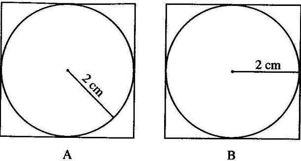
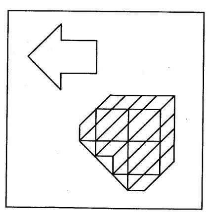
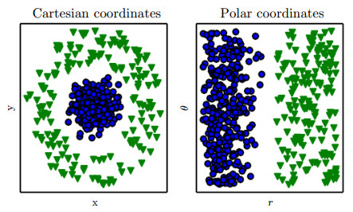

# Problem Solving and Design (1): The Problem Situation

Keywords: methodology | problem situation | interaction design | search problems

Of everything I have skimmed in the last few months, I would never have guessed that the most illuminating would be this: ["Factors That Affect Problem Solving"](https://web.archive.org/web/20160521150427/http://www.pep.com.cn/xgjy/xlyj/xlshuku/shuku13/shuku17/201008/t20100827_815322.htm) (in Chinese), an excerpt from the People's Education Press textbook *General Psychology*.

Each of the seven factors it names could be turned over on its own for a long time (though to me a few of them overlap as concepts): **the problem situation, transfer, prototype heuristics, mental set, functional fixedness, motivation and emotional state, and individual characteristics**.

I found it valuable because what it covers touches the two fields I have long been interested in: problem solving and methodology, and design. Thanks to this article, the concepts and ideas I had collected separately in each field have more chances to connect and come together. I haven't thought about it more deeply or as a whole yet, so I'll take the concepts one at a time and think as I write, letting it spread out (meaning I'll go wherever the wind takes me).

First, **the problem situation**. The same problem becomes more or less difficult depending on how it is put. Both examples in the article are interesting. One asks you to find the area of the square from figure A and from figure B:

Why are A and B not equally hard to solve? The article's explanation is that the stimulus pattern in each problem situation is closer to, or further from, the person's knowledge structure. The key to the problem is how the circle's radius relates to the square: the side of the square is twice the radius. The drawing in B makes it easy to see that the radius equals half the side. The way the radius is drawn in A means we have to search our heads for one extra piece of knowledge, that the distance from the centre to any point on the circle is the radius, so the radius in A can be redrawn as in B, and only then reach the same conclusion. That one extra step of thought is what makes the difficulty different. It gives concrete shape to what we usually mean when we call something "intuitive" or "obvious".

The other example is finding a simple shape (an arrow) inside a complicated figure. The point is that not only too little information but also too much can make a problem harder to solve:

What does too much information mean? I don't think it means redundant information. I think it means irrelevant information (I have been working on spam lately and spent ages picking at definitions). In the example, the complicated lines other than the arrow have nothing to do with the task of finding the arrow. They interfere with the problem, we have to keep resisting that interference while solving it, and naturally the problem gets harder.

Let me state a view here: to some extent, every well-defined problem can be treated as a search problem. Here is where that view takes me:

**Solving a problem means searching the possibility space of solutions for a feasible solution.** Solving a problem is rarely direct. It usually has to be broken into subproblems (which may be independent of each other or may depend on each other; speaking of dependencies, oh, I can't wait to start writing about mental set and functional fixedness). Suppose here that the problem has a unique solution (with several solutions, let alone several solutions of different quality, things get more complicated). Then the process of solving every subproblem and finally reaching the solution is like finding, in a network (or at least a tree), a path that leads to the solution. There can be many paths, which means that at any node (subproblem) you may have several choices of parent node (earlier subproblem) and of child node (later subproblem).

The following points explain the examples above further:

- Too little information relevant to solving the problem leaves too few child nodes to choose from. Put more quantitatively, the expected utility of many child nodes falls short of your decision threshold, so you have to try them almost by brute-force search (anyone who has taken an IQ test knows what I mean).
- Too much irrelevant information leaves too many child nodes to choose from. All that interference makes the differences in expected utility between many child nodes insignificant, and choosing becomes hard.
- Too much relevant information is what I called redundancy earlier. Now there are not only many child nodes to choose from, but the redundant relevant information also helps tell their expected utilities apart, which helps you find a shorter path (a faster way to solve the problem).

The article makes three points in all about the problem situation. The square-area and arrow examples explain the second and third. The first, about spatial position, generalizes a little into some kind of distance between elements (size, shape, colour, space, time), which really means certain quantifiable relationships.

So how is the problem situation connected to design? Note that by design I mean "design" with the art and aesthetics taken out of the everyday sense of the word, pushed towards usability (in the categories used for internet product design today, closer to interaction than to visual design). For this kind of design, the purpose is solving problems. Take software interaction design: the whole struggle is how to convey the right information through all kinds of interactive elements, so that every function gets an optimal path. Of course, that optimum may be the ultimate in usability, but more likely it is some more complex value function, one that also has to consider, say, the software company's profits. That is what makes interaction design so challenging in practice.

------------------

I didn't expect the very first concept to spin out this much so casually. Looks like this will become a little series: spread out as far as it goes, then pull it all together (what I'm really thinking: since I'll pull it together anyway, why bother polishing now, hmm). I wanted to drag in some machine learning too, but I've run out of steam for that, so later. It has been ages since I dashed off a post like this (it took just over an hour). I have always had lots of small ideas that felt too shallow, and I was too lazy to spend a lot of time grinding away at any one of them. Now I seem to have found a good (or at least productive) way to produce. So, look out for the next one, "Mental Set and Functional Fixedness" (hopefully with fewer parentheses).

---

An older post, added to this site on 2026-09-28. The original date of writing is unknown, and the text keeps its original wording.
