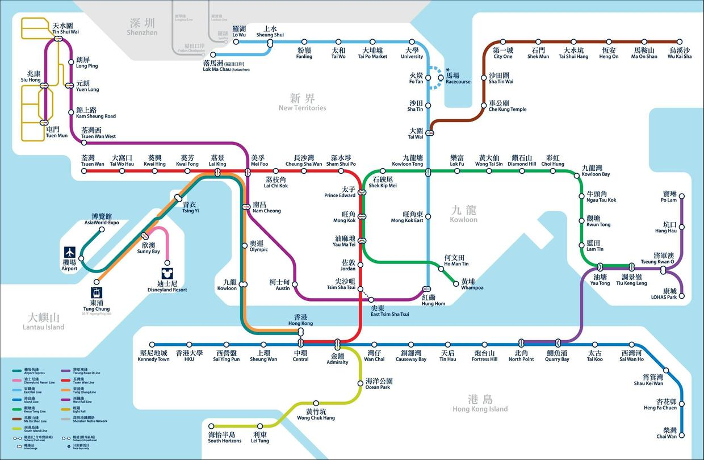

# 问题解决与设计（三）：开放问题

关键词：开放问题 | 信息不完全 | 隐含前提条件 | 可证伪性

有了[问题情境](problem-solving-and-design-1-situation.html)，也对[可行解](problem-solving-and-design-2-feasible-solutions.html)这个东西有了更多了解，接下来要思考的就是如何大浪淘沙，在可能性空间中找到可行解。之所以说是大浪淘沙，是因为可能性空间可能会很大，视问题情境的约束强度而定。假设是这样一个问题：

> A1. 只乘坐地铁，找到从香港中环到旺角的最短路线。

只要借助地铁路线图，我们不难较快地找到A1的可行解（这里也是唯一/最优解）。但假设去掉地铁的限制，允许任何行动方式，我们就会面临一个大得多的可能性空间：

> A2. 找到从香港中环到旺角的最短路线，行动方式不限。

除了地铁以外，巴士、出租车、渡轮、仅凭人力（步行+游泳）、飞机乃至多种混合，都在可能性空间之中。所谓**开放问题**，一部分含义就在于**广阔的可能性空间**。现实中我们遇到的各种问题，大部分都属于可能性比较多的问题。更为棘手的是，“开放”还有另一部分含义：**可能性空间是会变化的**。

**问题开放的根本原因是不完全的信息**，而这种信息不完全来源于两个方面：问题本身和问题解决者。

问题本身不够明确会造成信息不完全。比如上面提到的路线问题A1和A2，其实都是很模糊的问题，有很多没有给出的因素。还记得我们之前讨论过可行解的两个要素吗，A1和A2之中资源和方法中我们只给出了方法（行动方式），却没有明确可用的资源，比如可支配的资金。再严格一点，行动方式中比如游泳和步行，我们没有明确是“谁”去行动，没有评估这个“谁”的游泳能力，速度有多快，即使是坐飞机，我们也需要确定型号不是。此外，像是“不限定行动方式”这样的条件也是极为模糊的，假设某天我们突然发明了瞬间移动，那么行动方式是不是该加上？整个可能性空间当然就会随外部事件的发生而变动。

即使问题已给出很完整的信息，问题解决者自身对问题的理解也可能具有局限性、不够完全。随着对问题理解上的深入，我们从原始问题中抽取出的问题及子问题的问题情境，可能会产生变化，这部分在第一篇中也有提到。

面对这些信息不完全，我们平时是怎样处理的呢？

第一，**抓大放小**。

拿A2来说，区分可能性优劣的最明显feature当然是各种交通工具的速度，而这些对速度的评估，来源于我们认知中一种对通常情况的先验知识，比如“通常而言”，飞机和地铁的时速分别是多少。从中环到旺角，精确考虑到时速也太夸张了（更夸张的还可以精确到型号），所以抓大放小，我们不需要速度的具体（绝对）数值，只需要各种交通方式的速度量级；进一步抓大放小，连量级都不需要，我们只需知道相对来说，飞机和地铁谁比较快，有这种相对的顺序信息足矣。这一连串的抓大放小、抓紧主要矛盾、削减次要因素权重，能够迅速地缩小可能性空间。如要问为什么可以缩小，到底凭借的是什么，答案是我们脑中这些关于速度的先验知识。

从问题提出者的角度上，很多本身信息不完全的问题，需要建立在与问题解决者对这些已有先验知识存在的共识之上，换一个说法就是使用了隐含条件。这种共识用得好，可以节省许多沟通成本，用得不好也可能带来灾难——很多自我认知到的共识，其实并不是事实上的共识。

这种在表述时隐含条件的惯常做法其实可以联系到科学哲学中一个重要内容：**波普尔的可证伪性原则**。可证伪性被波普尔用于区分科学和非科学理论，这种区分方法是非黑即白的，但现实的情况远非如此绝对。这里有[一篇知乎回答](https://www.zhihu.com/question/20036412/answer/137623933)很精彩地解释了为什么这种区分方法存在瑕疵。让我们关注其中2.1提到的问题。就我理解而言，整体论者想要表达的是，“证伪”所关注的条件命题，其条件部分其实是极为复杂的，可能包含了许多子条件。很多时候当我们看到一个条件命题`p -> q`的时候，实际上其更完整的表述是`(p ^ a1 ^ a2 ^ ...) -> q`，这里的`a1`，`a2`都是隐含的前提条件，因此由`~q`我们不能推出`~p`，只能推出`~(p ^ a1 ^ a2 ^ ...)`，即用非q不能证伪p，而只能证伪`(p ^ a1 ^ a2 ^ ...)`这个各条件的合式整体。

理想化地讲，我们在形成一种理论的时候，是有能力也是必须将所有前提条件明确下来的，因此我认为知乎回答2.1里提到的问题其实只是理论的表述不够完整所导致的。即使存在海王星这样预先未考虑到的隐含条件，也并非可证伪性本身的瑕疵（不过只能证伪整个理论的话，对科学发展的意义似乎大大减少了）。更进一步或许可以说，科学理论也需要尽量确保其讨论的问题不是开放的。理论越成熟，已明确的约束条件就越多。

第二，**对问题本身提问题**。

这种方法可帮助问题解决者深入理解问题本身，重新建立问题情境、划分子问题。此外，在对开放问题的探索过程中，可以对问题外部（比如提出问题者）提问题，增加显性的约束条件，完善问题本身，使空泛的问题变得更明确、更有针对性。永远从当下掌握的信息出发，根据问题解决过程中获得的新信息调整对问题的建模。

从这里可以看出，问题的提出与问题的解决之间并不总是一个单向的流式过程，也可能是一种反馈与迭代的循环控制过程。这里还可以进一步延伸到黑箱认识论，之后的文章里将再进行深入。

---

这篇写着写着好像和设计没有直接联系了哈哈哈（咦或许可以扯到用户和设计者对设计元素的共识？）
