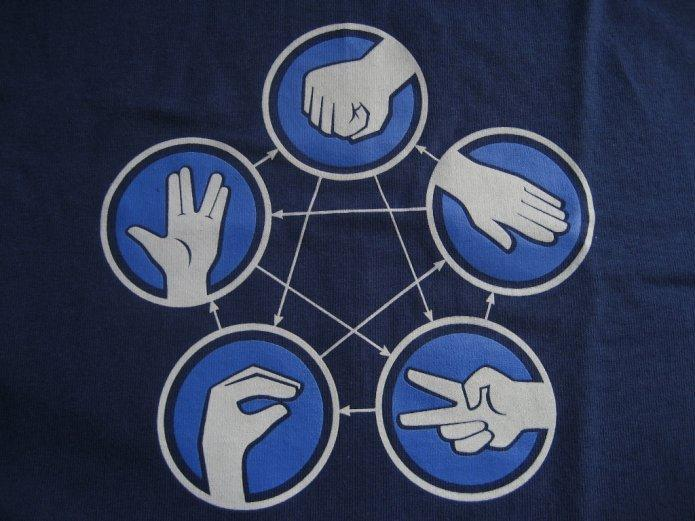
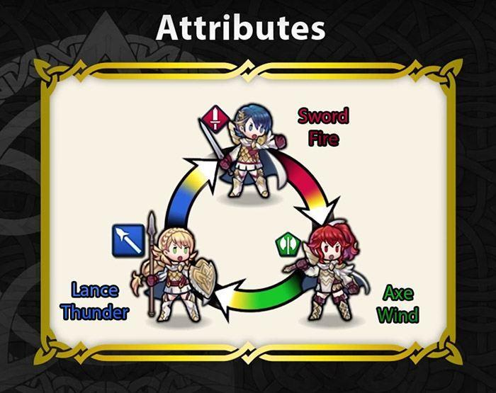

# Problem Solving and Design (4): Indecision and the Optimal Solution

> Interactive version: [Indecision and the Optimal Solution](../gallery/talks/problem-solving-and-design/ch4.html) (in Chinese), a condensed rewrite with figures you can drag and click. The whole series: [Problem Solving and Design](../gallery/talks/problem-solving-and-design/index.html) (in Chinese).

Keywords: value/loss functions | decision-making | systems of preferences | optimal solutions

### Indecision, choice and value functions

What is indecision? Take the Chinese word for it, 纠结, literally: a tangled, knotted ball of thread that you can neither pick apart nor cut, and random tugging only pulls it tighter.

Unfortunately, facing a problem almost always ties us in knots like this. There are two reasons. The problem itself may be complex, so a feasible solution is hard to find. But perhaps more often, plenty of feasible solutions are already in front of us and we have to choose the optimal one. **What ties us in knots is really how to choose.**

Let's start with a classic knot: the [trolley problem](https://en.wikipedia.org/wiki/Trolley_problem).

> Suppose you see a trolley whose brakes have failed, about to hit five people on the track ahead. On the side track there is only one person. If you do nothing, the five will be killed. There is a button beside you: press it and the trolley switches to the side track, killing only one. What do you do?

In knots yet? Let's first look at the most obvious key condition in this problem: five people on one side, one on the other. Going by the numbers alone, you save the five, of course. No problem there, right?

Let's add some seasoning, and here comes a wave of questions:

1. The five are strangers to you, and the one is a relative of yours
2. 1,000,000 strangers, and one relative of yours
3. Five on one side and one on the other, all strangers, but you know that if you press the button you will in effect be actively killing one innocent person and will never have a clear conscience again; whereas if you do nothing, at least you haven't actively chosen to kill anyone, and though it will be hard, it seems bearable
4. (and the more you think, the scarier it gets...)

In knots now?

Why the knots? Because **we are clearly not as rational as we usually think we are**.

Save more people (utilitarianism)? Save your relative (morality, emotion)? Avoid harm caused by your own active choice (self-protection)? ...

Yet before **absolute rationality**, this problem is not the least bit hard. Let's try.

Suppose your **value function** for this problem is a simple linear function of several variables:

> f(x1, x2, x3) = a1x1 + a2x2 +a3x3

where:

`x1`: the number of people left alive on all the tracks
`x2`:  the number of your relatives left alive on the tracks
`x3`: the number of people on the tracks you actively killed

There you go. All you need is to give this value function the parameters you like, a1, a2 and a3, and you have built your own model. With it, every problem above has an optimal solution you can easily compute.

For example, if your parameters are 1, 100 and -2, then for problem 1, the value of saving the five passers-by is 1\*5 + 100\*0 + (-2\*1) = 3, and the value of saving your one relative is 1\*1 + 100\*1 + (-2\*0) = 101. 101 > 3, so without a doubt you save your relative.

You can also set up a more complex value function, with **more independent variables**, say, or **non-linearity**:

Model 2. The number of people you save has diminishing marginal returns. Saving two people rather than one may make a big difference, but saving 10,000 rather than 9,000 may not feel all that different. A log will do to illustrate:

> f(x1, x2, x3) = a1logx1 + a2x2 + a3x3

Model 3. The more of your relatives you save, the more pain you feel for having actively killed others:

> f(x1, x2, x3) = a1x1 + a2x2 + a3x2x3

Maybe this example is too gory, and absolute rationality is hard for us. But what I want to say should be clear: for many problems that tie us in knots, the root of the knot is irrationality, and the way out is to build a formal, quantified model and use a value function to evaluate the choices.

### Systems of preferences

Now let's relax a little.

We have a **decision model**, with choices in it and a value function. We know that a larger value of the function is of course better, and the largest naturally corresponds to the optimal solution. Sometimes it is the other way round, and then the function can be called a **loss / cost function**. This larger-and-smaller, this comparability, reflects which of the feasible solutions are better or worse relative to each other, that is, **[preference](https://en.wikipedia.org/wiki/Preference_(economics))**. Why do we need a value function? Fundamentally, what we need is for the choices to be **comparable**.

But comparability is actually a very interesting trap. Here is an example:

I'm sure everyone has played rock-paper-scissors. Scissors > paper, paper > rock, rock > scissors: simple, clear preferences, right? Not quite. The setup has a fatal flaw.

Suppose this **system of preferences** (or preference structure) is **transitive**, that is:

> (rock > scissors) AND (scissors > paper) -> rock > paper

Now we have these two preferences: paper > rock and rock > paper. Both holding at once breaks **consistency**:

> paper > rock -> NOT (rock > paper)

This means that in this system transitivity and consistency cannot coexist, and it follows that in the cycle of rock-paper-scissors there is never an optimal solution. We actually realized this long ago: when three or more people play, we give up transitivity. If rock, paper and scissors all show up at once, we go straight to the next round, until a round with only two of them decides the winner (which seems to turn it into a binary classification problem again, interesting).

There are many cyclic systems of preferences like this, such as the overcoming cycle of the five elements. Game design uses them a lot too, like the sword, axe and lance of Fire Emblem, or the way the sects counter each other in Fantasy Westward Journey. They cause no trouble because the whole point of the design is to eliminate the optimal solution and so balance the choices in the game. Besides, most games never have three sides fighting at once (even if many multiplayer games look very real-time), so transitivity never comes into it.

So cycles really are a very interesting structure. They suddenly remind me of things like PageRank (and the [League of Legends champion strength ranking I worked on...](https://github.com/simoncos/lola)). I'm drifting; better hit the brakes.

Besides consistency and transitivity, a system of preferences also needs **completeness**. That is, any two choices in the system can be compared:

> rock, paper -> (rock >= paper) OR (rock <= paper)

Without this basic completeness, the relative order of some choices cannot be determined, and an optimal solution cannot exist at all. Systems of preferences can have further properties too, such as **continuity** and **convexity**, which support all kinds of stricter decision models.

### Fighting indecision with complexity

Knots like rock-paper-scissors are frightening. What's frightening is that you think you are already very rational and have clear preferences among the choices, but those preferences cannot be transitive and consistent at the same time. Limited rationality can, taken as a whole, turn out to be irrational. Where does this irrationality come from in real life?

[A post on Zhihu](https://zhuanlan.zhihu.com/p/19740120) (in Chinese) discusses the harm of the **single-factor model** as a way of thinking. Facing the big and small problems of life, people often grab one factor while wrongly ignoring many other important ones, overthrowing one blind faith only to set up another. **It looks crude, quick and effortless, but in fact it takes twice the effort for half the result.**

We often take turns applying different "single-factor models" to whatever problem is in front of us, and as soon as we try to weigh several factors together, our heads can't cope; we patch one wall and knock down another. Rock beats scissors because a rock can break scissors, and scissors beat paper because scissors can cut paper. But can paper destroy a rock? No. Paper beats rock by wrapping... it... up... Clearly two single factors taking turns: a double standard.

We haven't used formalization, or a **sufficiently complex** model, to record and examine the whole thinking process and all the factors. So on important questions, especially the ones that set the direction of a life, every so often we unconsciously go round the same strange loop again, even get stuck in an infinite loop within one round, randomly goto-ing to some step. **We keep building new systems of preferences, but never one that is complete, transitive and consistent at once, and so we never find the optimal solution**.

Our brains like simplicity. If one method, one factor, could explain everything and settle every question (42?), why go to the trouble of weighing every last detail with painstaking care? Simplifying isn't a bad thing. Focusing on what matters and setting aside minor details, from [the previous part](problem-solving-and-design-3-open-problems.en.html), is a very useful strategy (especially for open-ended problems). But as this part has tried to say, **oversimplifying is wrong. It is running away from reason, and only ties the knots tighter.**

Of course, every problem has a level of model complexity that suits it. Too high and too low are both bad, and just right is best. I'll keep thinking about that in the next posts.

---

By now this series has been wrenched all the way from a psychology textbook to the basic concepts of decision-making and learning. So bringing in game design counts as design too, I tell myself :)
