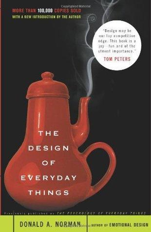
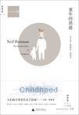
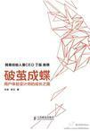
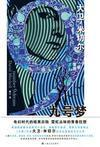
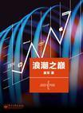
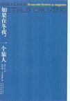
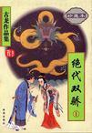

# Good Books I Read in the First Half of 2015

#### Five stars: highly recommended (in order of recommendation)

- [The Design of Everyday Things](http://book.douban.com/subject/1365318/) by Donald A. Norman

Category: **Design**

Review:
This is a book about design that takes a broad, commanding view while explaining things with meticulous care. Concise principles, detailed arguments, practical examples, and supplementary notes and references form its basic approach.

A good book in every respect, including the lack of footnotes that the author complains about: in the Kindle edition I read, the endnotes were properly linked to their markers. I learned a great deal. What stayed with me most was the use of information entropy to measure the complexity created by the number of product features and their corresponding controls.

Applying design principles in reverse is another interesting angle: for security, permissions, or the pleasure of a game.

Toward the end, the book discusses the linearity of text and the role of hyperlinks, which happens to be something I have been thinking about. I couldn't help marveling at how much the author had already considered so long ago. I read the 2002 edition, so those passages must have been written by then at the latest.

Appendix: [excerpts from the whole book](http://book.douban.com/review/7484409/).

- [尽头 (The End)](http://book.douban.com/subject/25762598/) by Tang Nuo

Category: **Essays**

Review:
Reading on and off from summer 2014 to February 2015, I finally reached the end. Yet I feel its echoes will linger strongly. This is a tree of a book, one that draws thought into profound depths. Another gain: many more writers and works I now want to know, including Yukio Mishima, Walter Benjamin, Flaubert and Kundera. Borges, one of the author's favorites, is of course one of mine too.

- [The Disappearance of Childhood](http://book.douban.com/subject/1005325/) by Neil Postman

Category: **Media**

Review:
Postman being Postman, although the book is about the emergence of the concept of childhood and its tendency to disappear, most of its argumentative energy goes into the nature and influence of print and television. For me, its strongest part is the first half's analysis of how the invention and spread of writing and printing changed the transmission of knowledge in human society. Many of its observations about the fundamental influence of written and printed media on the expression of content agree with my own thinking.

The second half mainly analyzes television's disruption of the system of written communication, leading adults and children to converge, and supports this with extensive social data. This involves a lot of American political and social knowledge, though, and I found it somewhat obscure and dry.

On China: Postman argues that because Chinese lacks a simple alphabetic writing system, printing initially had much less effect on society. The invention did not arrive at a favorable moment.

Appendix: [notes on the whole book](https://book.douban.com/review/7510159/).

- [破茧成蝶：用户体验设计师的成长之路 (From Cocoon to Butterfly: A UX Designer's Path to Growth)](http://book.douban.com/subject/25915629/) by Liu Jin and Li Yue

Category: **Design**

Review:
The first five chapters offered me little that was new. They are not very different from the systems analysis and design I studied as an undergraduate: probably an application of classical methodology to internet product design. Much of the work attributed here to designers or product managers was work I did in operations: data analysis, feature requests and little Photoshop advertisements at Yihaodian; then market analysis, user analysis and analysis of paths through features at a startup. At a small company, of course, you can do whatever needs doing as long as you don't waste time. My title was operations, but in practice I touched everything except development.

Chapter six is useful on practically every page. It connects requirements analysis to overall interaction design and explains several important design principles, inevitably recalling *The Design of Everyday Things* and Don Norman. Chapter seven covers the contents and finer techniques of interaction design deliverables: prototype wireframes, interaction specifications and so on. Chapter eight is mainly about teamwork, design reviews, and following through so that the final product matches the interaction design. Chapter nine briefly discusses testing and evaluation. Chapters ten through twelve are more about awareness and attitudes, with very good examples.

Detailed and well organized throughout, it lives up to its reputation as a good introduction to interaction design for internet software.

- [number9dream](http://book.douban.com/subject/24866005/) by David Mitchell

Category: **Fiction**

Review:
A story with a beginning but no end, interspersed with more stories that have beginnings but no ends, neither beginnings nor ends, or grand beginnings and feeble endings. Less exquisite than *Ghostwritten* or *Cloud Atlas*, but its chaos leaves a very particular melancholy.

- [浪潮之巅 (On Top of Tides)](http://book.douban.com/subject/6709783/) by Wu Jun

Category: **Technology**

Review:
I started this three or four years ago and finally read it from beginning to end this time. Some reviewers say that many of its views are too subjective and even many of its facts are the author's conjectures. Still, I can't think of another book currently offering such a comprehensive, rational and engaging account of the IT industry's development over several decades. Some of its analyses of key factors resonated strongly with me.

- [If on a Winter's Night a Traveler](http://book.douban.com/subject/2136484/) by Italo Calvino

Category: **Fiction**

Review:
Highly experimental: a novel with only beginnings and no endings. The way it finally connects all the chapters is quite brilliant.

- [绝代双骄 (The Peerless Twins, three volumes)](http://book.douban.com/subject/1089517/) by Gu Long

Category: **Fiction**

Review:
The first original Gu Long novel I finished. The plot is wonderfully entertaining and the interlocking stories are extremely intricate. Yet each character's ending feels plain and natural, which shows his skill.

#### Four stars: worthwhile (in reading order)

- [古董局中局3：掠宝清单 (Antique Mystery 3: The Looting List)](http://book.douban.com/subject/26261240/)
- [Farewell My Concubine](http://book.douban.com/subject/2137767/)
- [一路去死 (On the Road to Death)](http://book.douban.com/subject/20442382/)
- [楼下的房客 (The Tenants Downstairs)](http://book.douban.com/subject/1485495/)
- [我的征途是星辰大海 (My Journey Is the Stars and the Sea)](http://book.douban.com/subject/4937547/)
- [Blindsight](http://book.douban.com/subject/10608453/)
- [Steal Like an Artist: 10 Things Nobody Told You About Being Creative](http://book.douban.com/subject/7061613/)
- [中国吃 (Eating in China)](http://book.douban.com/subject/1064014/)
- [Ringworld](http://book.douban.com/subject/3684656/)
- [狂骨之梦 (A Dream of Crazy Bones)](http://book.douban.com/subject/3316174/)
- [The Crowd: A Study of the Popular Mind](http://book.douban.com/subject/2256351/)

*Compiled from the books I recorded on Douban and the short reviews I left after reading them. Book links and cover images are from Douban; all Douban links on this page are in Chinese. English renderings accompanying untranslated Chinese titles are descriptive.*
