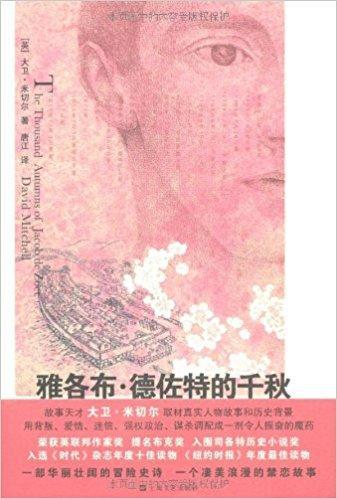
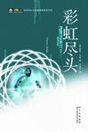
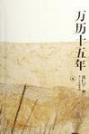
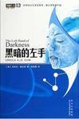

# Good Books I Read in the Second Half of 2015

#### Five stars: highly recommended (in order of recommendation)

- [The Thousand Autumns of Jacob de Zoet](https://book.douban.com/subject/11501823/) by David Mitchell

Category: **Novel**

Review:
The most brilliant parts: the revelation of the thirteen tenets of the Mount Shiranui shrine, Uzaemon's death, the British ship's unloosed cannon fire, and the magistrate and abbot's game of Go alongside a butterfly's life and death. Jacob, Orito, Uzaemon, the abbot, the magistrate and the British captain all leave deep impressions. Dr. Marinus is practically a symbolic figure, quite distinctive.

Ten years, twenty, thirty, and at the very end: the person that copper-haired, green-eyed Jacob still could not forget was Orito Aibagawa, on the far side of the world. Black hair, black eyes, independent and quiet, still beautiful with the burn scar on her left cheek, and never his.

- [Rainbows End](https://book.douban.com/subject/3601195/) by Vernor Vinge

Category: **Novel | Science fiction**

Review:
The best science fiction depiction of virtual reality I have read. Memorable ideas include the strange route through which mind control works; search and analysis as basic vocational school subjects; connecting knowledge across fields becoming more important than deep exploration; clusters of analysts; and the almost omnipotent Rabbit's fundamental, fatal weakness, which even it did not initially understand: all its eggs in one basket.

Its brilliance lies in the various premises. The plot seems unfinished.

- [1587, A Year of No Significance](https://book.douban.com/subject/1041482/) by Ray Huang

Category: **Social sciences**

Review:
The book's overarching perspective: many local problems ultimately came from the Ming dynasty's rule by civil officials and its ethical structure being too backward to meet changing economic and foreign affairs needs. This top-down perspective is not beyond dispute, of course. The top constrains the bottom, but the bottom may also drive the top. Conditions across the long span from the Wanli reign to the late Qing and early Republic could hardly have remained as unchanged as the author suggests. One point always holds, though: a collective runs into serious trouble when no institutional system properly maintains and coordinates the relationship between its upper and lower structures in both directions.

And the Ming state's grain and supply transport problems are a potent reminder of the importance of decoupling. Transport between peers without distribution hubs: just thinking about it is a nightmare…

Appendix: [excerpts from the whole book](https://book.douban.com/review/7569857/).

- [The Left Hand of Darkness](https://book.douban.com/subject/3816883/) by Ursula K. Le Guin

Category: **Novel | Science fiction**

Review:
A very slow-burning book. The story only starts moving toward its climax almost halfway through, when Estraven goes to rescue Ai. Their escape is the best part. Its worldbuilding is excellent, from the planetary environment and human physiology to technology, culture, politics and philosophy. The contrast between the two countries' institutions and populations is interesting. A novel focused on feeling and worldview: the relationship the two protagonists finally develop is hard to define, but it lingers.

#### Four stars: worthwhile (in reading order)

- [Taipei People](https://book.douban.com/subject/1031146/) **Short stories**
- [黑暗之城：九龍城寨的日與夜 (City of Darkness: Days and Nights in Kowloon Walled City)](https://book.douban.com/subject/26552069/) **Social sciences | Architecture**
- [The Secret Language of Color](https://book.douban.com/subject/24661349/) **Nature | Design**
- [Norwegian Wood](https://book.douban.com/subject/1046265/) **Novel**
- [Mastering Machine Learning with scikit-learn](https://book.douban.com/subject/26281221/) **Computing | Python**
- [哲学 科学 常识 (Philosophy, Science, Common Sense)](https://book.douban.com/subject/1986050/) (appendix: [excerpts](http://book.douban.com/review/7690584/)) **Philosophy**
- [The Willpower Instinct](https://book.douban.com/subject/10786473/) (appendix: [excerpts](http://book.douban.com/review/7716025/)) **Psychology**

*Compiled from the books I recorded on Douban and the short reviews I left after reading them. Book links and cover images are from Douban; all Douban links on this page are in Chinese. English renderings accompanying untranslated Chinese titles are descriptive.*
