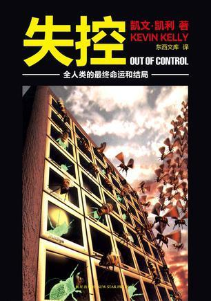
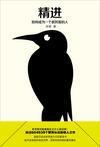
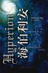
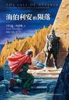

# Good Books I Read in 2016

#### Five stars: highly recommended (in order of recommendation)

- [Out of Control: The New Biology of Machines, Social Systems, and the Economic World](https://book.douban.com/subject/5375620/) by Kevin Kelly

Category: **Technology | Across disciplines**

Short review:
A book discussing fascinating concepts including collectives, control, complex systems, evolution, adaptation, and the convergence of biology and machines. It has a typically Western approach, with plentiful, lively examples and an emphasis on connecting phenomena across broad fields. The writing flows well and the examples fit. Some of its references also show that the author has an academic grounding. Extremely thought-provoking.

Appendix: [excerpts from the whole book](https://book.douban.com/review/7945102/).

- [精进：如何成为一个很厉害的人 (Making Progress: How to Become a Highly Capable Person)](https://book.douban.com/subject/26761696/)

Category: **Psychology | Methodology**

Short review:
This book is quite controversial on Douban. Some think it just repackages what everyone already knows; I disagree. Its title sounds like motivational chicken soup, and the author's marketing on Weibo and Zhihu honestly gets irritating. But overt advertising like this is actually among the more conscientious kinds.

Considering only the book, I think it is a good discussion of thinking and methodology. The prose is not entirely smooth, but the content is illuminating. Memorable ideas include the half-life of returns, choosing interruption points in tasks, divergent and convergent thinking, the Johari window, and overestimating one's grasp of knowledge during concentrated study… Still, practice is what actually creates value. This book did influence my later decisions and ways of doing things, particularly making me more deliberate about where to pause a task. Five stars isn't excessive for a book that changes life in practice.

Appendix: [excerpts from the whole book](https://book.douban.com/review/8088495/).

- [Hyperion](https://book.douban.com/subject/2052049/) by Dan Simmons

Category: **Novel | Science fiction**

Short review:
The structure of six people telling their stories reminded me of *Cloud Atlas*. This is a richly imagined world with brilliant premises. I happened to be playing *The Elder Scrolls* while reading it and felt a kinship in their grandeur. The stories are understated and moving, told in a steady, matter-of-fact voice: science fiction combining the soft and the hard. The Shrike, the Time Tombs, the labyrinth worlds: what an enormous mystery. Of the six stories, the one about aging backward left the strongest impression, followed by the priest's and the colonel's.

- [The Fall of Hyperion](https://book.douban.com/subject/25941905/)

Category: **Novel | Science fiction**

Short review:
The second book of the Hyperion quartet. It becomes terrific once the climax gets underway… Full of details and descriptions of the world, combining space opera, cyberpunk and time travel. You can see the nourishment many science fiction works have drawn from it, and it also recalls the roughly contemporary *A Fire Upon the Deep* series. Many mysteries are revealed and new ones appear. The labyrinths, which interest me most, still haven't been explained. And what about faster-than-light travel and the voice behind it? Looking back after reading the third book, I find many mysteries in this second one still unresolved. Gladstone, such a contrast with Cheng Xin in *The Three-Body Problem*, haha, and Kassad are wonderfully drawn. The parts beyond the plot deserve rereading.

#### Four stars: good (in reading order)

- [The Little Prince](https://book.douban.com/subject/4894876/) **Fairy tale**
- [超·杀人事件 (Super Murder Cases)](https://book.douban.com/subject/5939312/) **Fiction | Mystery | Deconstruction**
- [Baccano! 01](https://book.douban.com/subject/3242963/) **Fiction**
- [隱形邏輯：香港式建築極限 (Invisible Logic: The Limits of Hong Kong Architecture)](https://book.douban.com/subject/26381084/) **Architecture | Design** (unfinished)
- [呼兰河传 (Tales of Hulan River)](https://book.douban.com/subject/1060852/) **Fiction | Literary**
- [The Martian](https://book.douban.com/subject/26586492/) **Fiction | Science fiction**
- [可能与不可能的边界：P/NP问题趣史 (The Boundary Between the Possible and Impossible: A History of the P/NP Problem)](https://book.douban.com/subject/25779326/) **Popular science | Mathematics**

#### Roundup

I finished far fewer books in 2016 than in 2015. A small goal for 2017: every month, finish one leisure read, mainly fiction, and one broad read that expands my horizons and stimulates thinking, such as *Out of Control* or *精进*. Every two months, finish one book of intensive study, such as mathematics or coding. This will probably still be a little difficult, particularly the intensive study. But without a goal, attention never gets allocated to it, and progress becomes difficult.

*Compiled from the books I recorded on Douban and the short reviews I left after reading them. Book links and cover images are from Douban; all Douban links on this page are in Chinese. English renderings accompanying untranslated Chinese titles are descriptive.*
