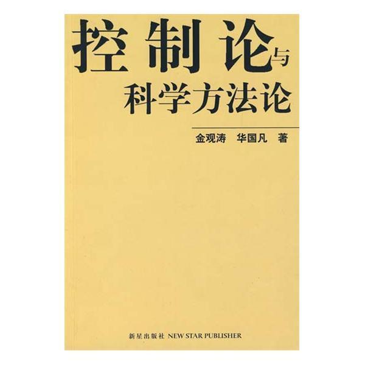
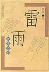
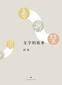

# Books I Read in the First Half of 2017

#### Five stars: highly recommended (in order of recommendation)

- [控制论与科学方法论 (Cybernetics and Scientific Methodology)](https://book.douban.com/subject/1322336/) by Jin Guantao and Hua Guofan

Category: **Broad reading | Cybernetics | Philosophy of science**

Short review:
First reading: a good book worth reading several times. Without advanced mathematics, it connects cybernetics, systems theory, information theory, and the general patterns of scientific discovery through plain examples. I finally have some understanding of why those first three are collectively called the “old three theories.”

This was my second reading, years later. I gained considerably more, but also found the book less good than I once thought. Discussing concepts while bypassing rigorous definitions is difficult after all. The final section on black-box epistemology is good and happens to relate to the articles I have been writing recently, the [Problem Solving and Design series](problem-solving-and-design-1-situation.en.html). It helped a little.

Appendix: [excerpts: feedback, conjugacy, catastrophe and stability, black-box epistemology](https://book.douban.com/review/8407350/).

- [Thunderstorm](https://book.douban.com/subject/1013416/) by Cao Yu

Category: **Fiction | Drama**

Short review:
Read in one sitting. I wonder whether this represents the ultimate in dramatic conflict. At several points a slightly happy ending was possible, but all sorts of details became the last straw, and everything collapsed at the end. As drama, that is artistic and beautiful. Back in the real world, though, it is better to let go of fixations where possible, avoid getting trapped in a rigid mindset, and be able to both take things up and put them down.

- [文字的故事 (The Story of Writing)](https://book.douban.com/subject/4067778/) by Tang Nuo

Category: **Broad reading | Culture**

Short review:
Knowledge, flavor, thought. Work has recently brought me into closer contact with Chinese characters from mathematical perspectives. Individual characters become almost entirely abstract symbols; even their meanings are obtained indirectly from context and the like. Yet every character has a story, connected to a knowledge base developed over thousands of years. Starting from oracle-bone inscriptions and other early characters, Tang Nuo reveals a small part of the winding evolution of this symbolic system and its semantic repository, then raises farther-reaching questions and reflections. A “professional reader” indeed.

More remarkable still is his ability to balance feeling and reason, phenomena and logic: rich, concrete description on one side, concise thought on the other. The birth and death of characters, their origins and destinations, their many forms, and the eternity of writing as a whole compared with individual human lives: fascinating and captivating. Reading it restored much of my love for writing, especially Chinese characters.

Appendix: [excerpts: conceptual abstraction, phonosemantic characters, shared memory and encoding/decoding, semi-supervised evolution](https://book.douban.com/review/8331157/).

#### Four stars: good (in reading order)

- [Endymion](https://book.douban.com/subject/25941891/) **Fiction | Novel | Science fiction**

- [The Rise of Endymion](https://book.douban.com/subject/25941893/) **Fiction | Novel | Science fiction**

- [科学的极致：漫谈人工智能 (The Extremes of Science: Essays on Artificial Intelligence)](https://book.douban.com/subject/26546914/) **Broad reading | Popular science | Computing | Mathematics**

  Short review:
  Quite a good book. Although the title says artificial intelligence, it also discusses complex systems and topics leaning toward physics, beyond what is ordinarily called AI. These are fascinating subjects, many worth further study, and the references are fairly comprehensive. The quality varies between essays, though. Some read more like quickly written blog posts, wandering wherever a thought takes them. Many formulas are presented without enough explanation. As popular science, it fails to make difficult ideas accessible; the neural network section is rather muddled. The whole book also lacks cohesion, though it passes muster as an essay collection.

  Appendix: [excerpts: three schools, Turing machines, general intelligence, self-reference, flow networks, collectives](https://book.douban.com/review/8339197/).

- [庆余年 (Joy of Life series)](https://book.douban.com/subject/3155622/) **Fiction | Novel | Time travel**

#### Three stars (in reading order)

- [博尔赫斯谈话录 (Conversations with Borges)](https://book.douban.com/subject/25952961/) **Broad reading | Interviews | Literature**
- [The Golden Bough (two volumes)](https://book.douban.com/subject/1905742/) **Broad reading | Culture | Religion**
- [人间词话 (Remarks on Ci Poetry)](https://book.douban.com/subject/1203426/) **Broad reading | Literature**

#### Roundup

- Some simple figures:
  - Reading time: approximately 86.1 hours, averaging 14.4 a month.
  - Completed versus planned: fiction 4/6; broad reading 6/6; intensive study 0/3; total 10/15.
  - Five stars: fiction 1/4; broad reading 2/6.
  - Four stars: fiction 3/4; broad reading 1/6.
  - Three stars: broad reading 3/6.

- Progress: quite far short of the earlier plan to [finish 2.5 books a month](reading-2016.en.html). If I counted the volumes of *Joy of Life* separately, the fiction/leisure part would be way over the target (hides face). Broad reading was just right; intensive study was a complete collapse, Orz. Overall, still an improvement on 2016. I need to make more effort, squeeze down gaming time further, and stop taking it quite so easy, haha.

- New goals for the second half: fiction 2; broad reading 4; intensive study 2.

- New plan: for five-star books in broad reading or intensive study, try more ways of consolidating what I gain, such as longer reviews and relationship diagrams of knowledge or concepts, to get more out of them.

- Additional content: three-star books join the roundup from this edition. Feels like a good way to draw fire; come argue! Actually, three stars from me on Douban is still all right. Below that, I don't even bother recording the book.

*Compiled from the books [I](https://www.douban.com/people/simoncos/) recorded on Douban and the short reviews I left after reading them. Book links and cover images are from Douban; all Douban links on this page are in Chinese. English renderings accompanying untranslated Chinese titles are descriptive.*
