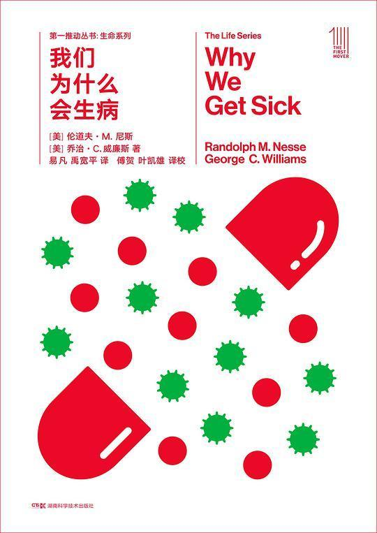

# 2018年我读过的好书

#### 五星推荐（按推荐顺序）

- [我们为什么会生病](https://book.douban.com/subject/30164677/ "我们为什么会生病") by 伦道夫·M·尼斯、乔治·C·威廉斯

分类：**泛读 | 生命科学 | 科普**

评：非常好的科普，从演化/达尔文的视角看医学/生物学的方方面面，并提出很有意义的猜想和问题。关于人类眼球、呼吸道和食道等的进化bug都很经典，不久前还在知乎上看到人拿来反对设计论。距离英文初版94年超过二十年了，颇有兴趣继续了解一下演化生物学迄今为止有哪些相关发展。结合genetic programming、genetic engineering相关知识（虽然都叫genetic，完全两个领域），或者在读者生病时看更带感（雾

附：[全书摘抄](https://book.douban.com/annotation/66339095/)

#### 四星不错（按最近阅读顺序）

- [Programming Collective Intelligence : Building Smart Web 2.0 Applications](https://book.douban.com/subject/2209702/ "Programming Collective Intelligence") **精读 | 计算机 | 数据挖掘**
  评：涵盖了一些常见的数据挖掘算法，和内容对比书名似乎有点容易误导，除非说只要是数据集都算collective。各种算法蜻蜓点水，这次算是借本书为索引，再去搜索、巩固一些基本知识。一些应用试用场景及细节讲得不错，但是没有对应上专有术语也没有引用，导致入门者难以深入。代码和实验没怎么看得进去（genetic programming那章实现除外）。随机优化那一章收获蛮多的：cost function, representation of constrained problem, similar solutions yield similar results。

- [心 : 夏目漱石作品系列](https://book.douban.com/subject/27135380/ "心") **虚构 | 小说 | 日本**
  评：有一个书评写得好，犹豫不决和暧昧来源于对自己和他人的不信任，最后让人将自己的命运交予外部世界。

- [必然](https://book.douban.com/subject/26658379/ "必然") **泛读 | 科技**
  评：观点很好，有些点和我正在写的文章一模一样。。。美式啰嗦减一星，不过也算是帮忙提供了一点写作素材
  附：[全书摘抄](https://book.douban.com/people/simoncos/annotation/26658379/)

- [沙丘](https://book.douban.com/subject/26836970/ "沙丘") **虚构 | 小说 | 科幻**
  评：设定有趣，传奇色彩挺浓的

- [尽头](https://book.douban.com/subject/25762598/ "尽头") **泛读 | 文学 | 二刷**
  评：二刷，现在来看唐诺确实有点啰嗦和掉书袋，但想要表达的东西毕竟复杂，只能靠冗余和网络来逼近准确？减一星，但仍是一本值得读的书。
  附：[全书摘抄](https://book.douban.com/people/simoncos/annotation/25762598/)

- [Improv Wisdom : Don't Prepare, Just Show Up](https://book.douban.com/subject/2887103/ "Improv Wisdom") **泛读 | 方法论**
  评：跟我的一些想法和做法有相合之处。即兴是一种放松的专注，在作者的总结里不只是flow本身，也包括令人更有机会进入flow的方法。即使盲目乐观也比不开始更好，put doing before thinking，这是我期待自己可以做到的。幽默本身价值不大这个观点也值得思考。
  附：[全书摘抄](https://book.douban.com/people/simoncos/annotation/2887103/)

- [鹿鼎记 : （全五册）](https://book.douban.com/subject/1559310/ "鹿鼎记")  **虚构 | 小说 | 武侠**
  评：金庸的情节确实扎实，只不过有时比较拉杂。七个老婆有种钦定的感觉，到最后十几章完全变成龙套了。神龙教和日月神教一样，明眼人应瞧得出来原型的蛛丝马迹。直男癌仍然严重。这里面写的最好的情感部分，倒可能是韦小宝和康熙了。

- [Think Python : How to Think Like a Computer Scientist](https://book.douban.com/subject/26634683/ "Think Python") **精读 | 计算机 | Python**
  评：写了三年python代码了，这还是我看完的第一本关于Python的书，依然有所收获。以现在我对Python的了解程度看，本书内容流畅，都是要点精华，所有提到的都讲得十分透彻，概念定义清晰、前后连贯，并且都有作者的个人实践经验和深入理解，每章后面不光有练习还有debug经验分享。即使没接触过任何编程语言的人，也可以从这本书入门写代码。

- [链接 : 商业、科学与生活的新思维(十周年纪念版)](https://book.douban.com/subject/24862722/ "链接") **泛读 | 科普 | 复杂系统**
  评：非常好的早期复杂网络研究及应用领域介绍，没背景看个热闹，有背景感觉全书充当了一个简单综述的作用。一个收获是可以看到早期复杂网络的一些研究历程，特别是从静态的随机图如何到生长机制（结点的新生消亡）+链接偏好；另外也进一步认识到复杂网络的广泛存在，幂律在各种网络里的发现，任何复杂系统背后很可能都有网络的存在，关于艾滋病的传播与治疗和基因-蛋白质相互作用的系统都挺有趣；阿喀琉斯之踵的部分也很有意思，幂律下的无尺度网络可以抵御随机攻击/故障（容错性高），但却受不了人为对枢纽节点的针对性攻击，不重要与重要在骰子的哪一端变得critical（但如果枢纽节点的内部也是一个比较无中心化的子网络呢？比如Google.com的背后）。虽然行文有些部分因为过多引用导致凌乱，但总体是很好的科普/科研入门用书。
  附：[全书摘抄](https://book.douban.com/people/simoncos/annotation/24862722/)

- [笑傲江湖（全四册）](https://book.douban.com/subject/1002299/ "笑傲江湖（全四册）") **虚构 | 小说 | 武侠**
  评：散了点，边角没必要的写得多了，很多主要剧情转得突兀。写得好的有学剑、梅庄和三女感情线的一部分。杨莲亭是个大胡子666

- [故事 : 材质、结构、风格和银幕剧作的原理](https://book.douban.com/subject/25976544/ "故事") **泛读 | 创意 | 剧作**
  评：不错的书，对于我一门外汉来讲，算是对电影剧本及故事有了一些系统性的了解，有助于更好地欣赏别人的创作，以及审视自己的idea。
  附：[全书摘抄](https://book.douban.com/people/simoncos/annotation/25976544/)

#### 小结

- 简单统计：
  - 总体：约107.5小时，月均9.0小时，共18本
  - 分类：虚构（6），泛读（10），精读（2）
  - 星级：五星力荐（1），四星推荐（11），三星还行（6）
- 完成情况：参考之前计划的[每月完成2.5本书](reading-2016.html)则一年共30本，我了个sigh，18本压了及格线。还有一本未完成但应该会继续的精读：[Deep Learning](https://book.douban.com/subject/26883982/)，目前只读完第一部分。
- 2019年新目标：总阅读时间到200小时，精读5+，泛读保持10+，争取多输出。

*注：本文整理自[我在豆瓣上记录的书及短评](https://book.douban.com/people/simoncos/collect)，书籍信息链接及图片来源均为豆瓣。*
