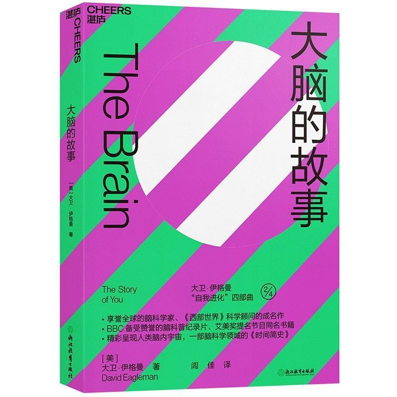
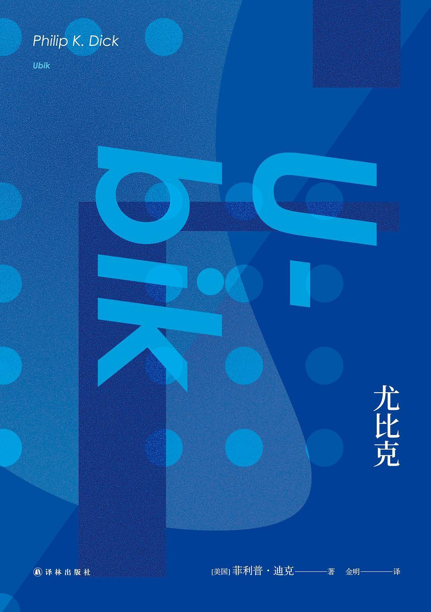
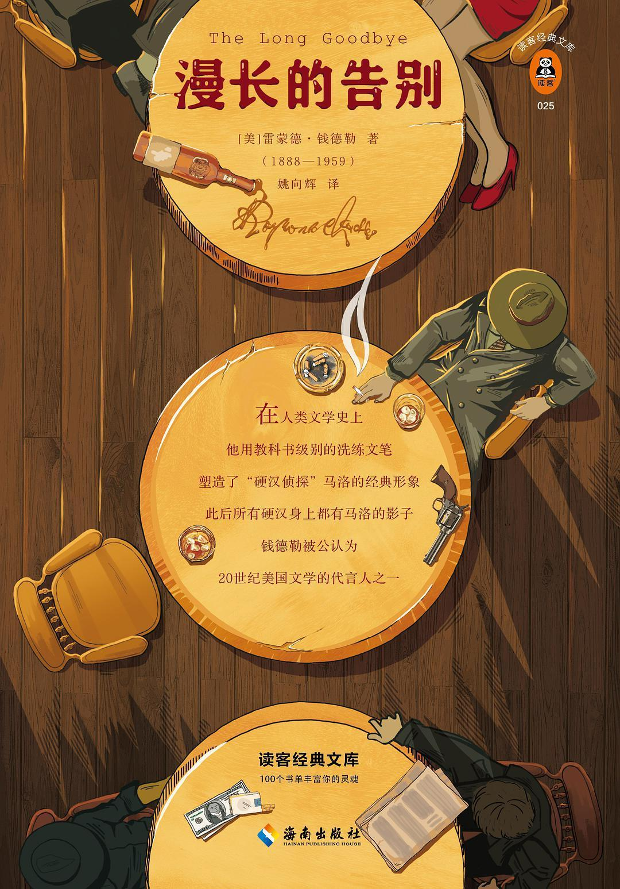
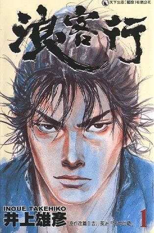
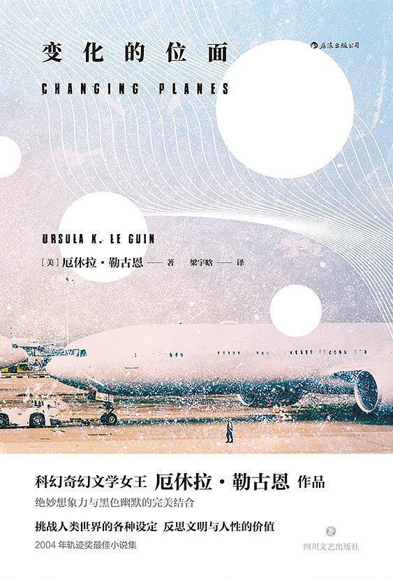

# 2019年我的读书小结

#### 五星力荐（按推荐顺序）

- [惊人的假说](https://book.douban.com/subject/30171327/) by [英] 弗朗西斯•克里克（Francis Crick） &
- [大脑的故事](https://book.douban.com/subject/33383607/) by [美] 大卫·伊格曼（David Eagleman）

分类：**泛读 | 神经科学 | 科普**

评：
把这两本书并列放在一起，是因为内容一脉相承（主要从视觉角度来讨论意识问题），连作者都是师生关系。《惊人的假说》94年首版，出自克里克之手（没错，就是DNA那位），书名有点不知所云、术语多、信息密度大。全书最重要的几个关键词：意识、视觉、神经元、记忆、注意机制、猴子（雾）。神经网络那章提及的模型们可算得上是祖宗辈的了，有一个Adaline网络是60年的，真是令人感叹。《大脑的故事》2015年首版，有点像是10s对90s、学生对老师的一种传承。每章都是一个有趣的大问题，经典和前沿都有涉及到，举例精湛、行文老练，最后还有reference，从科普的角度上看也是一本青出于蓝的书。

附：[惊人的假说-全书笔记](https://book.douban.com/people/simoncos/annotation/30171327/) & [大脑的故事-全书笔记](https://book.douban.com/people/simoncos/annotation/33383607/)

- [尤比克](https://book.douban.com/subject/27041532/) by [美] 菲利普·迪克（Philip K. Dick）&
- [少数派报告（小说集）](https://book.douban.com/subject/27041504/) by [美] 菲利普·迪克（Philip K. Dick）

分类：**虚构 | 小说 | 科幻**

评：
或许菲利普·迪克（PKD）这个名字许多人包括我认知都不太足够，但《银翼杀手》《少数派报告》《高堡奇人》这些名字之中，我们总有一个不会太陌生。今年年末我连续读了五本PKD，此外《高堡奇人》美剧上市、游戏《Cyberpunk 2077》即将上市、电影《黑客帝国》传出可能拍续集的消息，加上一些现实世界的大变化，PKD和赛博朋克就像他笔下的幻觉一样无孔不入。《尤比克》是一本慢热的书，我读完只能骂出脏话，经历了前半本的乏味，后半本把我整个人抽离出去了一半，而《少数派报告》小说集里也是篇篇精彩。可能因为一些嗑药trip带来的体验，PKD的小说非常青睐于“自我意识”（自己不是自己）以及“真实与虚幻”这两个主题（世界不是世界），幽默感、故事套路和写侦探小说的雷蒙德·钱德勒有那么点神似。如果说阿西莫夫是科幻之神（希望其他粉不要打我），PKD可能是鬼。

- [漫长的告别](https://book.douban.com/subject/30316475/) by [美] 雷蒙德·钱德勒（Raymond Chandler）

分类：**虚构 | 小说 | 侦探**

评：
侦探/推理这个类型我已经多年未涉及了，很高兴能够读到这本合口味的小说。钱德勒的文笔可以封为神级，幽默、忧郁（这两个词放一起是不是很有意思）、利落、老辣，本书的翻译也功不可没，我第一次在小说里笔记这么多段落。豆瓣上一个短评说得好，侦探小说只是这个故事的外壳，好的类型小说或许都不满足于只当一本类型小说。“说一声再见，就是死去一点点。”告别的气氛蔓延全书，这种复杂的情绪可能是我们从这本书中所能带走的最美、最持久的东西。

- [浪客行](https://book.douban.com/subject/2065597/) by [日] 井上雄彥

分类：**虚构 | 漫画**

评：
神作无疑，画工让人流口水，无论是打斗、心理活动还是搞笑，表现力都非常强。很多角色的人设很惹人喜爱，故事和想要表达的思想也蛮有意思。ps.《古剑奇谭三》北洛的人设真的没有参考宫本武藏吗？然后...小次郎！！！这套漫画属于有生之年系列，不想放“在读”列表一辈子了，所以归到了已读。

- [变化的位面 Changing Planes](https://book.douban.com/subject/30324808/) by [美] 厄休拉·勒古恩（Ursula K. Le Guin）

分类：**虚构 | 小说 | 科幻**

评：
令人想起博尔赫斯、《你一生的故事》《格列佛游记》（小说）、《奇诺之旅》（动画）、《异域镇魂曲》（游戏），有文学性的幻想世界集锦，几乎每一个世界都能给我留下印象，有些如果扩展成更大的架空世界应该会很有趣，脑洞中足见厄休拉的渊博知识。书名Changing Planes一语双关，而《异域镇魂曲》的英文原名不正是Planescape吗，有意思。

#### 四星推荐（按最近阅读顺序）

- [仿生人会梦见电子羊吗？](https://book.douban.com/subject/27041533/) **虚构 | 小说 | 科幻**
  评：小说想要表达的东西比电影要复杂许多。个人最有感觉的片段是男主进入戏院直到证明另一个赏金猎人的身份的部分，以及公寓里的桃子和眼泪。

- [高堡奇人](https://book.douban.com/subject/27039411/) **虚构 | 小说 | 科幻**
  评：跟想象中不太一样的一本，作为科幻没有“幻”的东西，反而非常接近或者不如说根本就是严肃小说。读出了一点读云图时的感觉。

- [长眠不醒](https://book.douban.com/subject/27194517/) **虚构 | 小说 | 侦探**
  评：如村上所说，这本比《漫长的告别》凌乱，但是我真的蛮喜欢钱德勒的文笔，很老辣。

- [流吧！我的眼泪](https://book.douban.com/subject/27039412/) **虚构 | 小说 | 科幻**
  评：有点清奇啊，嗑过药才写得出来那些描述嗑药的段落吧，文学性也很强，如果归为类型小说可能有点概括不足了（这完全不是一部满足于讲故事的小说）。另外，风格真的令人想起钱德勒了。又：关注译者豆瓣了，真的是把这本书吃透了，译文才会让人觉得这么舒服吧。

- [脑与阅读](https://book.douban.com/subject/30391099/) **泛读 | 神经科学 | 科普**
  评：主题的深入与讨论的细致程度使然，这实在不能说是一本好读的科普，大量的神经科学/心理学研究成果（配图好评）加上作者本身的消化提炼猜想，甚至很有一点学术讨论的味道了。本书的主要内容虽然都与阅读相关，但最终目的是要探讨人类神经系统的适应性/可塑性。选阅读这个切入点可以说非常聪明，因为这种人类行为出现得非常晚，用进化很难解释；这种行为也是人类与其他动物的很大一个不同之处，因此可以做许多横向对比。阅读这件事同时涉及到低级的视觉、听觉（主要跟学习有关）信息加工，此外还有更深层次的语义加工，可以说是一个相当大的坑。对语言、视觉、神经科学感兴趣的人，这本书都非常值得一读，繁复之下，即使不陷入每一个细节，也能有非常多的收获。本书成书于09年，十年里得有多少重要成果呢？
  附：[全书笔记](https://book.douban.com/annotation/91195405/)

- [看海的人（小说集）](https://book.douban.com/subject/26280924/) **虚构 | 小说 | 科幻**
  评：每篇都挺有意思的，神奇的几何与力、不均匀的时空、量子传送、因果衔尾蛇、虚拟化与缓存泄漏、同化与退化与洗脑...最喜欢 缓存 和 看海的人。

- [自私的基因 40周年增订版](https://book.douban.com/subject/30290031/) **泛读 | 生物学 | 科普**
  评：站在前沿上的科普向书注定会有许多问题，从多年再版的修修补补可见一斑，但这不能掩盖本书的发光之处。写作上一个比较明显的缺点是部分论述过于冗长，特别是倒数第二章里对各种评论的回应。meme是我圈子里对这本书提到最多的部分，但在书中其实只有很初步的讨论。反而是从基因粒度去看演化的视角让人对自然演化有了更多理解。阅读本书前后经过了三个礼拜的时间，中间留下了不少划线和想法，总的来讲挺有收获。
  附：[全书笔记](https://book.douban.com/annotation/91195438/)

- [认知天性](https://book.douban.com/subject/30353486/) **泛读 | 心理学 | 科普**
  评：结构松散，内容还是有价值，除了一些老朋友外，一些例子我是在本书第一次见，与《学习之道》《刻意练习》互相映衬，互为补充。
  附：[全书笔记](https://book.douban.com/people/simoncos/annotation/30353486/)

- [论自由](https://book.douban.com/subject/4820726/) **泛读 | 政法**
  评：读（值得读的）书并不代表可以解决一切问题，但至少让你剩下需要考虑的问题稍微高级一点。本书思想也有其局限性（如原则过于简化，从最后一章陷入对各种实际问题进行的费力讨论中可见一斑），但精华仍然是精华。可惜的是，不愿意读书的人，你是很难强迫他读进去的。即使愿意，读书也非常容易因固有立场陷入片面。书里提到：不同观点交锋出真知。而同温层中尽是回声。这本书出版于1859年，整整160年，世界在人文面上步履维艰。翻译堪堪及格。在这个节骨眼上读此书，带着自己的所见所思来读，还是有一些收获的，晚点放笔记上来。
  附：[全书笔记](https://book.douban.com/people/simoncos/annotation/4820726/)

- [暗时间（文集）](https://book.douban.com/subject/6709809/) **泛读 | 心理学 | 问题解决**
  评：过于散乱，其实关注的东西都很有意思，也看得出来作者读了很多认知心理方面的书。我看到y combinator部分时被成功绕进去了，想起了被GEB支配的恐惧（不愧是连名字都照学GEB的文章）...之后有时间再补完。排序文章戳中g点，排序问题其实就是搜索问题，另外最后一篇贝叶斯则刚好给我文章草稿提供了素材，加一星！
  附：[全书笔记](https://book.douban.com/people/simoncos/annotation/6709809/)

- [上瘾](https://book.douban.com/subject/27030507/) **泛读 | 心理学 | 设计**
  评：上瘾这个译名不如原名hooked，全书总的来说比想象中好。培养用户习惯的四步：内外触发、行为、奖励（特别是多变的）、投入，跟learning how to learn里的习惯四要素有很明显的对应，书中还提到几种认识偏差。不少例子很对我口味，比如lol和stackoverflow，另外还带了一笔游戏化。第六章的自己会用/对用户有很大价值这两个维度的讨论很有趣。
  附：[全书笔记](https://book.douban.com/people/simoncos/annotation/27030507/)

- [学习之道 Learning how to learn](https://book.douban.com/subject/26895988/) **泛读 | 心理学**
  评：前两周刚上完公开课，现在再过完一遍书，中间已经开始用上了书里提到的一些方法如番茄时钟、每日清单、回想。受益匪浅。之后的学习过程中也要多回顾多尝试运用。
  附：[全书笔记](https://book.douban.com/people/simoncos/annotation/26895988/)

- [阿莱夫（小说集）](https://book.douban.com/subject/25796122/) **虚构 | 小说**
  评：这一本有好几篇都很有味道。被《阿莱夫》那段列锦秀哭了。读起来大脑完全进入diffuse mode，非常放松，莫名地很搭shafiq的soul album《the loop》。

- [数学](https://book.douban.com/subject/25829287/) **泛读 | 数学**
  评：章节名都是数学里可能算是一等一重要的基本概念
  附：[全书笔记](https://book.douban.com/people/simoncos/annotation/25829287/)

- [文明的冲突与世界秩序的重建](https://book.douban.com/subject/4202004/) **泛读 | 政治｜外交**
  评：大学时看了个开头，这次终于一遍通读完了。感觉被本书纠正了不少以前对政治和外交的naive认知，对于宗教也有了一些不同的观念。虽不至于认为书中观点都是正确的，但其中大量的事实细节及观点表述过程，足够让人得以稍稍更深入地理解一些事情。行文态度上个人觉得作者已经算是非常中立了，并没有明显地倾向于某种文明和价值观。把二十年前的本书与这二十年里发生的一些大事（比如阿拉伯之春、美国总统竞选和一带一路）和小事（还有日常在网络上、生活中接触到的各种舆论观点）相对照，仔细琢磨下，感觉非常有意思。
  附：[全书笔记](https://book.douban.com/people/simoncos/annotation/4202004/)

- [三体全集 : 地球往事三部曲](https://book.douban.com/subject/6518605/) **虚构 | 小说 | 科幻**
  评：三刷完成（第三部是二刷），上次刷还是六七年前，瑕不掩瑜。这次感觉前两本比第三本好。不同段落水准有差异，很多地方文笔总感觉不顺畅。

- [杜撰集（小说集）](https://book.douban.com/subject/25796061/) **虚构 | 小说**
  评：用不像小说的手法写像小说的文本

- [小径分岔的花园（小说集）](https://book.douban.com/subject/25796120/) **虚构 | 小说**
  评：这次重读觉得反而不如恶棍列传喜欢，可能是太形而上、隐喻太多的关系。当然不可否认其先锋性，但叙述过于蜻蜓点水给人一种没有把事情想深入想明白、偷懒的印象，也或许正是作者想要给我们的印象，毕竟骨子里还是个诗人。

- [恶棍列传（小说集）](https://book.douban.com/subject/25796066/) **虚构 | 小说**
  评：《恶棍列传》部分的梗概和白描以前不解其好，现在能够欣赏，蛮喜欢王永年的译文。有不少句子都很有味道，大部分出现在各个故事结尾。比如“多年来一直追踪他的可怕的马车撞上了他”，或是“xxx凌晨，纽约一条繁华街道上发现了xx的尸体。他身中五弹。一只幸免于难的、极普通的猫迷惑不解地在他身边逡巡。”几个故事都简洁有力，画面感很强。《玫瑰角的汉子》则是埋了第一人称为犯人的梗，《双梦记和其他》里五个故事中的两个来自一千零一夜（后者真神作，好想搞一套全集）。

#### 小结

总的来说今年比去年有进步，阅读总时长有提高，虽然非虚构精读没有一本完成，但泛读多了不少，远超[年初定下的目标](reading-2018.html)，并且都输出了许多想法可以留待更深入的探索，虚构方面也读到不少好书。书源方面，特别安利一下微信读书：书库全、有无限卡免费读所有的书、笔记导出功能、社交链，此外最近还出了支持多款电子书设备的app，总体完胜Kindle、多看、豆瓣。

- 2019小结：
  - 总体：约149.5小时，月均12.5小时，共42本（漫画1套算1本）
  - 分类：非虚构泛读（21），非虚构精读（0），虚构（21）
  - 星级：五星力荐（7），四星推荐（19），三星还行（15），二星较差（1）
  - 目标达成：
    - 总时间：149.5/200
    - 非虚构精读：0/5
    - 非虚构泛读：21/10
- 2020目标：
    - 总时间：200
    - 非虚构精读：5
    - 非虚构泛读：10
    - 书评：2

*注：本文整理自[我在豆瓣上记录的书及短评](https://book.douban.com/people/simoncos/collect)，书籍信息链接及图片来源均为豆瓣。*
