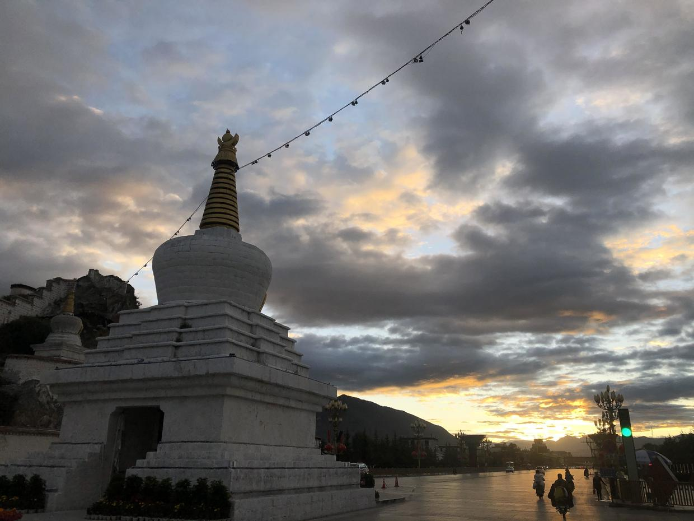
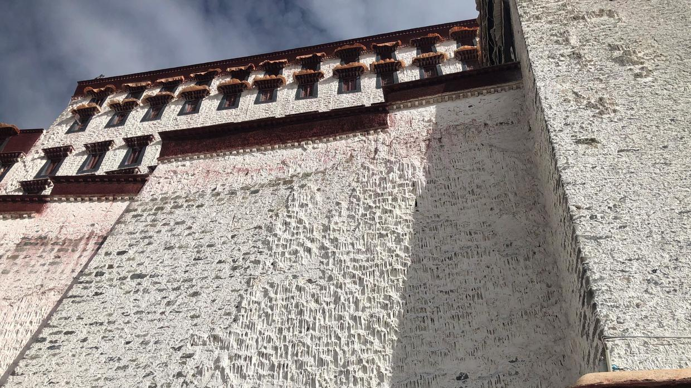
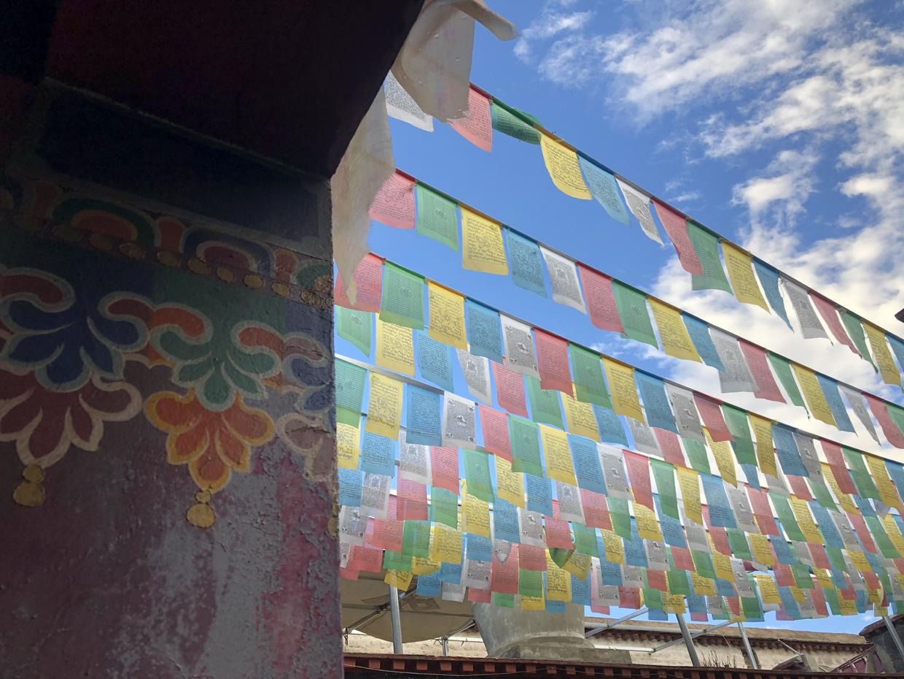
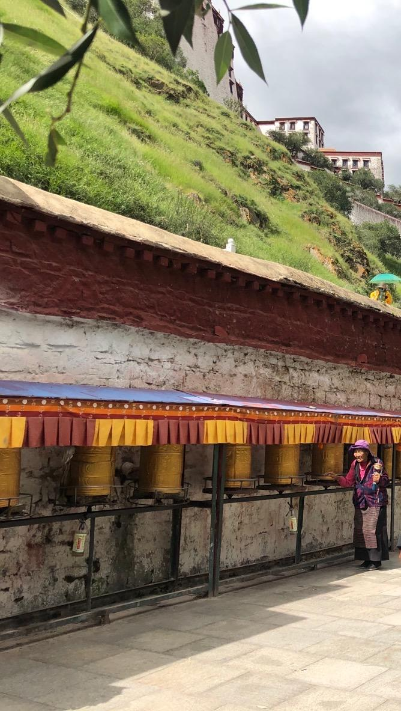
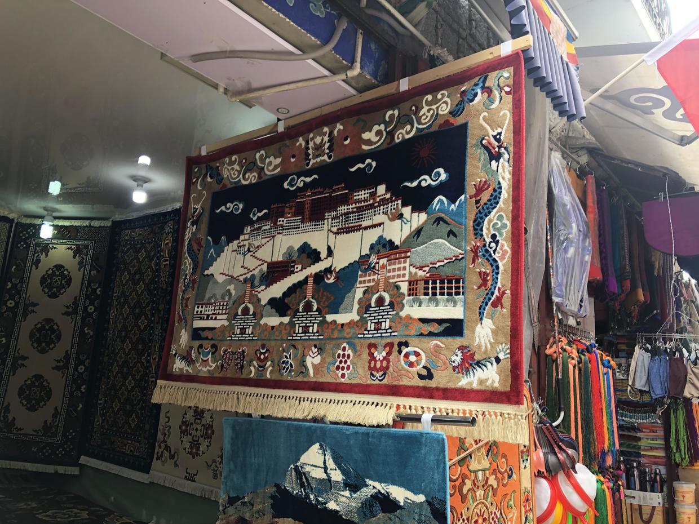
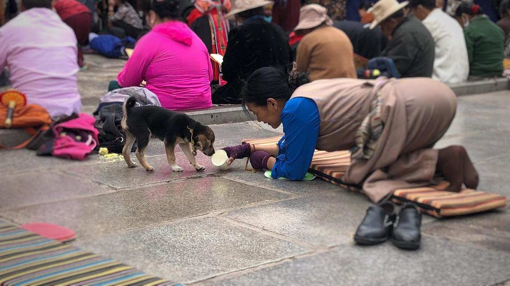
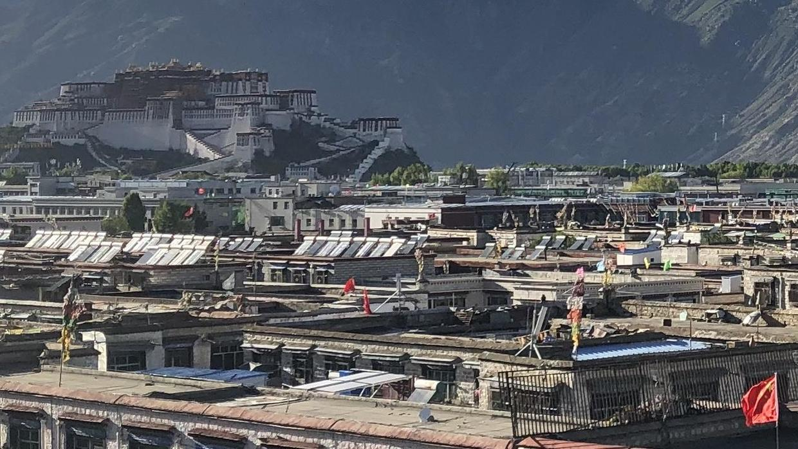
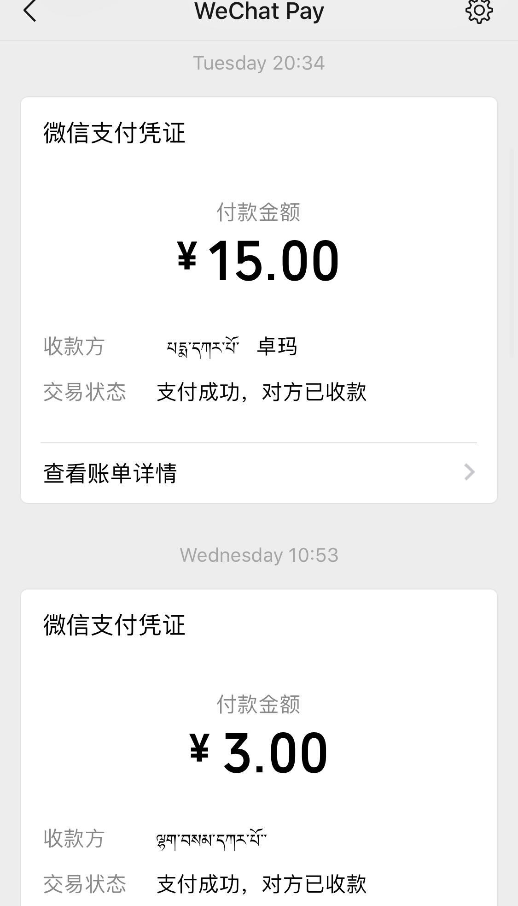
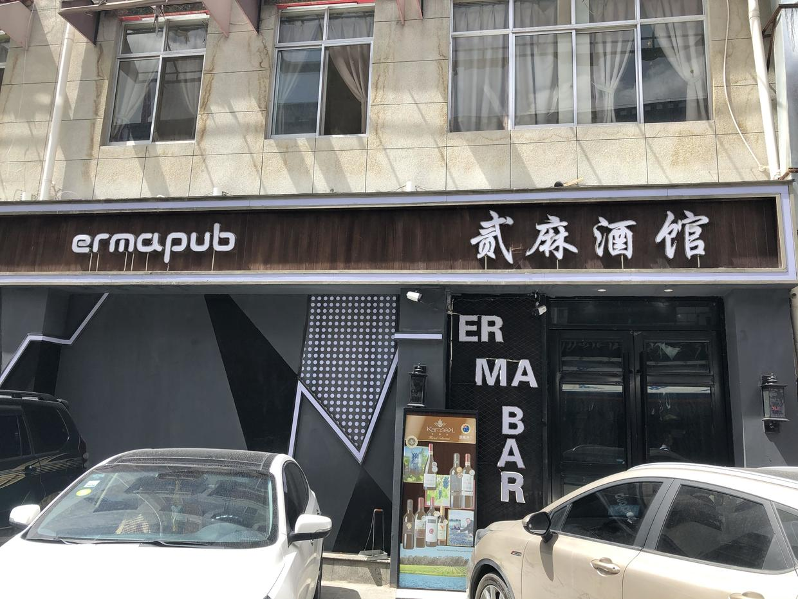

# A Thing or Two Seen and Heard in Lhasa

1\. The white stupa is there to join up the Potala Palace's dragon vein, which the road cut through

2\. The white walls are made by splashing on coat after coat of whitewash, which contains milk and white sugar; built up layer on layer over the years, some parts have even formed something like stalactites

3\. The blue, white, red, green and yellow of the prayer flags stand for sky, cloud, fire, water and earth

4\. Prayer wheels, seen everywhere in Lhasa, and the people turning them

5\. Tibetan rugs and ornaments are all very beautiful, the fruit of a thousand years of accumulated culture

6\. Pilgrims and a puppy outside the Jokhang Temple

7\. Ordinary buildings in Lhasa may not be taller than the Potala; solar panels glint on the rooftops, and prayer flags and national flags dance together

8\. Mobile payment in Tibet is more widespread than I had imagined. The aunties at the roadside who trade with locals and speak no Chinese, and many of the earth toilets along the national highways, all take WeChat Pay or Alipay. Behind this is infrastructure that many people poured their hearts into building

9\. Only after coming to Lhasa did I learn that the city is also called Little Sichuan. There are lots of people from Sichuan, and besides Tibetan and Mandarin, Sichuanese is widely spoken, so wanting to find a place that serves Mianyang rice noodles here is not such an unreasonable request

