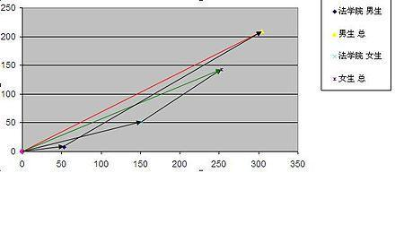

# Simpson's Paradox and the Flaws of Intuition


Keywords: Simpson's paradox | intuition | statistics | additivity

[Simpson's paradox](https://en.wikipedia.org/wiki/Simpson%27s_paradox) really is a classic. In the words of the [Chinese Wikipedia](https://zh.wikipedia.org/zh-hk/辛普森悖论) (in Chinese):

> The side that comes out ahead in every group comparison sometimes turns out to be the side that loses in the overall assessment.

A post on Jianshu uses the example of comparing treatments for kidney stones, with good visualizations, and it is worth a look: ["Simpson's Paradox"](https://www.jianshu.com/p/5582464ef4d9) (in Chinese). A rather more extreme example makes it easier to explain what exactly this paradox is:

Suppose a university is admitting students. Its School A admits women at a rate of 100% **>** men at 90%; School B admits women at 10% **>** men at 0%.<br>
There are 100 women and 100 men applying.<br>
10 women apply to School A and 90 to School B, so A admits 10 women and B admits 9, 19 women admitted in all;<br>
90 men apply to School A and 10 to School B, so A admits 81 men and B admits 0, 81 men admitted in all.<br>
Overall, the admission rate for women, 19/100 = 19%, **<** the rate for men, 81/100 = 81%.

Here comes the question: at both School A and School B, women are admitted at a higher rate than men. **Intuitively, the overall admission rate for women should also be higher, but in fact it is the other way round.**

What is going on?

First, let me try an explanation that makes sense. From the students' point of view, applying to a school is like betting on football. Applying to School A is like betting on who wins, low risk; applying to School B is like guessing the exact score, high risk. Women have a better chance of winning their bets (both schools admit them at higher rates), whether because women are better than men overall (they know more about football) or because the university favours women (whichever team the girls bet on, we do our best to let it win). But most women chose to guess the score and most men chose to bet on who wins, and the gap in difficulty between guessing the score and betting on who wins is huge, bigger than the difference between men and women. So **the stronger but more adventurous women were nearly all wiped out, while more of the weaker but more cautious men survived**.

Thinking further: **why does this phenomenon defy intuition?**

Because our intuition contains this logic: if each part of one thing is bigger than the corresponding part of another thing, then the first thing is bigger than the second. It can be formalized as follows:

```
Suppose:
A=A1+A2+...+An
B=B1+B2+...+Bn, then:
if Ai>Bi for every i=1,2...,n, then A>B
```
This logic clearly doesn't hold up in the example. **The root cause lies in the "+" and "=" in the supposition, which carry a hidden premise of additivity.** What exactly are A1, A2, A3? Can they be added, and does their sum equal A? If A, B, Ai and Bi are all real numbers, additivity comes from the definition, and the logic above is naturally fine. But in the example of the schools' admissions, have we defined, or can we derive, the additivity of admission rates? No.

**Before formalizing, it seems very hard for us to see the hidden premise of additivity.**

When playing games with numbers, the worst thing you can do is take things for granted. Intuition is to some extent the same as trying your luck: how well it works depends on how well the nature of the problem fits the assumptions of the intuition. Don't say numbers lie. Lying is a deliberate act with a purpose; numbers can only be miscalculated, they cannot lie.

Wikipedia also explains the phenomenon geometrically, representing admission rates as slopes. The slopes of the green and red lines are the overall admission rates of women and of men respectively, and you can see **the additivity of vectors, not of slopes**:

> Each of the women's two vectors, taken alone, has a larger slope than the men's, meaning both their rates are higher. But in the end the men's overall vector has a larger slope than the women's.



June 2019: behind the phenomenon of Simpson's paradox there are two sets of factors. In the example above, one set is the university's admission rates for men and women; the other is the men's and women's choices of where to apply. **Understood from the point of view of cognition**, intuition inclines us to think that only the first set of factors has a qualitative effect on the outcome of the system (whose final admission rate is higher), and to ignore the second. In particular, the first set of factors and the outcome under examination are both "admission rates for men and women", which seem very close in meaning, so we "naturally" take them to be the deciding factor.
