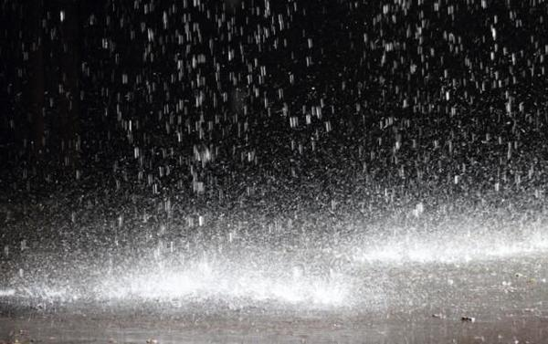
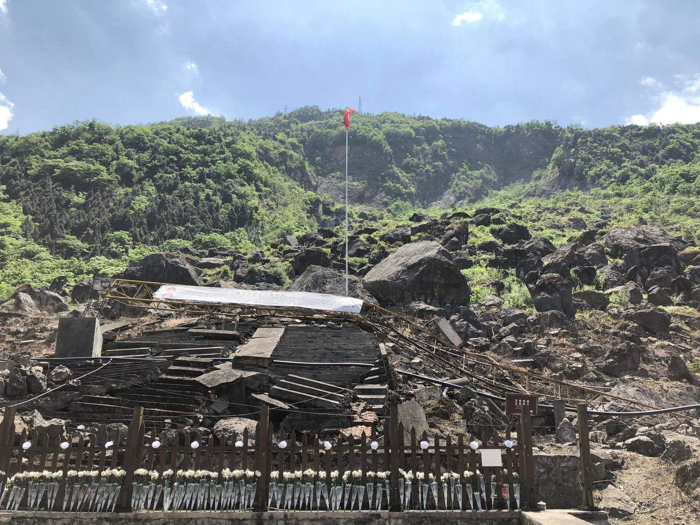

# Ten Years Like Rain

Not long ago a good friend invited me to Shenzhen for a YiXi talk event. One of the speakers, Wang Shu, gave a talk called "About to Climb the Taihang", on what he had seen and thought over dozens of journeys along the ancient roads of the Eight Passes of the Taihang. At first, all he thought about was the magnificent landscape along those mountain roads and the great history that had played out on them: changes of regime, emperors on tour. Gradually he began to notice the stories of ordinary people on the old roads: refugees fleeing war, common people massacred and buried alive, scholars who came back after decades in exile. Then he realized that history tends to favour grand narratives and pays no attention to the memories of ordinary people, while we are easily swept along by grand narratives, overlooking the real people behind history and forgetting their sweat, blood and tears.

The talk left a deep impression on me. The space for filling history books is scarce and expensive, so history prefers material that can be painted in bold strokes, to give its readers more universal and forceful views, values and positions. Ordinary people's stories can at most be footnotes. Only universal and forceful stories can survive for long, and in the end they turn into symbols and concepts.

Today it is exactly ten years since the Wenchuan earthquake. What have those words hardened into in history?

> The Wenchuan earthquake, also known as the 2008 Sichuan earthquake or the 5.12 earthquake, struck at 14:28:04 Beijing time (UTC+8) on Monday, 12 May 2008. Its epicentre was near the town of Yingxiu in Wenchuan County, Ngawa Tibetan and Qiang Autonomous Prefecture, Sichuan Province, China, 79 kilometres west-northwest of the provincial capital, Chengdu. According to the China Earthquake Administration, it had a surface-wave magnitude of 8.2 and a moment magnitude of 8.3 (the United States Geological Survey gave a moment magnitude of 7.9), and it damaged an area of more than 100,000 square kilometres. Its intensity may have reached XI. Its seismic waves travelled around the Earth six times, and it was felt across most of China and in many other countries and regions in Asia: as far north as Liaoning, as far east as Shanghai, as far south as Hong Kong, Guangdong, Macau, Thailand and Vietnam, and as far west as Pakistan.

> As of 12:00 on 18 September 2008, the Wenchuan earthquake had killed 69,227 people, injured 374,643 and left 17,923 missing. It was the most destructive earthquake since the founding of the People's Republic of China, and the deadliest since the Tangshan earthquake. Direct economic losses in the disaster areas of Sichuan, Gansu, Shaanxi and other provinces totalled 845.1 billion yuan, and health care, housing, school buildings, communications, transport, public order, the landscape, water works, the environment and ethnic minority cultures in the disaster areas were severely damaged. The disaster stirred a strong public response, and donations poured in from across China and around the world, totalling more than 50 billion yuan. The Chinese military mobilized its largest force in peacetime for the relief effort, and large numbers of Chinese volunteers, along with professional humanitarian rescue teams from all over China and from other countries, joined in. After the earthquake, the government of the People's Republic of China announced it would invest one trillion yuan and rebuild the disaster areas over three years on the principle of "one province helps one county", aiming largely to finish by 2010. In early 2012, Jiang Jufeng, then governor of Sichuan, announced that reconstruction was complete.

These are the first two paragraphs of the Chinese Wikipedia article on the Wenchuan earthquake. For Chinese people, 2008 is probably a year still fresh in memory: the snowstorms at the start of the year, the earthquake in May, the Olympics in August, great highs and great lows. To people untouched by the disasters and not directly part of the Olympic celebrations, what do these events look like? Normally, much like the text above, or even more symbolic. Is there anything wrong with that? Of course not.

I can still recall scraps of how history books and documentaries described the Tangshan earthquake: people sound asleep in the middle of the night, the ground suddenly splitting open, derailed trains, casualty figures repeated again and again, and the huge rescue operation. For me it was only a disaster from decades ago and a thousand miles away. It appeared as a question on an exam paper or a topic at the dinner table, and then I put it out of my mind. Time forms an absolutely solid barrier that fixes history in a display case, where people can look at it without it shaking the reality they live in now. When everyone who lived through a piece of history has left this world, all the actual memories are gone too, and only the narratives remain. Do these narratives ask anything of me? Nothing at all.

Or so it was, until I lived through an earthquake myself.

---

I was in my first year of high school. It was a little muggy that day. At noon I went to a wedding, and by the time I got back to school it was nearly two. Classes started at half past two, so I decided not to go back to the dorm. Passing the little garden, I stopped for a few seconds to look at the water lilies in the pond, thinking that summer had arrived.

I got back to the classroom a little after two. The student in charge of that subject was already writing on the blackboard ahead of the first class of the afternoon. I put my head down on my desk for a nap. Suddenly it felt as if someone was playing very loud music. I looked up, and the world had gone unsteady.

People shouted as they rushed out of the classrooms, shouted as they poured down the stairs, shouted and shouted, until everything around fell quiet. It was very quick, really, no more than a minute or two. For the teaching building, it had only twisted a body that had never moved before, showing that stone too has a supple side. It didn't fall. It only cracked open, in places you could see and places you couldn't. Did the bell for class ever ring?

Communications cut.

The sports field received the whole school as its guests. People counted heads, bandaged wounds, and shared their worries.

Communications cut.

People queued for the emergency dinner the canteen handed out, a steamed bun or an egg.

Communications cut.

People risked going back into the classrooms to grab some desks and chairs, then back into the dorms to grab some quilts.

Communications cut.

People passed the little garden and saw only an empty pond, and the water that had leapt out of it.

Communications cut.

The light slowly faded. Emergency lamps came on, and here and there the small glow of phones.

Communications cut.

Every so often the ground shook again, a sign that none of this was anywhere near over.

Communications cut.

A fine drizzle began to fall.

Communications cut.

At first light, I picked up my quilt and set off home alone, into a world both familiar and unknown. That world was very quiet. The lamps on the big bridge lay in pieces, quietly, beneath their posts. The road had quietly cracked into lines. Smelling of sweat and hugging my quilt, I hesitated quietly for a while, then quietly stepped onto the bridge.

Beyond some big questions, one small question was: where would I sleep tonight? This question, and many, many others, would keep ringing out over the months that followed, and echo even ten years on.

Communications cut.

---

Now, ten years later, I have long since become someone who lived through it, in a way, and someone who tells it. The history that records the disaster won't remember me, whose luck was bad but not so very bad, and probably won't remember the other versions of me whose luck was better or worse. We are all too ordinary, and at the same time too rich. History can only remember the cold outline and the verdict, not the richness that still holds warmth. Each of our memories is like history too, unable to hold that much.

Time is like a rain that never stops, and in the rain no one can see the tears. But the rain cannot erase the fact that the tears were real, even if no one tells of them, even if no one remembers.

At least we can remember that they were real.

[Appendix: "Old Memories: Four Years On"](https://www.jianshu.com/p/aedf75a08e06) (in Chinese)

Taken on 10 May 2020:

