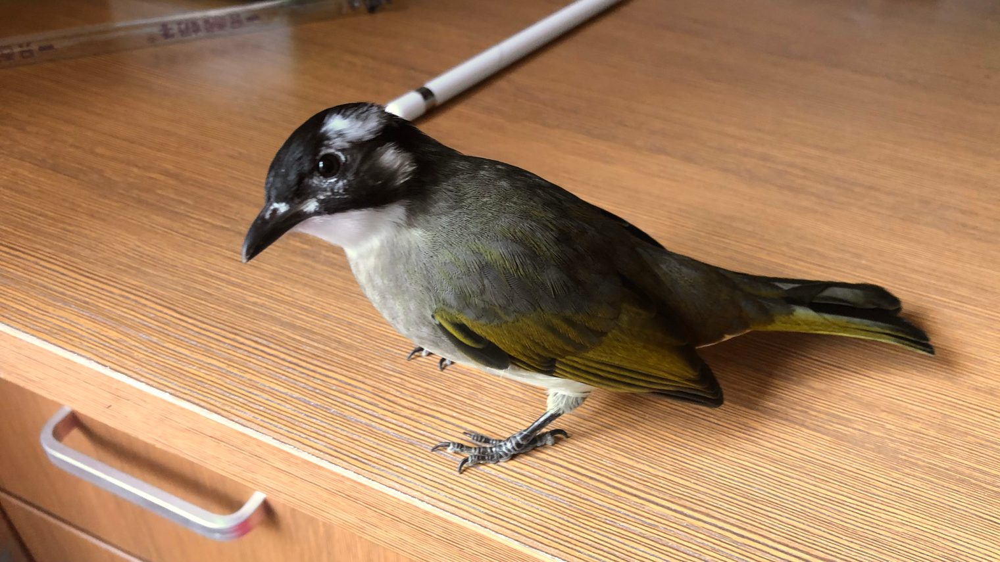

# Thank You for Sheltering from the Rain

After several days of rain, today was a rare sunny day. It was also the day the little bulbul that came to our home four months ago flew away. It was only a hundred-odd days, yet it feels as if the time it was here was long; we had already built up so many memories. At the hundred-day mark I even wrote [a post](a-bulbuls-first-100-days.en.html) about the funny little moments.

All through those hundred-odd days, the conflict in my heart rose and fell but never went away. For this little sprite, born only in May, our cramped home might, over the ten-odd years of life ahead of it, be a happy captivity. However lovely the adjective, the noun still carries regret. In this small world it would never want for food or water, never have to worry about wind, rain or thunder, never fear predators. But it could never reach the bigger world behind the transparent walls. That world has trees and flowers, breezes and sunshine, and its own kind. That world has no roof and no walls. Now and then I would put myself in its place and imagine how vast the difference between the two spaces must be. For a life born with wings, spending it all in a small world would be too great a waste.

So even though its unexpected flight out left me very low, even though I put the cage out on the balcony and kept hoping, hopelessly, that it would come back, even though I worried that a bird raised indoors couldn't cope with the harshness of the big world, I still felt that it was the world it belonged in. Perhaps all along I had quietly hoped it would leave one day.

As the sun went down, I stood on the balcony in a daze for a while, trying to spot it in the trees outside. Then, somehow, I thought of a rainy day last week. It was a weekday lunchtime, and I was hurrying along alone under my umbrella when a little boy darted in under it. His hair was already soaked. Walking fast to keep up with me, he muttered to himself about his bad luck getting caught in the rain, without a word about sharing my umbrella, the little rascal. I asked, and he was heading for the bus stop a few hundred metres away, across the road, so I said I'd walk him there. He asked where I was going, then said, so you'd have to go out of your way. I smiled and said it was fine, held the umbrella in my right hand, put my left arm around his shoulders, and jogged him over in time to catch his bus. When he called out his thanks, I knew this little journey was over. We might never meet again, and even if we did, we wouldn't recognize each other. Walking on quickly with my umbrella, still warm inside, I dimly remembered a morning in Hong Kong last year. That day the roles were reversed: I was waiting for the lights on a traffic island when a sudden downpour soaked me from head to toe, and a man opened his umbrella over my head.

Small, scattered kindnesses like these, hard to repay, too slight even to call ichigo ichie, a meeting that happens once in a lifetime. Yet whether you are the one giving or the one receiving, you may carry them with you for a long time.

That made me think of Death Stranding, which I finished not long ago. Cold, malicious rain, and you at the end of your rope, and then in front of you stands a timefall shelter built by a player you have never met. I believe everyone knows that warmth in the heart, and so on the rest of the journey you often want to leave supplies and structures behind to help whoever comes next. Or the fire passed on in Dark Souls, or the call and answer in Journey, or the animals travelling together in Shelter. What you give me, I give to others; today's cause is tomorrow's effect, which the day after becomes a cause again, and so that warmth spreads out like ripples and burns on like a flame that never goes out. The hero of Death Stranding struggles across the land to reconnect the whole of America, but what really matters is not connecting things to things. It is the connections between people, between one life and another. A connection doesn't always last, but it always leaves something behind in each of us.

How strangely a seemingly unreal game and reality mirror each other. Just look at Death Stranding and the COVID-19 pandemic that swept the world. And it was the pandemic that kept me in my hometown for so long, and so I met the bulbul while it was still a chick. How many connections has the pandemic cut, and how many have been made in the middle of it?

Forgive me for taking this so far afield. It looks as if I have strung together some things that have been on my mind lately, but what really pushed me to write something was still the bulbul. Perhaps what I mean to say happened to be said tonight by two songs the shop played: Leslie Cheung's "Spring, Summer, Autumn, Winter", about feeling lucky for a chance meeting, and another, which I would change by a word or two, about brief encounters that leave their mark on both sides.

In these months I couldn't teach you how to find food, fend off enemies or make friends, but at least I kept you healthy and beautiful, and in return we got so much laughter and comfort. Even though we weren't ready, everything in that big world, the beautiful and the dangerous, now goes back to you, your freedom included. The future is beyond my reach; all I can still send with you now are my good wishes and my thanks.

Thank you for sheltering here from the rain. Thank you for being connected to me.

