# 知乎社交网络分析（上）：基本统计

关键词：社交网络分析（SNA） | 统计 | 幂律分布

### 简介

为保证可读性，本文将分为上下两篇，上篇只涉及数据介绍及基本的统计描述性分析，下篇是[基于用户关注网络关系进行的分析](zhihu-social-network-analysis-2-follow-network.html)。

本文源自我在2015年[Social Computing](https://www.cse.cuhk.edu.hk/irwin.king/teaching/cmsc5733/2015)课程中参与的一个小组项目，主要语言为Python，这里是项目包括数据集的[Github传送门](https://github.com/simoncos/zhihu-analysis-python)（引用请使用该地址）。项目内容包括了知乎社交网络数据的爬取、存取、分析全过程。在本文中我打算略去数据爬取和数据库I/O的部分，重点在分享一些有趣的结果。分析过程若有不周之处，还望指正，也期待可以和有兴趣的小伙伴讨论及合作，继续一些更深入的分析。

### 数据

（自带吐槽模式开启）

虽说不讲数据爬取，但要说清楚我们所使用的数据到底是啥，还是得简单提一下的。2015年10月，我们使用了[本人的知乎账号](https://www.zhihu.com/people/zhao-che)作为种子，先获得了所有我关注的用户的数据，再获得了这些用户所关注的用户的数据，所以算上种子的话一共是**3层的广度遍历**（注意其实这个数据可能是存在严重bias的，毕竟seed是一个逗逼，逗逼关注的人呢...咦怎么感觉脖子一凉）。这里的用户数据包括：用户的回答数，用户获得的赞同数、感谢数，用户关注的人和关注用户的人，用户回答过的问题以及每个问题的话题标签。这里给出数据的简要统计信息：

- 数据库文件: 688 MB（**SQLite**）
- 数据包含：2.6万名用户, 461万条关注连接, 72万个问题
- 数据的压缩包可以在这里[下载](http://pan.baidu.com/s/1bos5RqR)。

这里是一张数据全貌的示意图：
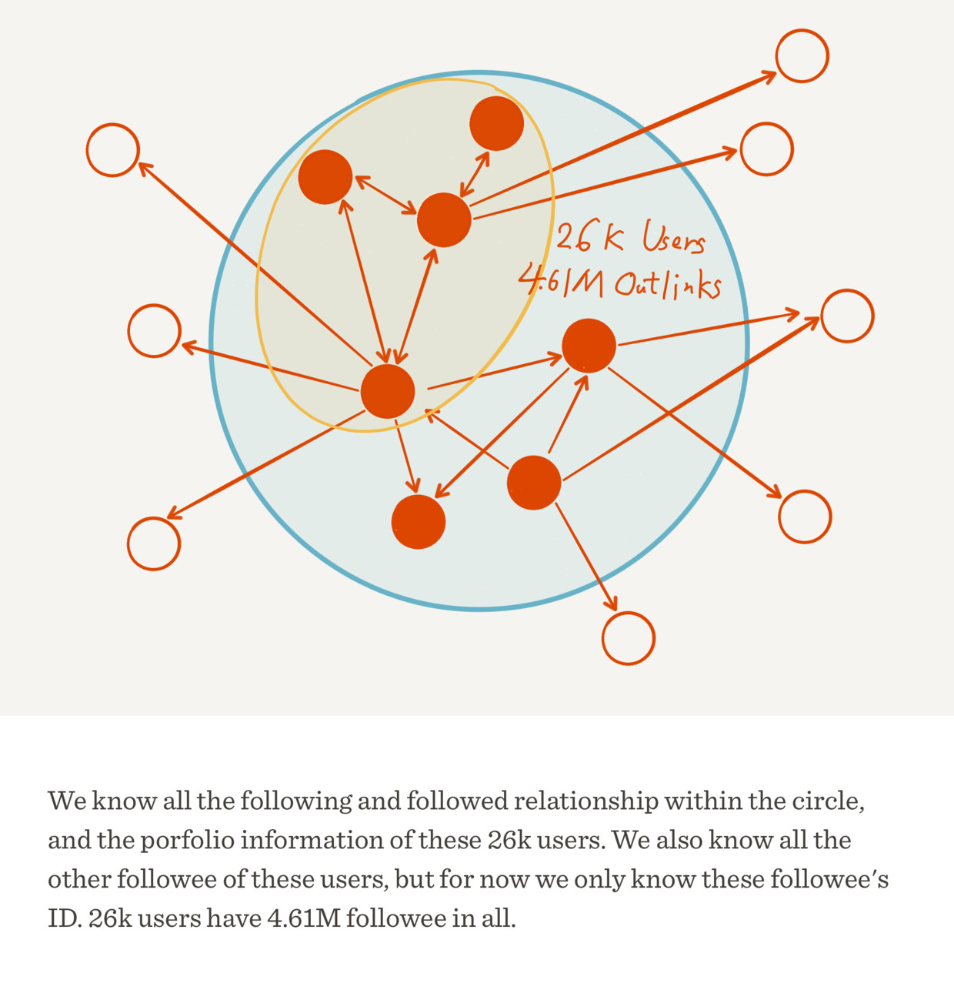

下面将着重介绍我们所做的分析。

### 玩的不是同一个知乎：均值、中位数与标准差

要告诉别人我们在知乎上混得怎样，最基础的几个指标是什么呢？一定是关注、回答、赞同、感谢。所以我们首先对用户的**关注数（followee）**、**关注者数（follower，粉丝数）**、**回答数（answer）**、**收到赞同数（agree）**和**收到感谢数（thanks）**的平均数、中位数以及标准差进行了计算，结果如下表：

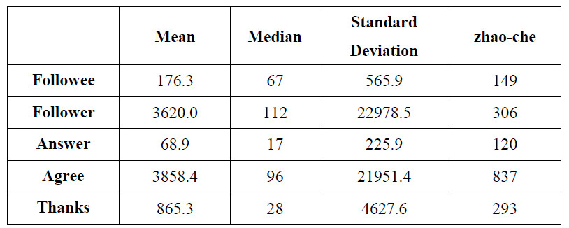

这里其实就有许多有趣的结论了。

首先我们看平均值，哇，平均每个人有三千多粉丝，三千多赞同，再看看可怜的我，306个粉和837个赞，而且他们回答的问题也并不多啊，却有那么多赞和粉丝，还让不让人玩知乎了？再看看中位数，顿时心里好受一些了，原来我混得挺不错嘛，五个指标都是我比较大，真开心（你是不是傻）。

究竟是什么原因造成平均值和中位数差异这么大呢，也许我们能从标准差看出来一些端倪——太大了，粉丝数和赞同数的标准差甚至超过了两万。

这意味着什么呢？我们知道，**标准差其实衡量了数据个体之间的离散程度，也可以解释为大部分的数值和其平均值之间的差异**。因此这么大的标准差可以说明知乎用户之间的差距可能略大于整个银河系（雾），同时也说明绝大部分用户的数值和平均值有很大的差距，要么大得离谱（比如[张佳玮](https://www.zhihu.com/people/zhang-jia-wei)），要么小得可怜（比如我）。

有人可能会不服气，说标准差严重依赖于数据本身的scale，不能充分说明问题。那么这里使用标准离差率（标准差除以平均值）来算算赞同数，21951.4/3858.4 = 568.9%。

以上现象还可以导出一个猜测，那就是知乎用户的这五个指标的值分布，都**不大可能是正态分布及其近似**。让我们回想正态分布的样子：

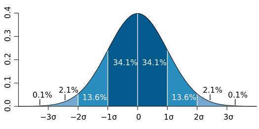

图片来源：[维基百科“正态分布”](https://zh.wikipedia.org/zh-cn/正态分布)，M. W. Toews 绘，CC BY 2.5。

如果是正态分布，中位数（最中间的值）、众数（最多的值）以及平均值三者至少应该是非常接近的，然而我们这里却是地月距离（怎么一下缩水那么多）。

### 当雪球滚到最后：长尾和幂律分布

为了进一步验证上面的猜测，我们绘制了五个指标的分布图（Distribution Graph）。

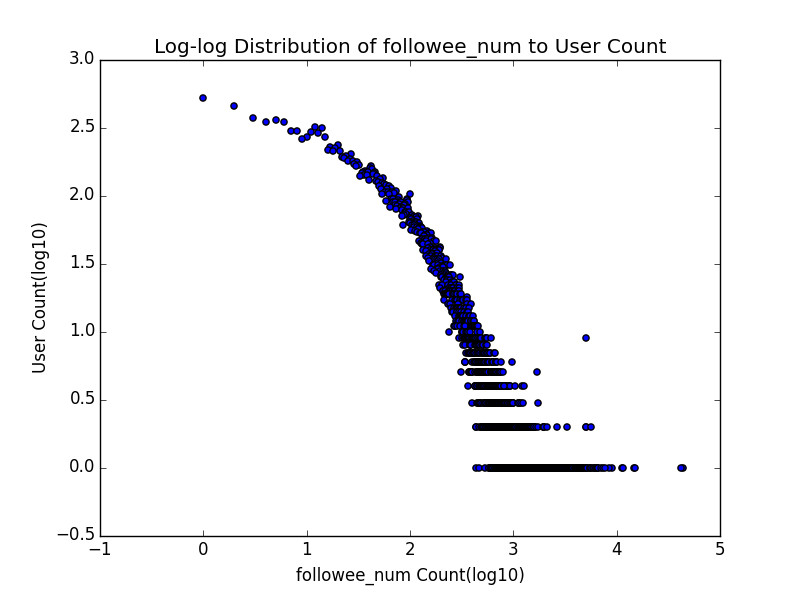

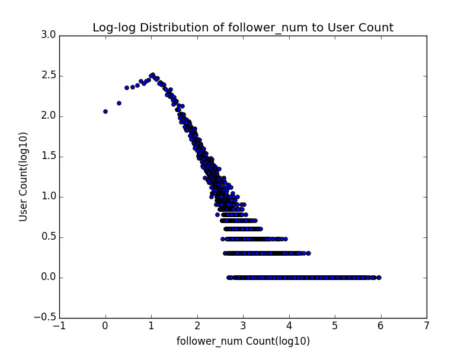

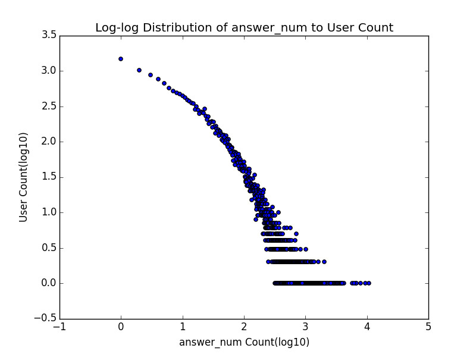

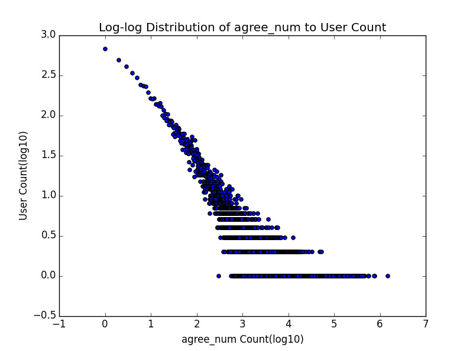

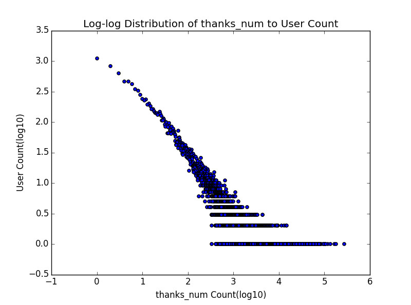

这里说明一下这五张分布图的含义，横轴表示指标的具体数值，纵轴表示有多少用户具有该指标值。需要注意的是横轴值和纵轴值都取了以10为底的log，这是研究中一种常见的处理办法，能够使图所表达的信息更清晰。以感谢数分布图为例，那个最左上方的点表示在这两万多知乎用户里面，有大于10的三次方也就是1000的人没有获得一个感谢（摸摸大）；而最下面那一排点则是说，感谢数是x1，x2，...， xn (反正都不小)的用户，都只有一个人——注意仅这一排点并不能形成什么有效的结论，因为可能感谢数100的只有一个人，101的就有好多人了，这一定程度上大概是因为**数据量小，采样不足**。但是如果把下面几排点放到一起考虑，也许会更有启发一些。

顺便提一句，其实关注数和粉丝数的分布图分别还有另外一个名字，它们其实是知乎用户关注网络的**出度（out-degree）分布图**和**入度（in-degree）分布图**，这点在下篇中还会有所提到。

如果是对这种分布图比较熟悉的童鞋，应该一眼就能看出，这绝壁不是正态分布，而极有可能是**幂律（power law）分布**（不过因为懒我们并没有做拟合去验证），这种分布在许多有人参与其中的网络中都会出现。此外，仔细**比较这五条曲线的整体形状**，有没有觉得有两条与另外三条略有不同？一条是关注数，一条是答案数，这两条曲线向外的弯曲程度似乎更明显，也就是说随着横轴值的增大，纵轴值减小的趋势相对较慢，而恰好五个指标里只有这两个是某个用户自己可以控制的，而其他三个指标则是由其他用户形成的群体所控制，这是很奇妙的一点，我觉得其实还有深挖的可能性。

现在让我们以感谢数为例，再画另外一种分布图。横轴表示每个用户的index也就是0，1， 2， 3...，顺序由感谢数大小决定，纵轴则是该用户收到感谢数的具体数值：

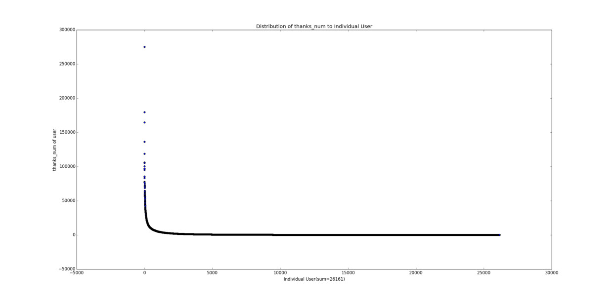

看到那个突破天际的点了吗，二十七八万的感谢（其实这个点在前面那张感谢数分布图中也出现了，你还认得仅在几个自然段以外的它吗）！再看看下面那条长长的尾巴，人艰莫拆。再来看一个更夸张的，赞同数：

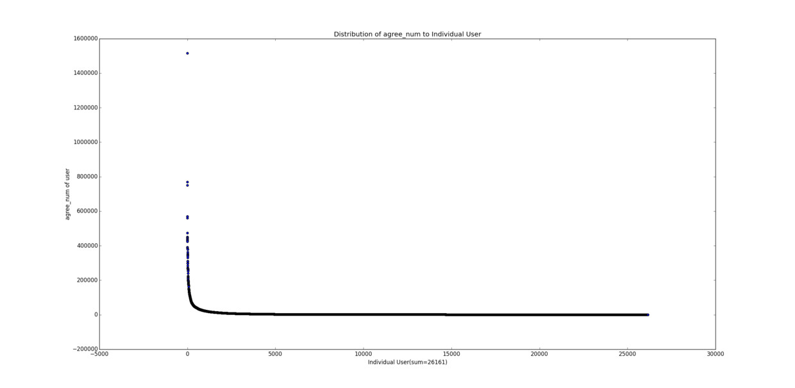

其他三个指标的图的形状也基本如此。

有其他知友使用远大于我们的数据量做了[类似的分析](http://zhuanlan.zhihu.com/sulian/19781120)，结论是一致的。总结一下就是：大多数人小得可怜，却有极少数人大得可怕，一点也不正（可）态（爱）。前几年不是有本书很火吗，叫做《长尾理论》？所谓**长尾**，指的就是这样一种现象（附送我对该现象的一些解释：[什么是「长尾效应」](http://www.jianshu.com/p/bf751d19e34e)）

到这里不由得让人提到另外一个东西：[马太效应](https://zh.wikipedia.org/wiki/%E9%A9%AC%E5%A4%AA%E6%95%88%E5%BA%94)。所谓穷的人越来越穷，富的人越来越富，感觉上其实就是长尾效应的动态解释（最近打算看看有没有相关的文献）。富的人掌握大量资源，因此更可能攫取更多资源，而穷的人则相反；大V因为有名而得到更多关注，同时因此变得更加有名；玩游戏carry从而得到更多钱，有了钱买装备又更可能carry。这是典型的正（滚）反（雪）馈（球）。最后造成的结果，就是长尾现象。

### 论如何滚成人生赢家：赞同与关注

这一节可以算是对上一节结论的一个支撑。下面这张图同时包含了用户的赞同数和粉丝数两个指标： 
（**!密集恐惧症高能预警!**）

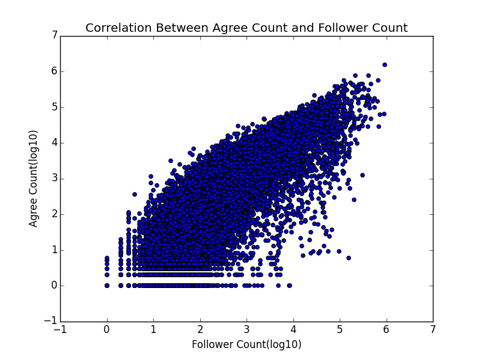

我想不需要我们再做个回归什么的了，一看就是赤裸裸的正相关啊。这也为我等如何冷启动逆袭成为知乎大V提供了理论支持——要么你就有本事回答出几个赞数突破天际的答案，要么你一开始就很有名，没写啥答案也能吸粉...（说的都是屁话...）

好了本篇到此结束，对网络关系更感兴趣的童鞋，不要错过[下篇](zhihu-social-network-analysis-2-follow-network.html)，下篇信息量更大哦~
