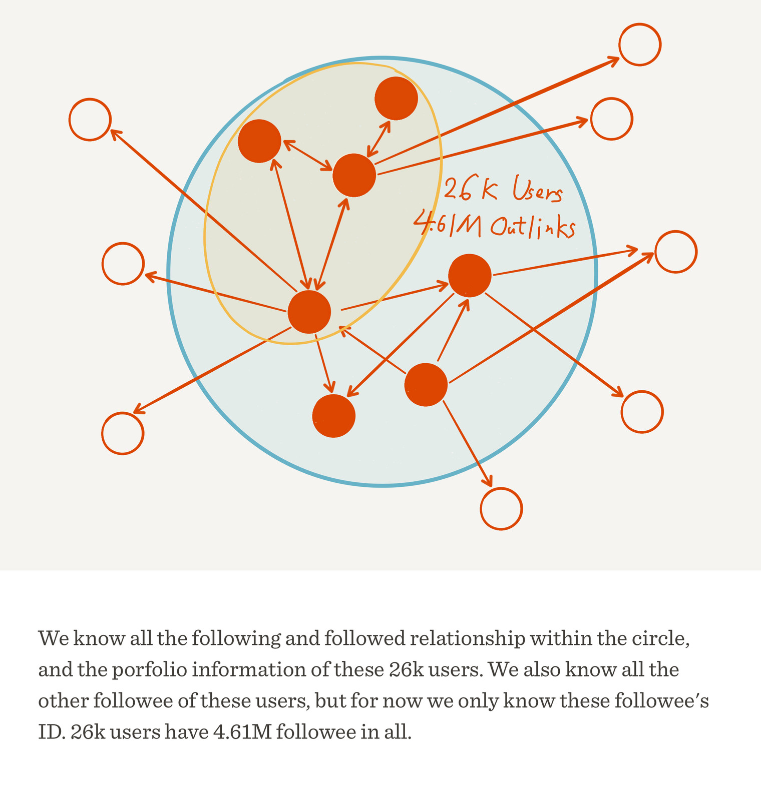
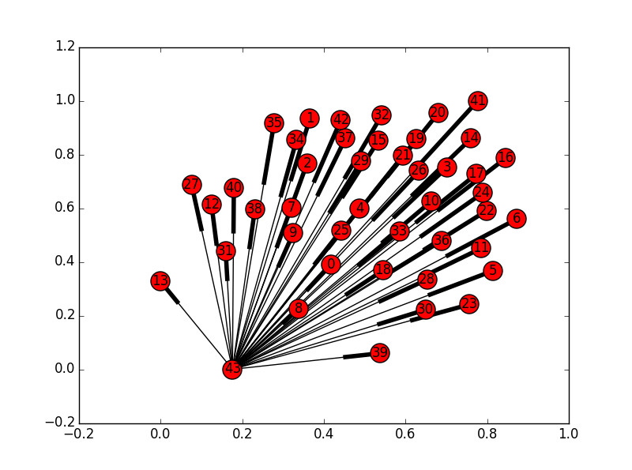
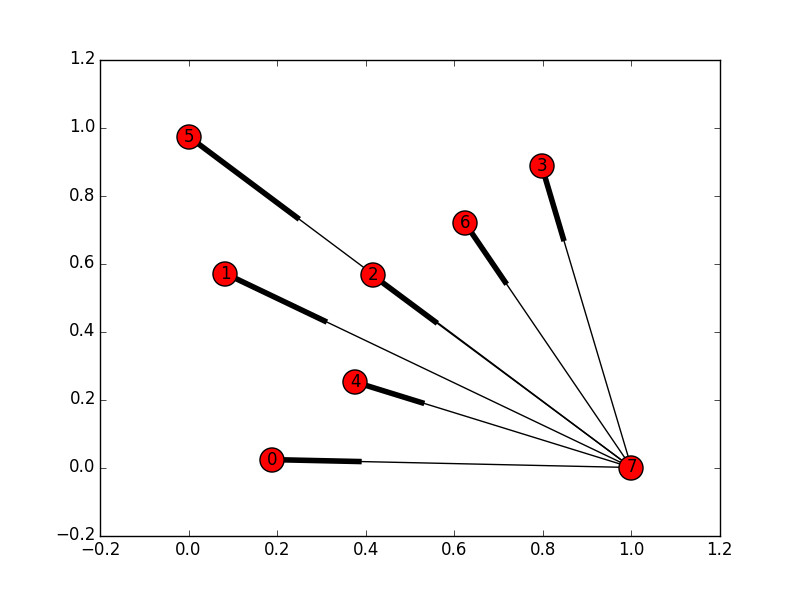
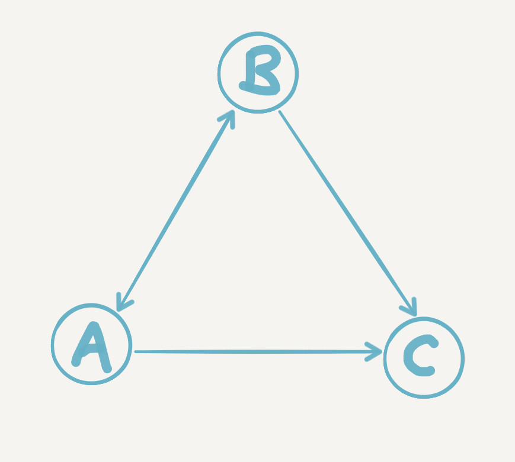
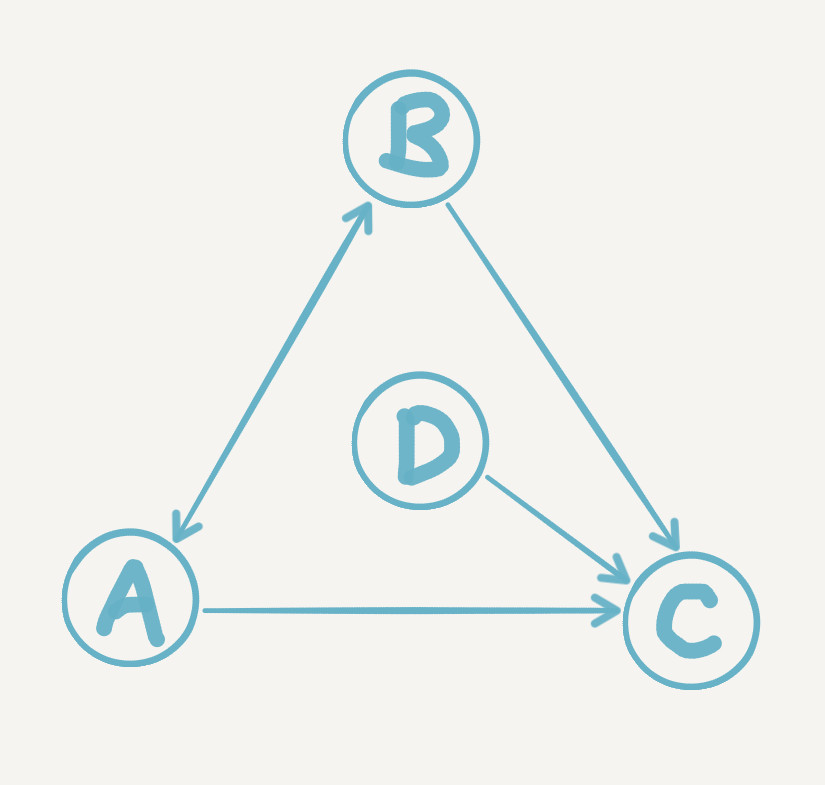
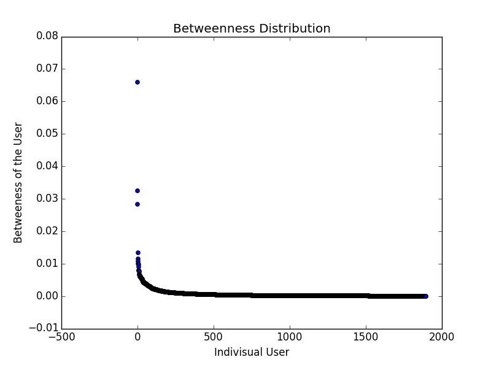
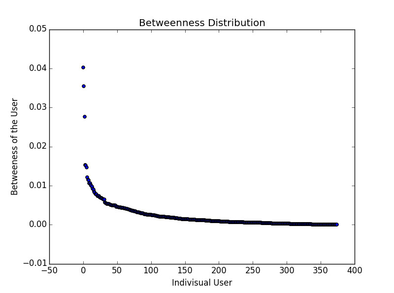

# 知乎社交网络分析（下）：关注网络

> 交互研究页：[知乎 2015：人、关注与影响力](../gallery/research/zhihu-2015.html?lang=zh)，把上下两篇的统计、网络、榜单与话题放在一起探索。

关键词：社交网络分析（SNA） | 复杂网络 | 图论 | 网络中心度 | 热门话题发现

本文是《知乎社交网络分析》的下篇，主要内容是对于知乎用户关注网络进行的分析。项目介绍（以及数据、代码和报告）及基本的统计分析内容请见[知乎社交网络分析（上）：基本统计](zhihu-social-network-analysis-1-basic-statistics.html)。

### 导言：社交网络是什么？

在上篇所述的基本的统计分析之后，我们已经对知乎用户的赞答谢关四个方面的总体情况有了一些了解。现在，让我们先来考虑这样一个问题：我们平常所说的社交网络或者说社会网络，到底是什么意思？也许你会讲，这还不简单，只要一个事情有多人参与，自然就会具有社交的性质，从而产生社交网络。那么让我们思考思考，维基百科算不算具有社交性质？

维基百科确实有很多人参与编辑词条啊，但是这些人之间有没有更直接的互动呢？假设编辑者们通过QQ、微博之类进行互动，那产生出的社交性质算不算是维基百科本身所具有的社交属性呢？即使维基百科提供评论区之类的功能，可以使编辑者之间直接互动，这些互动仍然是基于某个词条的，只要这个词条没什么大问题了，互动基本上也就随着编辑的停止而停止了。我认为这种临时建立起来的关系，并无法得到一个较为稳定的社交网络。

让我们再来思考一个例子。我们知道，一门科学源自跨越时代的许多人的共同贡献，那么这许多人，能够构成社交网络吗？当然不能。所谓牛顿和爱因斯坦的对话只是一种修辞，一篇已经发出的论文，如何能引用一篇未来的论文？但是当我们考虑到同一时代的同一学科，情况就有所不同，学者之间确实存在着各种交流合作的可能，因此我们可以认为学术领域的共同作者关系（Co-authorship）形成的网络其实是带有社交性质的。

从以上粗略的思考中我们或许可以总结**形成社交网络的几个条件：多主体的直接互动、互动的长期性、互动的近同时性**。

现在让我们重新回到知乎上面来。赞同、感谢、回答、关注，哪一种用户行为最满足以上三个条件？回答是基于问题的，知乎的产品设计并不突出是谁提出了某个问题，并且一个问题可以被不同的人进行编辑（类似维基百科的权限设计），也就是说回答者一般不大在意是谁提出了问题，所以回答连互动都称不上；赞同、感谢以及我们之前没有提到的评论，相对来说互动得稍微直接一点，但是鼠标一点了事，不具有长期性；只有关注关系，同时满足了三个条件。这里可能会有一个疑问，关注也只是鼠标那么一点，这能算长期的吗？不要忘记知乎的时间线（Timeline）机制，这使得关注者有更大的概率看到被关注者的活动并与之进行互动，并且只要关注不取消，这种对时间线的影响就是长期的。

到此，我们可以认为，如果想要对知乎从社交网络的角度上进行分析，可以重点考虑知乎用户之间的关注关系。接下来开始介绍我们对此进行的具体分析。

### 分析对象和分析方法

首先来了解一些网络的基本知识：

**一个网络可以被表示为一种图（graph），其中包含点（vertex / node）与边（edge / link）两种基本要素。**边可以具有方向性，也就是说对于一个点来说，可以有外连边（out-link）和内连边（in-link）两种边。如果边是具有方向性的，那么这种图称为有向图（directed graph），反之称为无向图（undirected graph）。图反映了点与点之间的某种相关关系，这种关系由边表现。

回到知乎上，我们知道关注和被关注实际上是一件事情的两个角度。A关注了B，等价于B被A关注。在我们所爬取的数据中（见下面的数据全貌图），我们知道这2.6万用户中的每个人都关注了哪些人。也就是说，我们知道了2.6万用户点的所有外连边。从另一个角度想，我们其实也知道在这2.6万用户之间谁关注了谁（蓝圈以内的部分），**加上**他们关注了其他什么人（蓝圈以外的部分）。因此我们只能分析这2.6万用户（红色实心圆），因为我们并不知道其他的人（红色空心圆）的所有连接，这是由我们的广度优先爬取机制所导致的，不爬完知乎整站，不会有真正完整的数据（那些没人关注的账号应该可以忽略）。

此外，即使剔除了蓝圈以外的部分，涉及的连边数仍然具有很大的量级，计算量会是一个问题，所以在这个项目中，我们仅仅选取了这2.6万用户的两个有趣的子集进行分析：获得赞同数大于1万的用户（共1895人）、获得赞同数大于5万的用户（共375人）。方便起见，我们将他们分别命名为**Net10k**和**Net50k**，其实可以说就是**两个不同级别的知乎大V群体**了。

接下来讲讲分析方法。一个网络图，别看里面只有点和边两种东西，其实可以包含复杂到极点的各种现象与性质。网络分析，或者进一步说复杂网络领域之中，存在大量人们为了描述网络的现象而定义的概念、以及为了量化网络的特征而设计的指标。后文将要涉及的分析建立在其中最基本的一些概念和指标上，如果对它们逐个详细介绍，那么本文篇幅会大大加长，而且会多出不少数学公式，这不符合我对本文的写作预期。因此我打算尽量从直觉（intuition）上来解释它们分别表达了什么的含义，即使给出定义也不求严格（数学公式才可带来最清晰严格的定义），重点仍在对分析的思考。此外，由于我们所讨论的知乎关注网络是有向图，**后面所有的指标和算法都只讨论有向图的**。当然，如果读者已有一定的基础，可以直接跳过相关的段落。

### 抱团的大V们：网络总体特征

一直以来知乎就给人一种印象，那就是大V们喜欢抱团。你关注我、我关注他、他又关注你，形成了紧密的圈子。那么我们怎样来量化这种特征？

假设有A、B、C三个用户组成的关注网络，其中唯一的边是A->B，那么你觉得这个网络是否紧密？我们可以这样想，三个人之间最多可以有6条边，那么我们可以用1除以6来表示这个网络的紧密程度。如果6条边都存在，那么紧密程度是1，都不存在则为0。这就是所谓图的**密度（density）**。Net10k和Net50k的密度分别是0.064和0.195，到这我们可以猜测，获得赞同更多的大V之间，关注关系也更为紧密。

接下来我们从另一个角度考虑这个猜测，先补充几个定义：

- 点的**度（degree）**：与一个点通过边相连的其他点的数量和，被称为这个点的度。有向图中一个点存在出度和入度两个度，一个只看它能到达哪个点，一个只看哪些点能到达它。对于知乎的关注关系而言，我们很容易就能看到出度就是你关注的人数，入度就是关注你的人数；

- 点与点之间的**路径（path）**：假如从点A出发，经过一条或更多条边，到达了点B，那么我们称这些边按顺序相连形成了一条A与B之间的路径。两点间的路径数量一定是大于等于0的。假设每条边的长度相等，那么包含边数最少的路径，便是所谓最短路径（shortest path），最短路径的长度一般被认为是两点之间的距离（distance）；

- 图的**平均最短路径长度（average shortest path length）**：对于一个网络而言，将所有点两两之间的最短路径长度进行算术平均，得到的就是所谓平均最短路径，可以用来衡量网络中点之间的平均距离。传说中的六度分隔（Six Degrees of Separation），其实指的就是一个网络的平均最短路径长度为6（这里大家可以想想边、度和路径三者间的联系）；

- 点的**偏心率（eccentricity）**：对于图中的任意一点P，算出它与其他各个点的最短路径长度（距离），其中最大的距离称作点P的偏心率。

- 图的**半径（radius）**与**直径（diameter）**：图的半径、直径分别是图中最小的、最大的点偏心率。注意图的直径不必然是半径的两倍。

- 图的**强连通子图（strongly connected subgraph）**：设想一个网络图G的一个子图G'（意味着G'中的点和边都只能从G中挑），其中每一个点都能通过某条路径到达另一个点，则我们说G'具备强连通性，而且是G的一个强连通子图。这里注意，单独一个点我们也认为是强连通子图，虽然单个点并没有值得研究的；

- 图的**强连通分量（strongly connected component）**：G的一个极大的强连通子图G''（意味着再往G''加任何G中剩下的点，都会破坏其强连通性）被称为G的一个强连通分量。这里需要注意，极大并不代表很大；

字好多看烦了吧，终于可以上图啦，下面分别是Net10k和Net50k的强连通分量示意图：

其中每一个红色圆圈都代表一个强连通分量，每条线（其实是很抽象的箭头orz）代表一条路径。光看这个我们还不清楚情况，我们来看二者对应的一些指标数据：

||Net10k|Net50k|
|---|---|---|
|点数量|1895|375|
|边数量|231416|27324|
|强连通分量数量|43|8|
|强连通分量点分布|1853,1,...,1（42个1）|368,1,...,1（7个1）|

总结一下我们知道了什么：

1. 基本上Net10k和Net50k这两个图就是强连通的，别说抱团了，这已经根本就是**挤成一坨**（好吧，一个圈子）。
2. 除了一个巨大的圈子，群体里就剩几个特立独行的高冷大V（都是只包含一个点的强连通分量），他们受到了其他大V的关注，但却没有任何回粉。在网络中，这种点也被称为**悬挂点（dangling nodes）**；

现在我们重点分析两个最大的强连通分量，连通倒是连通，但是如果A要经过100个人才能到B，那估计光凭关注关系，他们是没有缘分了。将Net10k和Net50k的最大强连通分量分别命名为**Net10k-C**和**Net50k-C**，以下是两者对应的指标数据：

||Net10k-C|Net50k-C|
|---|---|---|
|点数量|1853|368|
|平均最短路径长度|2.11|1.85|
|半径|2|2|
|直径|5|4|

如果你就是Net50k-C中的一个大V，还不认识其中的另一个大V？没关系，你关注的关注的关注...总会有他，所以你们总有机会看到彼此。强连通保证了总会有一条路径，平均最短路径向你保证平均来讲这条路径很短，只有2左右。直径和半径则告诉你**在最坏情况下**（你们碰巧是整个圈子里相距最远的两位），这条面基道路的长度在2到5（4）之间。What a small world，喜鹊们（雾）如是说。

再来对比Net10k-C和Net50k-C的平均最短路径长度和直径，后者都比前者要小，从另一个角度说明后者的关注圈子更紧密。而且注意一点，这些大V是来自各个不同的专业领域，但都紧抱在一起，这是很有趣的现象，有进一步分析的价值。

### 给大V排个位：网络连接分析

上节侧重于对知乎大V关注网络的整体进行分析，这固然很有趣；但或许更有趣的是这个整体之中的每个个体，同样是赞同数很高的大V，他们彼此之间是否能一较高下呢？他们在关注这种社交行为上是否具有差异，如何衡量这种差异？这是本节涉及的问题。

让我们先来设想一个简单的关注网络，其中只有A、B、C三个人。A关注了B，B关注了A，A、B同时关注了C，而C谁也不关注，如下图所示：

那么你觉得光凭关注关系来看，A，B，C谁更“牛”？从直觉上来说当然是C，因为C在三人之中得到了最多的关注。但是否只要粉丝更多就能说明更“牛”呢？下面我们在这个网络的基础上，来考虑几种很有趣的情况：

1. 多了10个自己粉丝数为0的用户，同时关注A
2. 多了10个用户，他们彼此全部互相关注，除此之外都没有其他粉丝
3. 多了10个自己粉丝数为1的用户，同时关注A，并且每个人还分别关注了10000个其他用户

那我们能说1里的A，或者2里的10个用户比C更牛吗？前两种情况明显不合道理，可以说是较为典型的作弊行为。作弊利用了**单纯粉丝数排序的漏洞：没有考虑到每个关注连接的质量差异**。第三种情况算是一种正常现象，但是你会觉得，这些用户一个是只有1个粉丝，几乎等于0，另一个是他们关注了那么多用户，那么他们关注A，真是因为A很重要吗？

既然发现了漏洞，那么假如不考虑赞同数等其他因素，我们是否有可能通过关注网络本身来予以解决呢？从直觉上来说，我们可以想到的是，用粉丝自己的粉丝的质量来衡量这个粉丝的质量，但粉丝的粉丝的质量又需要粉丝的粉丝的粉丝的质量来衡量...那么到底最后是个什么情况？到这里我们看到了**日常语言结构所能承载的思维深度之浅薄**，当一个问题到达这个复杂度，语言已然苍白无力，不得不将它托付给数学。

**PageRank算法**（其与Google的关系我就不赘述了）就是一个数学上非常优美的答案，不仅考虑到前述的连接质量问题，还解决了所有特殊情况——无论关注网络是什么样子的，都保证能得到一个满意的用户重要程度排序。

下面是我们对Net10k和Net50k分别计算PageRank值，注意这里只考虑大V们内部的连接，此外圈子里所有大V的PageRank值相加等于1。最后得到排名前五的知乎大V用户如下：

|Net10k top 5|Pagerank值|
|---|---|
|黄继新|0.00736|
|马伯庸|0.00560|
|张佳玮|0.00551|
|葛巾|0.00510|
|周源|0.00503|

|Net50k top 5|Pagerank值|
|---|---|
|黄继新|0.0112|
|马伯庸|0.0103|
|张佳玮|0.0102|
|梁边妖|0.0095|
|cOMMANDO|0.0090|

这些便是站在知乎大V巅峰的大V们了，是否觉得有一定道理呢？注意比较Net10k和Net50k前五用户的PageRank值，前者比后者小，这主要是因为总和为1的PageRank资源被更多的大V们分掉了。

下面让我们再考虑一点，所谓的“重要”，其实要看我们的目的是什么。假如我们是要看更多的好答案或者想要找人出书约稿，那么直接找到好答案的答主就好，而这些答主往往吸引了最多的关注，所以我们仅仅需要知道谁受到的关注最强（比如下图中的C）。

但是光是通过关注，我们会漏掉那些暂时没有得到太强关注的**好答主**（可能是刚刚加入知乎的大V潜力股），然而我们又不可能自己去一个一个挖掘这些好答主，如何是好？简单，假如你能找到几个类似**牵线人**的用户（比如下图中的D）你相信只要是他们关注的用户，质量都不会差，都合你口味，事情就简单了。你只需要不时看看他们都关注了谁，就能发现更大的世界。这其实也算是一种用户推荐系统的可行思路，这里就不展开了。

**HITS算法**便能做到只使用关注网络，通过**权威度（Authority）**和**枢纽度（Hub）**为我们分别挑出好的答主，和好的牵线人。

上面的基于直觉的分析是否说得通呢？让我们看看Net10k和Net50k的权威度和枢纽度前五名：

|Net10k Auth top 5| Auth值| Net10k Hub top 5 | Hub值 |
|---|---|---|---|
|张佳玮|0.0345|周诺|0.00344|
|梁边妖|0.0339|杨大懒人|0.00338|
|葛巾|0.0324|君陌Faust|0.00336|
|马伯庸|0.0319|ZENHO|0.00325|
|黄继新|0.0315|干脆面|0.00290|

|Net50k Auth top 5| Auth值| Net50k Hub top 5 | Hub值 |
|---|---|---|---|
|梁边妖|0.00749|杨大懒人|0.00976|
|张佳玮|0.00721|君陌Faust|0.00972|
|马伯庸|0.00683|ZENHO|0.00953|
|采铜|0.00677|Edison Chen|0.00885|
|谢熊猫君|0.00670|徐湘楠|0.00798|

Auth（好答主）方面，我相信大家应该能认同这样的结果名单。值得一提的是在两个大V群体之中，张佳玮（顺便提一下，张佳玮张公子就是上篇中那个在各条曲线中高高在上的闪亮极点）和梁边妖调换了位置，很有趣。另外在Net50k中，采铜老师一跃进入前五，马亲王（祥瑞御免）上升一名，黄继新则掉了出去。这些现象或许反映了**不同大V群体的一种喜好倾向的差异**。

Hub（牵线人）方面，说实话我个人只认识徐湘楠一个人，其中还有一位目前处于账号停用状态，这里便不做过多分析。只有一点比较有趣，作为大V，粉丝数很大很正常，然而这些用户关注的人数也算是很多的，好几个甚至达到了几千，不可不谓之具有某种交际花属性。另外提一下，Net10k Hub的第五名，叫干脆面的用户，我已经无法知道是谁了，原来的用户ID是wang-wang-wang-08-18，现在改掉了，总觉得跟徐湘楠（ID：miaomiaomiao）之间存在着某种联系...

综合来看，HITS和PageRank有不少相同的用户入榜，这是为什么呢？我给一个直觉上我认为对的解释，其实PageRank的值是Hub值和Authority值的一种叠加（其实感觉更像是乘的关系）后的结果，这样Hub或Auth中的一种很强，另一种也不弱时，PageRank便相应比较高，这样两种算法得到部分相同的结果便很正常了。黄继新是一个典型的例子，他的Auth值和Hub值在Net10k和Net50k中虽然都不是最高，但都排到前20名，而他的PageRank则是第一。**既有内容，又能充当渠道。**

### 不均衡中的均衡：Closeness和Betweenness中心度

到此先让我们总结一下，如果要衡量一个用户在关注网络中的“重要程度”，我们可以利用这几种指标：

- 该用户的粉丝数，即入度（In-degree）
- 该用户的PageRank值
- 该用户的HITS值

它们在网络分析中也可被归为同一类指标：**点的中心度（Centrality）**。但我们发现，其实三种指标所表达的“重要”，其含义是不完全一样的，同一个网络，同一个节点，可能不同的中心度排名会有不小的差距。接下来请允许我介绍本项目中涉及到的最后两种点的中心度：

- 点的**近性中心度（Closeness Centrality）**：一个点的近性中心度较高，说明该点到网络中其他各点的距离总体来说较近，反之则较远。假如一个物流仓库网络需要选某个仓库作为**核心中转站**，需要它到其他仓库的距离总体来说最近，那么一种方法就是找到近性中心度最高的那个仓库。

- 点的**介性中心度（Betweenness Centrality）**：一个点的介性中心度较高，说明其他点之间的最短路径很多甚至全部都**必须**经过它中转。假如这个点消失了，那么其他点之间的交流会变得困难，甚至可能断开（因为原来的最短路径断开了）。因此假如要**hack一个网络**的话，对哪个结点下手你懂的。从另一个角度想，这些点简直就像是**等在丝绸之路上必经关口的强盗**。不留下买路钱？让你无路可走，生意就别做了。

这两种中心度我目前并未找到很公认的中文翻译，姑且自己翻译了。另外同PageRank和HITS一样，由于指标的计算稍显复杂，这里就不详细叙述了。但是我们都使用的是网络分析库Networkx中的算法实现，对详细算法有兴趣的读者可自行查阅其文档。

本项目中我们分别计算了Net10k和Net50k的近性中心度和介性中心度，并画出了分布图。由于我们当时考虑欠周，算出的近性中心度是基于外连接而不是内连接的，我认为意义不大（你总是可以让自己关注更多人，从而得到更大的近性中心度），所以本文决定略过。下面主要说一下介性中心度，其于Net10k和Net50k的分布图分别如下：

我们又得到了两条长长的尾巴。图中横坐标表示每一个特定的大V，纵坐标是大V相应的介性中心度。长长的尾巴表明大部分大V的介性中心度接近0，即使长尾以外有少数几个人远超其他人，但介性中心度的值依然很小。这说明什么？说明这些大V即使退出知乎，也几乎不会影响其他大V之间建立关注关系。没了你，我还有许多其他最短路径到达另外一个大V。这进一步说明什么？说明**大V的关注网络是如此健壮**，健壮到即使失去许多结点，对整个圈子的连通几乎毫无影响。

再横向比较一下Net50k和Net10k，可以看到这种**随着圈子增大，幂律变得更强**，除了少数点，大部分的人介性中心度都更趋近于0，人数的增加进一步稀释了大多数人的“独特性”，直觉上我相信继续扩大这个圈子，到Net5k、Net1k甚至知乎全体用户，这种健壮性只会越来越强，虽然**人与人相比存在指数级的差异**，但**对整个网络本身而言，每个人几乎同等重要，也同等不重要**。这或许可以称之为知乎关注网络所具有的一种不均衡中的均衡吧。

### 大V都在关注什么：热门话题分析

最后，我们尝试了一种获得知乎上热门话题的办法（本项目中唯一涉及内容的分析），先取得Net10k和Net50k的**支配集**（**Dominating set**，这里由于我认为实际上不用这个子集结果也不会有显著区别，所以就不解释这个概念了），然后统计集合中所有用户的回答所对应的问题标签，最后对各个话题标签按出现次数排序。以下分别是二者的前20名：

**Net10k的热门话题Top 20：** 
调查类问题 3792, 生活 3096, 历史 1713, 恋爱 1464, 心理学 1432 
电影 1419, 人际交往 1404, 社会 1332, 互联网 1214, 情感 1197 
政治 1028, 两性关系 994, 教育 897, 中国 823, 人生 815 
游戏 805, 文学 772, 知乎 772, 法律 750, 音乐 738 
爱情 699, 文化 659, 创业 628, 大学 621, 程序员 619 
心理 617, 你如何评价 X 609, 女性 604, 编程 585, X 是种怎样的体验 582

**Net50k的热门话题Top 20：** 
生活 1435, 调查类问题 1365, 政治 1285, 历史 1204, 电影 1084 
健康 996, 社会 984, 医学 941, 恋爱 717, 中国 695 
两性关系 688, 英语 678, 人际交往 640, 心理学 634, 互联网 595 
法律 587, 微软（Microsoft） 555, 美国 552, 健身 538, 编程 511

我个人认为**大V们回答的问题所对应的话题，能够从一定程度上反映了知乎这个平台总体的话题领域热门程度**。另外，我觉得排在最前的一些热门话题也在一定程度上解释了为什么不同领域的大V会抱团，因为不论处于什么专业领域，**人们对于生活、历史、电影等人文和泛娱乐话题总是会感兴趣的**，一旦都感兴趣，又都有不错的见解和分享，自然更容易惺惺相惜。

到此，本文终于可以画上句号了，欢迎交流讨论。在此还要感谢和我一起参与本项目的其他三个小伙伴，四个人一起才得以在短短时间内做到这种程度（项目report里有我们的详细分工）。
